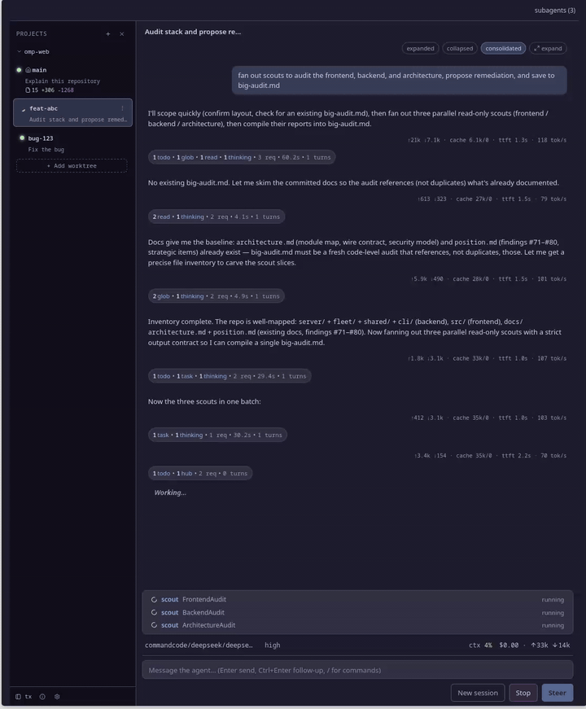
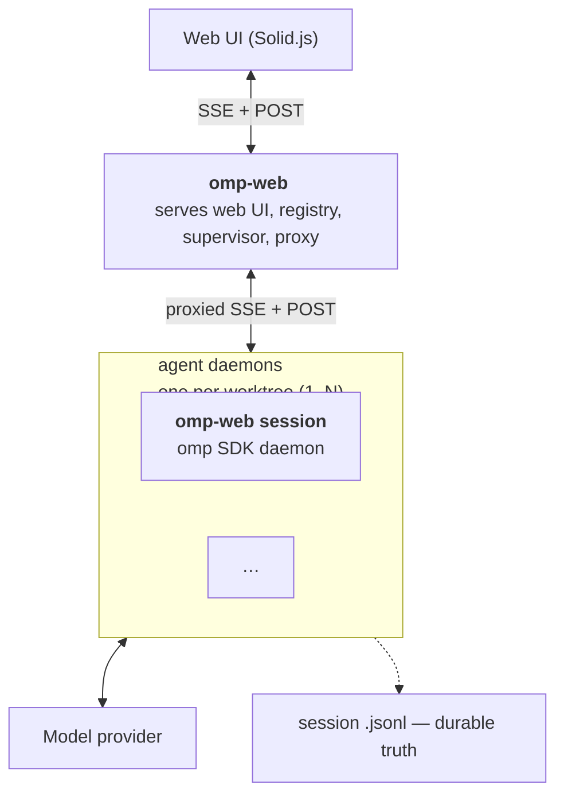

# omp-web

omp-web is a **web UI for running multiple oh-my-pi sessions, across all your repos and worktrees** — one installed command, one browser UI, N agent sessions.



## Features

- **Multiple Repos, Multiple Worktrees, Multiple Sessions, one UI.** Start, monitor, and chat with one agent daemon per worktree across every repo.
- **A full web UI, not a terminal wrapper.** Live-streamed responses, rendered markdown and diffs, tool output, slash commands, prompt history and autocomplete, per-session context/usage meters, and a transcripts/stats view.
- **Manage Repos and Worktrees from the UI** Register projects (deduped by realpath), create or adopt managed worktrees, and delete them safely — clean-tree-only, `git branch -d`, no `--force`.
- **CLI for automation** Spawn, stop, remove, inspect, and fan a prompt out to many daemons from the terminal — the same fleet the browser talks to.
- **Self-updating** `omp-web update` checks the release channel and reinstalls the latest version in one command.
- **Self-healing** Idle daemons exit after 30 minutes and are respawned on demand; crashed daemons restart with bounded backoff; dropped connections show `reconnecting` and browsers re-attach automatically.

## Runtime Modes

- **Fleet Mode** (`omp-web`) — starts the fleet (registry + supervisor + UI server); the browser talks to the fleet, manages repos and worktree state, and proxies you through to any daemon. 
- **Single Session Mode** (`omp-web session`) — the browser talks to one session daemon directly; the daemon serves the full single-session UI.
- **Sessions run as separate processes** — one worktree directory each, bound at spawn. A daemon hosts one live agent session in-process via the SDK — no child-process JSON-RPC hop — and serves the UI over SSE + POST.

## Architecture



Deep dive: [`docs/architecture.md`](docs/architecture.md) — wire contract, module map, security model.

## Requirements

- [Bun](https://bun.sh) (the runtime and the installer)
- The **`omp` CLI** with at least one provider and a default model configured — run `omp` and set it up in its `/settings` (or `omp login` for an OAuth provider). omp-web verifies this on first run and prompts fail until a model resolves.

## Install

```sh
git clone <this-repo> && cd omp-web
bun install
bun run install:omp-web       # build → pack → install into ~/.omp-web/install/
omp-web --version             # verify: prints <version>
```


## Usage

```sh
omp-web # start the fleet: registry + supervisor + UI
```

### Advanced

```sh
omp-web session [options]            # run a single-session agent daemon
omp-web sessions | projects          # roster / registered projects
omp-web spawn <path>                 # start a daemon on a directory
omp-web add-repo <path> [--start]    # register a project (deduped on realpath)
omp-web add-worktree <project> <name> [--no-start]      # create a managed worktree
omp-web add-worktree <project> --existing <path>        # adopt an existing one
omp-web stop <selector> | remove <selector>
omp-web rm-project <selector> | rm-worktree <daemon-id> [--delete-branch]
omp-web prompt <selector> <text> [--wait <ms>]
```

## Self-update

```sh
omp-web update                # check the release channel and reinstall the latest
omp-web update --check        # just report the newest version
omp-web update --version x.y.z   # pin a specific release
```

## Configuration and State

- Default data directory: `~/.omp-web/` 
- `config.json` (defaults, written only by the first-run offer)
- `fleet-state.json` (roster + registered projects, atomic writes, exclusive pidfile lock)
- `workspaces/` (managed worktrees, created lazily). Chosen at first run; config, state, and workspaces always live together under it.
- `<prefix>/install/` — the CLI code (default `~/.omp-web/install/`), independent of the data home.

## Environment variables
Fleet env overrides: `OMP_FLEET_PORT` (default 4722), `OMP_FLEET_STATE`, `OMP_FLEET_CONFIG`, `OMP_FLEET_WORKSPACE_DIR`, `OMP_FLEET_LOCAL_TEMPLATE` (dev). Daemon flags (`--cwd`, `--port`, `--host`, `--token`, `--resume`, `--idle-timeout`, …) map 1:1 to `OMP_SESSION_*` env vars.

## Behavior worth knowing

- **State locking.** One fleet per state file (a second `omp-web` exits 77); one daemon per session file (exit 1). Locks are pidfiles that self-heal after crashes.
- **Idle auto-exit.** Daemons shut down after 30m idle (no clients, no running agent); the fleet marks them `asleep` and respawns them on demand with `--resume`.
- **Health.** Daemons are restarted on-failure with bounded backoff; a dropped connection shows `reconnecting` and browsers re-attach on return. `OMP_PROTO` (2) gates fleet↔daemon drift.
- **Managed worktrees** can only be git-removed by omp-web if they live under `~/.omp-web/workspaces` and are clean — no `--force`, branch delete is `git branch -d` only. Adopted external worktrees are evict-only.

## Develop

```sh
bun install
bun run dev           # roster mode: vite (HMR) + fleet — ports chosen per run
bun run dev:single    # standalone: daemon (--watch) + vite — ports chosen per run
bun run dev:server    # just the daemon (--watch); bun run dev:web = just vite
bun run check:types   # tsgo (NOT tsc)
bun run lint          # oxlint (warnings don't fail)
bun run format        # oxfmt (TS/TSX only)
bun run test          # full suite; add a file filter: bun scripts/test.ts <file>
bun scripts/test-onboard.ts   # offline distribution E2E (install → serve → spawn → update)
```

Dev spawns are wired to the checkout via `OMP_FLEET_LOCAL_TEMPLATE` — no build needed for day-to-day work. Dev fleets scope their state per worktree (dev-fleets/<slug>-<hash8>/), so `bun run dev` in different worktrees coexists; same-worktree devs share the state lock.
