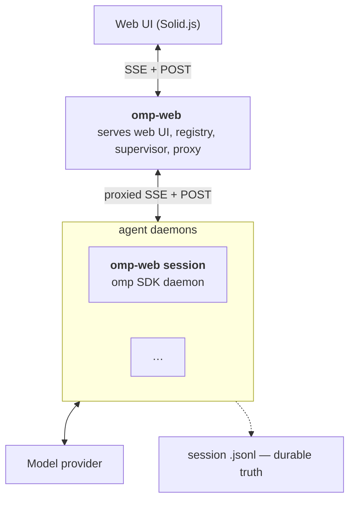

# omp-web

omp-web is a **web UI for running multiple oh-my-pi sessions, across all your repos and worktrees** — one installed command, one browser UI, N agent sessions.

omp-web has full control of the omp agent by using the SDK compared with other GUIs which use the RPC (which has no daemon control and limited subagent control).


> **⚠ Early-stage software.** omp-web is under active development and has sharp edges. Expect breaking changes between releases — the wire protocol, config/state formats, and UI are not yet stable. Session transcripts are durable `.jsonl` files, but the surrounding tooling (fleet state, config, managed worktrees) is still evolving; don't treat this as production data storage yet. Report issues and rough spots as you find them.

## Features

- **Multiple Repos, Multiple Worktrees, Multiple Sessions, one UI.** Start, monitor, and chat with one agent daemon per worktree across every repo.
- **A full web UI, not a terminal wrapper.** Live-streamed responses, rendered markdown and diffs, tool output, slash commands, prompt history and autocomplete, per-session context/usage meters, and a transcripts/stats view.
- **Custom wire protocol to support full SDK control** A significant advantage versus RPC based clients.
- **Manage Repos and Worktrees from the UI** Register projects (deduped by realpath), create or adopt managed worktrees, and delete them safely — clean-tree-only, `git branch -d`, no `--force`.
- **CLI for automation** Spawn, stop, remove, inspect, and fan a prompt out to many daemons from the terminal — the same fleet the browser talks to.
- **Self-updating** `omp-web update` checks the release channel and reinstalls the latest version in one command.
- **Self-healing** Idle daemons exit after 30 minutes and are respawned on demand; crashed daemons restart with bounded backoff; dropped connections show `reconnecting` and browsers re-attach automatically.

## Runtime Modes

- **Fleet Mode** (`omp-web`) — starts the fleet (registry + supervisor + UI server); the browser talks to the fleet, manages repos and worktree state, and proxies you through to any daemon.
- **Single Session Mode** (`omp-web session`) — the browser talks to one session daemon directly; the daemon serves the full single-session UI.
- **Sessions run as separate processes** — one worktree directory each, bound at spawn. A daemon hosts one live agent session in-process via the SDK — no child-process JSON-RPC hop — and serves the UI over SSE + POST.

## Architecture



Deep dive: [`docs/architecture.md`](docs/architecture.md) — wire contract, module map, security model.

## Requirements

- [Bun](https://bun.sh) (the runtime and the installer)
- The **`omp` CLI** with at least one provider and a default model configured — run `omp` and set it up in its `/settings` (or `omp login` for an OAuth provider). omp-web verifies this on first run and prompts fail until a model resolves.

## Install

```sh
# One-liner (bun-only; installs bun >= 1.3.14 if missing):
curl -fsSL https://raw.githubusercontent.com/nibblebot/omp-web/main/scripts/install.sh | sh
```

The installer downloads the latest release tarball, verifies its sha256 against the release manifest, and installs it into a pinned project dir (`~/.omp-web/install/`) with a `~/.bun/bin/omp-web` symlink — then `omp-web update` keeps it current.

## Verify:

```sh
omp-web --version
```

## Usage

```sh
omp-web                         # start the fleet: registry + supervisor + UI
```

## Self-update

```sh
omp-web update                  # check the release channel and reinstall the latest
omp-web update --check          # just report the newest version
omp-web update --version x.y.z  # pin a specific release
```

## Configuration and State

- Default data directory: `~/.omp-web/`
- `config.json` (defaults, written only by the first-run offer)
- `fleet-state.json` (roster + registered projects, atomic writes, exclusive pidfile lock)
- `workspaces/` (managed worktrees, created lazily). Chosen at first run; config, state, and workspaces always live together under it.

## Develop

```sh
bun install
bun dev      # roster mode: vite (HMR) + fleet — ports chosen per run
```

In a linked worktree, `bun dev` forks the dev fleet state from the main
worktree (copy-once, like a git fork), so the worktree's roster boots with the
main worktree's sessions/projects instead of empty; later runs keep the
diverged fork — delete the worktree's dev state file
(`~/.omp-web/dev-fleets/<worktree>-<hash8>/fleet-state.json`) to re-fork.
`--state-from <path>` forks from an explicit state file or directory; running
`bun dev` in the main worktree itself never self-seeds. `--fresh` skips all
seeding and starts on a clean state (removes the worktree's existing dev
state, so the roster boots empty); the next plain `bun dev` forks again.

## Advanced

```sh
omp-web session [options]            # run a single-session agent daemon
omp-web sessions | projects          # roster / registered projects
omp-web spawn <path>                 # start a daemon on a directory
omp-web add-repo <path> [--start]    # register a project (deduped on realpath)
omp-web add-worktree <project> <name> [--no-start]      # create a managed worktree
omp-web add-worktree <project> --existing <path>        # adopt an existing one
omp-web stop <selector> | remove <selector>
omp-web rm-project <selector> | rm-worktree <daemon-id> [--delete-branch]
omp-web prompt <selector> <text> [--wait <ms>]
```

## Manual install

Install from this repo (build → pack → install):

```sh
git clone <this-repo> && cd omp-web
bun install
bun run install:omp-web       # build → pack → install into ~/.omp-web/install/
omp-web --version             # verify: prints <version>
```
