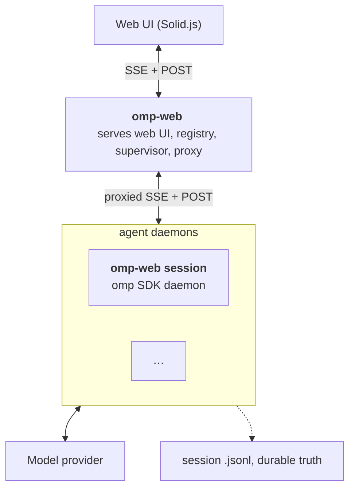

# omp-web

omp-web is a **web UI for running multiple oh-my-pi sessions, across all your repos and worktrees**: one installed command, one browser UI, N agent sessions.

Because it drives the agent through the SDK instead of the RPC, omp-web has full daemon and subagent control; RPC-based GUIs don't.


> **⚠ Early-stage software.** omp-web is under active development and has sharp edges. Expect breaking changes between releases: the wire protocol, config/state formats, and UI are not yet stable. Session transcripts are durable `.jsonl` files. The surrounding tooling (fleet state, config, and managed worktrees) is still evolving; don't treat this as production data storage yet. Report issues and rough spots as you find them.

## Features

- **Multiple Repos and Worktrees, one UI.** Start, monitor, and chat with one agent daemon per worktree across every repo.
- **A full web UI, not a terminal wrapper.** Live-streamed responses, rendered markdown and diffs, tool output, slash commands, prompt history and autocomplete, per-session context/usage meters, and a transcripts/stats view.
- **Custom wire protocol for full SDK control.** The SSE + POST contract carries the full SDK surface, including daemon and subagent control the RPC doesn't expose.
- **Manage repos and worktrees from the UI.** Register projects (deduped by realpath); create or adopt managed worktrees. Managed worktrees delete safely: clean-tree-only, `git branch -d`, no `--force`.
- **CLI for automation.** Spawn, stop, remove, inspect, and fan a prompt out to many daemons from the terminal, the same fleet the browser talks to.
- **Self-updating.** `omp-web update` checks GitHub Releases and installs a newer release when available.
- **Self-healing.** Idle daemons exit after 30 minutes by default and are respawned on demand; crashed daemons restart with bounded backoff; dropped connections show `reconnecting` and browsers re-attach automatically.

## Runtime

`omp-web` (bare, or `omp-web serve`) runs the fleet: registry, supervisor, and the web UI it serves on one port, loopback by default, proxying the browser through to whichever session daemon you select. `omp-web session` runs one session daemon (one process, one bound directory, one live agent session, wire API only, no web UI): the fleet spawns these by default with a local template, and you run one by hand on a remote host for the fleet to dial in. Non-loopback fleet service requires browser authentication; non-loopback session daemons require a token.

Session daemons are disposable processes; the durable truth is the session `.jsonl` transcript on disk.

## Architecture


```mermaid
flowchart TB
  browser["Web UI (Solid.js)"]
  fleet["<b>omp-web</b> <br/>serves web UI, registry, supervisor, proxy"]
  model["Model provider"]
  log["session .jsonl, durable truth"]

  subgraph daemons["agent daemons"]
    daemon1["<b>omp-web session</b> <br/>omp SDK daemon"]
    dots["…"]
  end

  browser <-->|"SSE + POST"| fleet
  fleet <-->|"proxied SSE + POST"| daemons
  daemons <--> model
  daemons -.-> log
```

See [`AGENTS.md`](AGENTS.md) for the engineering map, wire contract, and import, state, and security boundaries.

## Requirements

- [Bun](https://bun.sh) **1.3.14 or newer** (the runtime and installer). The one-line installer installs Bun when absent; upgrade an existing older installation first.
- The **`omp` CLI** with usable provider credentials and a default model configured: run `omp` to configure it, or `omp login` for an OAuth provider. An interactive first run with no fleet config checks this setup; missing setup warns but does not prevent the fleet from starting. Prompts need a usable model and credentials.

## Install

```sh
# One-liner (bun-only; installs bun >= 1.3.14 if missing):
curl -fsSL https://raw.githubusercontent.com/nibblebot/omp-web/main/scripts/install.sh | sh
```

The installer downloads the latest release tarball, verifies its sha256 against the release manifest, and installs it into a pinned project dir (`~/.omp-web/install/`) with a `~/.bun/bin/omp-web` symlink by default (or `$BUN_INSTALL/bin/omp-web`). Put that bin directory on `PATH`. Then `omp-web update` keeps it current.

## Verify

```sh
omp-web --version
```

Run `omp-web` to start the fleet and open its printed UI URL. Register a repository in the UI, start or select a session, and send a prompt. Local sessions use your ordinary SDK credentials.

## Self-update

```sh
omp-web update                          # install the latest release if newer
omp-web update --check                  # check for an update without installing
omp-web update --version x.y.z          # select a specific newer release
omp-web update --force --version x.y.z  # reinstall or downgrade to a specific release
```

`--version` selects a release for this invocation, not a durable pin; a future bare update still checks the latest release. Restart the running fleet after updating.

## Configuration and State

- Default data directory: `~/.omp-web/`
- `config.json`: fleet config, loaded read-only; only the interactive first-run offer and operator edits write it. Keys include `templates` (spawn commands), `workspaceDir`, `bind`, `browserAccessToken` (a sha-256 digest, not plaintext), `browserOrigin`, and `trustedProxies`. `OMP_FLEET_CONFIG` selects a different file. Flags such as `--bind`/`--browser-access-token` and env `OMP_FLEET_BIND`/`OMP_FLEET_BROWSER_TOKEN` override file keys; CLI/env browser tokens are plaintext inputs hashed in memory.
- `fleet-state.json`: roster and registered projects, with atomic writes and an exclusive lifetime pidfile lock. Defaults beside the selected config; `OMP_FLEET_STATE` selects another path.
- `workspaces/`: default managed-worktree root, created as needed or during accepted first-run setup. `--workspace-dir`, `OMP_FLEET_WORKSPACE_DIR`, or config `workspaceDir` select another root independently of config and state.
- `logs/` beside the state file: durable lineage-file mirrors streamed over enrolled callback pairs when the fleet log store is available. Default local/template daemons keep transcripts in their SDK session directory and are not automatically mirrored.

Interactive first run can choose a data home and write `config.json` there. If you choose a non-default location, set `OMP_FLEET_CONFIG` to that file for subsequent launches. Config, state, and workspace paths can be configured separately; installed code remains in its installation prefix.

## Develop

```sh
bun install
bun run dev                # Vite HMR + fleet; open the printed ui URL; no managed auth broker
```

Dev auto-opens the browser for interactive graphical local runs; `--open`/`--no-open` override this. Use the printed `ui` URL, not the fleet's potentially stale `dist/` UI. Restart dev-spawned daemons after server edits; they are not watched.

Source imports into `lib/` use extensionless `#lib/<path below lib/>`, such as `#lib/wire/protocol`, through root `package.json`'s imports mapping. Keep local imports such as `./helpers` relative. Shared libraries are closed: their repository imports stay inside `lib/`, with no library cycles, enforced by `bun run lint`.

In a linked worktree, `bun run dev` copy-once forks the main worktree's existing **dev** fleet state when available; otherwise it starts empty. Later runs keep the diverged roster. `--state-from <path>` seeds from an explicit state file or directory, while `--fresh` deletes this worktree's existing dev roster and skips seeding. Dev state lives outside the repo at `<data home>/dev-fleets/<slug>-<hash8>/` (worktree basename and sha-256 prefix of its realpath). Config and the managed-workspace root remain shared across dev stacks; a separate dev roster does not isolate workspace storage.

By default, development starts only the fleet and Vite, with no managed auth broker or automatic credential configuration. Production `omp-web` never manages broker startup. Local sessions use the user's ordinary SDK credentials.

## Advanced

```sh
omp-web session [options]            # run a single-session agent daemon
omp-web sessions                    # roster
omp-web projects                    # registered projects
omp-web spawn <path>                 # start a daemon on a directory
omp-web add-repo <path> [--start]    # register a project (deduped on realpath)
omp-web add <name> <url> [--token <t>] [--cwd <path>]   # register an external daemon
omp-web provision <name> [--label k=v]                  # enroll via the configured spawn hook
omp-web add-worktree <project> <name> [--no-start]      # create a managed worktree
omp-web add-worktree <project> --existing <path>        # adopt an existing one
omp-web stop <selector>
omp-web remove <selector>
omp-web rm-project <project>
omp-web rm-worktree <daemon-id> [--delete-branch]
omp-web prompt <selector> <text> [--wait <ms>]
```

`stop`, `remove`, and `prompt` selectors accept `all`, an exact daemon ID, `label:k=v` (also `tag:k=v`), `project:name`, or name globs with `*` and `?`; quote globs to prevent shell expansion. Project arguments accept a registered project ID, path/realpath, or basename. Control commands connect to loopback; `--port` or `OMP_FLEET_PORT` selects the fleet port (default 4722).

`prompt` submits without waiting unless `--wait <ms>` supplies a result timeout.

See [`CONTRIBUTING.md`](CONTRIBUTING.md) for the checks before a pull request and [`AGENTS.md`](AGENTS.md) for the full engineering map.

## Manual install

Install from this repo (build → pack → install):

```sh
git clone https://github.com/nibblebot/omp-web.git && cd omp-web
bun install
bun run install:omp-web       # build → pack → install into ~/.omp-web/install/
omp-web --version             # verify: prints <version>
```
