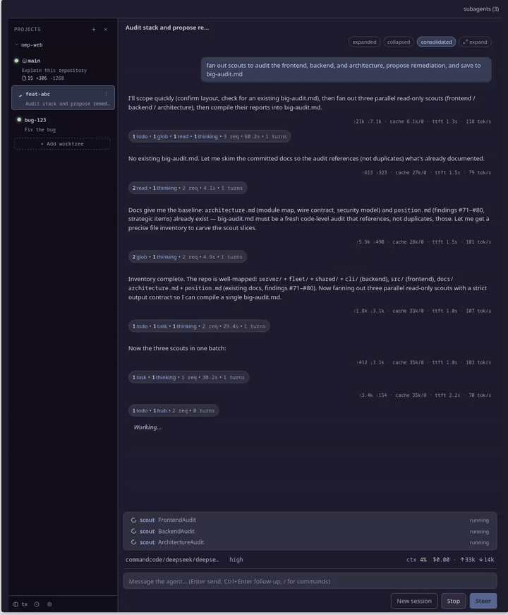
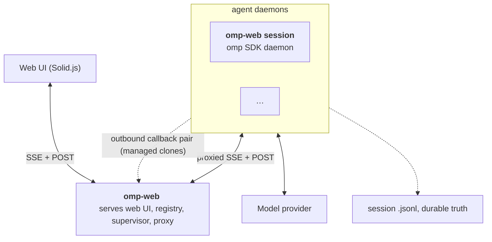

# omp-web

omp-web is a **web UI for running multiple oh-my-pi sessions, across all your repos, worktrees, and independent clone workspaces**: one installed command, one browser UI, N agent sessions.

Because it drives the agent through the SDK instead of the RPC, omp-web has full daemon and subagent control; RPC-based GUIs don't.




> **⚠ Early-stage software.** omp-web is under active development and has sharp edges. Expect breaking changes between releases: the wire protocol, config/state formats, and UI are not yet stable. Session transcripts are durable `.jsonl` files and the fleet mirrors them continuously, but the surrounding tooling (fleet state, config, managed worktrees, clone workspaces and their provider profiles) is still evolving; don't treat this as production data storage yet. Report issues and rough spots as you find them.

## Features

- **Multiple Repos, Worktrees, and Clones, one UI.** Start, monitor, and chat with one agent daemon per worktree or per independent clone workspace across every repo.
- **A full web UI, not a terminal wrapper.** Live-streamed responses, rendered markdown and diffs, tool output, slash commands, prompt history and autocomplete, per-session context/usage meters, and a transcripts/stats view.
- **Custom wire protocol for full SDK control.** The SSE + POST contract carries the full SDK surface, including daemon and subagent control the RPC doesn't expose.
- **Manage repos, worktrees, and clones from the UI.** Register projects (deduped by realpath); create or adopt managed worktrees; or create independent clone workspaces through a declared provider profile (sandboxed bwrap or Kubernetes). Managed worktrees delete safely: clean-tree-only, `git branch -d`, no `--force`. Clone workspaces delete only through the verified-deletion gate (see [Clone workspaces](docs/src/content/docs/fleet/clone-workspaces.md)); remove and worktree delete both route through that same gate for clone entries.
- **CLI for automation.** Spawn, stop, remove, inspect, and fan a prompt out to many daemons from the terminal, the same fleet the browser talks to.
- **Self-updating.** `omp-web update` checks the release channel and reinstalls the latest version in one command.
- **Self-healing.** Idle daemons exit after 30 minutes and are respawned on demand; crashed daemons restart with bounded backoff; dropped connections show `reconnecting` and browsers re-attach automatically. Clone workspaces add an explicit stop/wake lifecycle: stop preserves the workspace volume and session logs, wake re-provisions compute and resumes the last session (cold volumes materialize the transcript from the fleet store first).

## Runtime

`omp-web` (bare, or `omp-web serve`) runs the fleet: registry, supervisor, and the web UI it serves on one loopback port, proxying the browser through to whichever session daemon you select. `omp-web session` runs one session daemon (one process, one bound directory, one live agent session, wire API only, no web UI): the fleet spawns these by default with a local template, and you run one by hand on a remote host for the fleet to dial in.

Session daemons are disposable processes; the durable truth is the session `.jsonl` transcript on disk.

## Clone workspaces

Beyond local worktrees, omp-web can create **clone workspaces** managed by an external provider (sandboxed `bwrap`, or Kubernetes) declared in `~/.omp-web/config.json` under `providerProfiles`. A clone workspace runs in its own volume (`.checkout/` working clone with an independent object store, `.home/` private writable home whose `agent/sessions` tree holds the transcripts) with the session daemon inside, dialing the fleet over the outbound callback pair. Profiles carry operator-declared limits and secret references (names only cross trust boundaries). `omp-web preflight --profile <id>` validates a profile's executable, tools, secret references, and callback reachability before workspaces use it. The required streaming gateway/proxy and cluster prerequisites are operator setup, not something omp-web provisions; see [Sandboxed session runtime](docs/src/content/docs/advanced/sandbox-runtimes.md) and [`apps/session/image-README.md`](apps/session/image-README.md).

Clone workspace notes:

- **Stop and wake.** `stop` keeps the checkout and the session logs. `wake` re-provisions compute and resumes the last session; a cold volume (or missing transcript) is materialized byte-identical from the fleet store before the resume path runs, and an explicit session pick on a ready clone switches to that real session rather than booting fresh.
- **Deletion is verified.** Deleting a clone workspace runs the verify-at-deletion gate (quiesce, Git guard, store completeness, read-only flip) before any provider or volume deletion; a blocked deletion keeps the workspace, volume, and logs.
- **Session logs are not the workspace.** Transcripts never contain working-tree files; uncommitted work in a clone is not recoverable from them.
- **Runtime distribution.** The fleet ships the provider executables and a reproducible session-runtime image definition; provider runtimes must be installed and preflighted per host. Isolation limits are honest ones: bwrap and Kubernetes sandboxes share the host kernel, and model/tool credentials reach the sandbox as environment values that a sandboxed process can read. See the [Security model](docs/src/content/docs/operations/security.md).

> **Status of runtime claims.** omp-web does not yet claim production-grade proof for the clone runtime: real Kubernetes lifecycle evidence (no operator cluster) and production same-origin TLS gateway + streaming-proxy failure/recovery evidence (not provisioned) are pending operator setup, as are the multi-runtime/fairness load dimensions. The streaming callback path itself works over explicit loopback HTTP (developer default) with HTTPS required elsewhere, and clone workspaces need a real provider profile: the default fleet has none, so clone routes fail with a typed `unavailable` until one is configured.

## Architecture


```mermaid
flowchart TB
  browser["Web UI (Solid.js)"]
  fleet["<b>omp-web</b> <br/>serves web UI, registry, supervisor, proxy"]
  model["Model provider"]
  log["session .jsonl, durable truth"]

  subgraph daemons["agent daemons"]
    daemon1["<b>omp-web session</b> <br/>omp SDK daemon"]
    dots["…"]
  end

  browser <-->|"SSE + POST"| fleet
  fleet <-->|"proxied SSE + POST"| daemons
  daemons -.->|"outbound callback pair (managed clones)"| fleet
  daemons <--> model
  daemons -.-> log
```

See [System architecture](docs/src/content/docs/advanced/architecture.md) for an overview of the runtime, conceptual wire model, and import, state, and security boundaries.

## Requirements

- [Bun](https://bun.sh) (the runtime and the installer)
- The **`omp` CLI** with at least one provider and a default model configured: run `omp` and set it up in its `/settings` (or `omp login` for an OAuth provider). omp-web verifies this on first run and prompts fail until a model resolves.

## Install

```sh
# One-liner (bun-only; installs bun >= 1.3.14 if missing):
curl -fsSL https://raw.githubusercontent.com/nibblebot/omp-web/main/scripts/install.sh | sh
```

The installer downloads the latest release tarball, verifies its sha256 against the release manifest, and installs it into a pinned project dir (`~/.omp-web/install/`) with a `~/.bun/bin/omp-web` symlink. Then `omp-web update` keeps it current.

## Verify

```sh
omp-web --version
```

## Documentation

Full user documentation lives under [`docs/src/content/docs/`](docs/src/content/docs/) and builds as a Starlight site (`bun install && bun run dev:docs`).

- [What is omp-web?](docs/src/content/docs/getting-started/overview.md) and [Installation](docs/src/content/docs/getting-started/installation.md): the product model and prerequisites.
- [First run](docs/src/content/docs/getting-started/first-run.md) and [Start your first session](docs/src/content/docs/getting-started/start-first-session.md): from an empty fleet to your first prompt.
- [Core concepts](docs/src/content/docs/concepts/projects-worktrees-session-daemons-sessions.md): projects, worktrees, session daemons, and sessions.
- [Fleet management](docs/src/content/docs/fleet/sidebar.md) and [Analysis](docs/src/content/docs/analysis/transcripts.md): the roster and the historical browser.
- [CLI commands and flags](docs/src/content/docs/reference/cli.md), [Configuration schema](docs/src/content/docs/reference/configuration.md), [Environment variables](docs/src/content/docs/reference/environment.md), and [Files and directories](docs/src/content/docs/reference/files.md): the canonical references.
- [Troubleshooting](docs/src/content/docs/operations/troubleshooting.md) and [Security model](docs/src/content/docs/operations/security.md): failure handling and trust boundaries.
- [Clone workspaces](docs/src/content/docs/fleet/clone-workspaces.md), [Provider profiles](docs/src/content/docs/configuration/provider-profiles.md), and [Sandboxed session runtime](docs/src/content/docs/advanced/sandbox-runtimes.md): the clone runtime and its provider configuration.
- [Stored sessions](docs/src/content/docs/analysis/stored-sessions.md) and [Browser access and sign-in](docs/src/content/docs/operations/browser-auth.md): fleet-store history browsing and non-loopback sign-in.
- [System architecture](docs/src/content/docs/advanced/architecture.md): runtime overview, conceptual wire model, and import, state, and security boundaries for contributors.

## Self-update

```sh
omp-web update                  # check the release channel and reinstall the latest
omp-web update --check          # just report the newest version
omp-web update --version x.y.z  # pin a specific release
```

## Configuration and State

- Default data directory: `~/.omp-web/`
- `config.json` (fleet config; defaults are loaded read-only, and the file is written only by the first-run offer and by operator edits). Keys include `templates` (spawn command templates), `workspaceDir` (managed worktrees root), `bind`, `browserAccessToken` (stored only as its sha-256 digest), `browserOrigin`, `trustedProxies`, and `providerProfiles` (clone provider profiles; see Clone workspaces). Env `OMP_FLEET_CONFIG` selects a different config file; flags such as `--bind`/`--browser-access-token` and env `OMP_FLEET_BIND`/`OMP_FLEET_BROWSER_TOKEN` override the file keys.
- `fleet-state.json` (roster + registered projects + clone workspace records, atomic writes, exclusive pidfile lock)
- `workspaces/` (managed worktrees, created lazily). Chosen at first run; config, state, and workspaces always live together under it.
- `logs/` under the fleet state dir (the fleet log store): a durable mirror of the session lineage logs streamed by every managed daemon. Store layout is `logs/<workspaceId>/<sessionId>/<relpath>` plus a per-session `index.json`. Retention is explicit and manual: nothing is garbage-collected automatically. A workspace deleted without passing the verification gate leaves its store subtree as an orphan, listed by `GET /ctl/logs/orphans` and removed only by `POST /ctl/logs/purge {workspaceId}`; verified (read-only) store data is kept unless the operator purges it manually. Read-only history browsing never wakes compute; a deleted workspace's sessions are view-only, and resuming one onto a fresh clone is the explicit `POST /ctl/workspaces/:id/resume-clone` action.

## Develop

```sh
bun install
bun run dev                # vite (HMR) + fleet, stable per-worktree UI port, opens the UI in your browser; no managed auth broker
bun run dev --auth-broker  # opt into adopting or spawning an auth broker for clone sandboxes
```

Source imports into `lib/` use extensionless `#lib/<path below lib/>`, such as `#lib/wire/protocol`, through root `package.json`'s imports mapping. Keep local imports such as `./helpers` relative. Shared libraries are closed: their repository imports stay inside `lib/`, with no library cycles, enforced by `bun run lint`.

In a linked worktree, `bun run dev` forks the dev fleet state from the main worktree (copy-once, like a git fork), so the worktree's roster boots with the main worktree's sessions/projects instead of empty; later runs keep the diverged fork. `--state-from <path>` forks from an explicit state file or directory, and `--fresh` skips seeding and starts on a clean state. Dev fleet state is scoped per worktree outside the repo at `<data home>/dev-fleets/<slug>-<hash8>/` (slug is the worktree basename, `hash8` the sha-256 prefix of its realpath), so several dev stacks and your real fleet coexist.

By default, development starts only the fleet and Vite, with no broker token creation, authenticated probe, adoption, spawn, restart, or automatic broker environment export. `bun run dev --auth-broker` explicitly opts into adopting an authenticated broker on loopback or spawning `omp auth-broker serve` as a restartable child, then exporting `OMP_AUTH_BROKER_URL`/`OMP_AUTH_BROKER_TOKEN` for clone profile `secretRefs` using `env:` references. Broker setup failures warn and let the stack continue; sandboxes that need broker-borrowed credentials cannot resolve them without another explicit credential source.

Production `omp-web` never manages broker startup. Local sessions use the user's ordinary SDK credentials; isolated clone sandboxes need explicitly configured credentials or an operator-run broker exposed through their profile's `secretRefs`. Explicitly supplied `OMP_AUTH_BROKER_URL`/`OMP_AUTH_BROKER_TOKEN` and existing profile `secretRefs` remain opt-in configuration and are inherited by the default dev stack without being replaced.

## Advanced

```sh
omp-web session [options]            # run a single-session agent daemon
omp-web sessions | projects | profiles   # roster / projects / provider profiles
omp-web spawn <path>                 # start a daemon on a directory
omp-web add-repo <path> [--start]    # register a project (deduped on realpath)
omp-web add <name> <url> [--token <t>] [--cwd <path>]   # register an external daemon
omp-web provision <name> [--label k=v]                  # enroll via the configured spawn hook
omp-web add-worktree <project> <name> [--no-start]      # create a managed worktree
omp-web add-worktree <project> --existing <path>        # adopt an existing one
omp-web add-clone <project> <name> --profile <id> [--local <path> | --remote <url>] [--revision <rev>] [--branch <b>] [--no-start]
omp-web preflight --profile <id>     # validate a provider profile locally
omp-web start <selector>             # ensure a clone workspace is running (wake)
omp-web stop <selector> | remove <selector>
omp-web rm-project <selector> | rm-worktree <daemon-id> [--delete-branch]
omp-web prompt <selector> <text> [--wait <ms>]
```

See [`CONTRIBUTING.md`](CONTRIBUTING.md) for the checks before a pull request and [`AGENTS.md`](AGENTS.md) for the full engineering map.

## Manual install

Install from this repo (build → pack → install):

```sh
git clone <this-repo> && cd omp-web
bun install
bun run install:omp-web       # build → pack → install into ~/.omp-web/install/
omp-web --version             # verify: prints <version>
```
