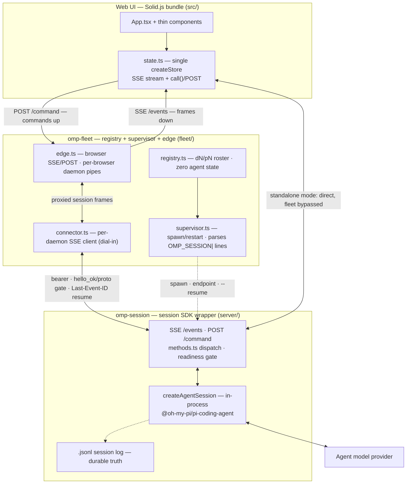

# omp-web — System architecture

Overall architecture for omp-session + omp-fleet. Product positioning lives in [`position.md`](position.md); per-command usage is in the [README](../README.md).

## Topology

```
browser (Solid, one app, two modes)
   ⇄ SSE/POST ⇄ omp-session (standalone: full single-session UI)
   ⇄ SSE/POST ⇄ omp-fleet (roster mode) ⇄ per-browser proxied SSE/POST ⇄ omp-session …
                                      ⇄ control SSE/POST ⇄ omp-session …  (remote: ssh -L / tailnet / direct)
```

One web app, two modes. Standalone: the browser talks to one omp-session daemon directly. Roster: the browser talks to omp-fleet's edge, which proxies each attached browser through to the selected daemon.

## Architecture diagram



## Layers and import discipline

Strictly leaf-ward layering, verified across the tree:

- **`shared/`** — the leaf: `protocol.ts` (wire contract) and `sse.ts` (SSE codec + ring). Imports nothing in the repo.
- **`server/`** — the omp-session daemon. Imports from `shared/` only.
- **`fleet/`** — the omp-fleet supervisor/registry/edge. Imports from `shared/` only; never from `server/`.
- **`src/`** — the Solid browser client. Imports from `shared/` only; imports neither backend layer.

fleet↔session coupling is exactly one wire-contract file plus one SSE codec, with `OMP_PROTO` gating drift at hello.

## The wire contract (`shared/protocol.ts`, OMP_PROTO 2)

- **Transport:** `GET /events` (SSE, server→client, all frames) + `POST /command` (client→server, one `ClientCommand` per request, `202` accept). Answers ride the SSE stream only — one answer channel. No WebSocket on the agent-driving path; WS remains solely on the collab relay.
- **Priming sequence** on every `/events` open: `hello_ok` → `attached` → `history` → `state` → `collab_status` → `available_commands` → `ready`. Connect implies attached.
- **Resume:** daemon-global monotonic delta seqs; a bounded ring (10k entries) replays deltas past `Last-Event-ID`. Priming is fresh and current, so stale clients skip replay. Consumers dedup by id (`call_result` resolves only a pending call).
- **Keepalive:** id-less `ping` events (never advancing resume counters); consumers treat >2× the ping interval of silence as a dead peer and reconnect.
- **Backpressure:** a stream whose enqueue would exceed 4 MiB is terminated with an error — drop-and-resume: the consumer redials with `Last-Event-ID` and the ring covers the gap.
- **Idempotency:** POST commands dedup by client-supplied id within a bounded window; duplicates get another `202`.
- **Evolution rule:** additive changes only. `OMP_PROTO` (currently 2) must bump on any breaking change to the handshake or frame shapes.
- **Project/worktree onboarding (additive):** new `ClientCommand` variants `add_project` (`{path, start?, template?, labels?}`), `remove_project` (`{projectId}`), `create_worktree` (`{projectId, name, baseRef?, existingBranch?, start?}`), `add_worktree` (`{projectId, worktreePath, start?}`), `delete_worktree` (`{daemonId, deleteBranch?}`) and `worktree_delete_info` (`{daemonId}`) — plus `list_project_branches` (`{projectId}`), the add-worktree branch picker's feed — the edge answers them in-process (shared registry/supervisor/worktrees module) and its fail-closed command allowlist grew with them; the parallel `/ctl` routes serve the CLI/API. New fleet-scoped frames: `registered_projects` (broadcast; lets project groups with zero daemons render) and unicast `worktree_delete_info` (owned/dirty counts/branch merge+push evidence for the delete confirmation — never tokens/endpoints) and `project_branches` (the project's local branches with checked-out state). `DaemonEntry` gains optional `projectId` and `managed` fields (absent for remote entries and older edges).
- **Spawn contract (R6b):** omp-session prints `OMP_SESSION|{"event":"listening",…}` on **stdout** immediately after bind, before session creation, so a spawner learns the endpoint early. The advertised `url` is `ws://`-shaped for legacy reasons; consumers normalize via `daemonHttpBase` (ws→http, wss→https, strip path). A remote wrapper may print a later `{"event":"endpoint"}` line when the reachable address differs from the bind.

## omp-session daemon (`server/`)

One process, one bound cwd (immutable), one live in-process SDK session (`createAgentSession` — no child process, no JSON-RPC hop). Sequential session *replacement* (`newSession`, `switchSession`, `branch`, `fork`, `handoff`, `compact`, `retry`, `freshSession`); concurrency lives one layer up in omp-fleet. Disk `.jsonl` logs make the daemon disposable: respawn with `--resume` and the transcript is back.

Module map (split along the seams identified in the 2026-08 audit):

- `index.ts` — boot, HTTP routing, dispatch wiring, readiness gate, idle auto-exit, signal/shutdown, static UI serving (`embedded-dist.ts`), bearer auth (R14: loopback exempt, off-loopback hard-requires `--token`), `/download` realpath jail.
- `methods.ts` — the `WebMethodName` dispatch table.
- `sse-delivery.ts` — stream registry, ring, broadcast, backpressure termination.
- `ui-context.ts` — `ui_request`/`ui_response`/`ui_request_end` dialog relay (ExtensionUIContext), incl. collab fallthrough.
- `subagent-mirror.ts` — subagent lifecycle/progress mirror + byte-offset transcript reader; steer/abort.
- `daemon-broker.ts` — the omp hub daemon-broker polling/control client behind the ActiveDaemons panel.
- `session-entry.ts`, `settings-model.ts`, `config.ts` — session state snapshots, settings model + side effects, flag/env parsing.
- `collab-host.ts`, `collab-relay.ts`, `collab-session.ts`, `collab-cli.ts` — the collab room machinery (see below).

Lifecycle gates: a **boot gate** preserves connect-implies-attached for streams that race session creation; a **readiness gate** fails prompt-family calls with `not_ready` until provider/model/auth resolution completes and the daemon broadcasts `ready`. **Idle exit:** with no attached clients, running agent/queue, in-flight bash/eval, open dialog, or live collab room, the daemon exits cleanly after the idle timeout — the `.jsonl` is already durable.

## omp-fleet (`fleet/`)

Holds the registry of N daemons and zero SDK state — all agent truth lives in the omp-session processes and their `.jsonl` logs.

- `registry.ts` — JSON persistence (atomic tmp+rename on every mutation) to `~/.ompweb/fleet/state.json` (env `OMP_FLEET_STATE`), monotonic `dN` id allocation floored above the max id found on disk, boot-time status reconciliation, and the first-class `projects[]` (`pN` monotonic ids, realpath-keyed, deduped on registration — a duplicate realpath returns the existing project; `removeProject` refuses while any roster entry references it and names the blockers; never touches disk). Projects persist in the same atomic state file; project-set mutations fire a dedicated `onProjectsChange` hook (edge → `registered_projects` broadcast). Roster serialization (`toRosterEntry`) structurally strips token/endpoint/template before anything reaches a browser.
- `discovery.ts` — project discovery: roots one level deep, git repos + worktrees.
- `worktrees.ts` — managed-worktree path mapping + lifecycle. Layout: `<workspaceDir>/<repo-basename>/<slug(name)>` under the `workspaceDir` knob (env `OMP_FLEET_WORKSPACE_DIR`, flag `--workspace-dir`, config-file key, default `~/ompweb/workspaces`; created lazily on first worktree, never at boot); a repo-basename collision gets a `-<sha1-prefix>` suffix via the `<basename>/.ompweb-repo` ownership marker. Lifecycle: `resolveBaseRef` (`git symbolic-ref refs/remotes/origin/HEAD` → local default branch → current HEAD, no fetch), `createWorktree` (branch = slugified name, or attach an existing not-checked-out branch; refuses an existing target dir or a checked-out branch), `listProjectBranches` (local branches + checked-out state via for-each-ref/worktree-list — feeds the branch picker), `listUnregisteredWorktrees` (linked worktrees minus registered — feeds the Add-existing tab), `worktreeDeleteInfo` (owned/dirty + branch merge/push evidence) and `deleteWorktree` (ownership = realpath under `workspaceDir`, clean-only — dirty refuses, no `--force`; optional `git branch -d`, never `-D`), plus `registerWorktreeEntry` (roster entry `mode: "spawned"` tagged `projectId`/`worktreeOf`, optional spawn).
- `supervisor.ts` + `spawn-parse.ts` — spawns children from **command templates** (never a hardcoded launch method): `{cwd}`/`{token}`/`{name}`/`{labels}`/`{resume}` substitution is shell-escaped; child stdout is parsed for `OMP_SESSION|` lines; endpoint resolution precedence is wrapper `endpoint` line › template `host` + port › `advertise` › loopback, with a 30s resolution timeout. Fresh 32-byte token per spawn attempt; respawn is serialized per daemon (mutex) with `--resume`; restart-on-failure with a bounded, window-based budget; SIGTERM→SIGKILL escalation; intentional-stop/manual-respawn flags so expected deaths don't trigger restarts.
- `connector.ts` — dials each daemon (dial-in only; daemons never dial out) with bearer auth, verifies `hello_ok.cwd` against the registry entry and `OMP_PROTO` against the local version before the daemon is drivable, keeps liveness via the SSE silence deadline, and redials with `Last-Event-ID` + jittered exponential backoff. `retain`/`release` arms an idle-drop so unused control sockets close and the daemon's own idle timer can fire.
- `edge.ts` — the browser surface: browser SSE + POST, per-browser daemon pipes and rings (one slow browser is dropped and resumed without stalling others), `sessionId` stamping on all session-scoped frames (guards cross-daemon contamination on session switch), a waking-set serializing spawn-resume vs attach, and fail-closed command/frame allowlists kept exhaustiveness-safe against the protocol union at compile time (the allowlist gained the project/worktree onboarding commands).
- `fanout.ts` + `selectors.ts` — `dN` / `all` / glob / `label:k=v` / `project:name` selectors and fan-out prompting with per-turn correlation on each target's `agent_end`.
- `server.ts` + `cli.ts` — loopback control API and the `omp-fleet` CLI; `daemons-aggregator.ts` — the aggregated daemons panel feed. Control-plane routes added by onboarding: `GET /ctl/projects` → `{ projects: ProjectEntry[], registered: RegisteredProject[] }` (discovery stays ephemeral + read-only; the registered set is merged alongside), `POST /ctl/projects` `{path, start?, template?, labels?}` → `201 {project, entry?}` | `400` bad path | `409` dedup (already registered), `DELETE /ctl/projects/:projectId` → `200 {removed}` | `409` naming referencing daemons | `404`, `POST /ctl/projects/:id/worktrees` (create-new `{name, baseRef?, existingBranch?, start?}` | add-existing `{worktreePath, start?}`) → `201 {entry}`, `GET /ctl/worktrees/:daemonId/delete-info` → guard-evidence payload (never deletes), `DELETE /ctl/worktrees/:daemonId` `{deleteBranch?}` → stop → evict → `git worktree remove`; ownership + dirty guards run BEFORE any mutation (`403` unowned / `409` dirty — no `--force`), and transcripts live under the agent dir, never inside the worktree.

## Browser client (`src/`)

One Solid app. `state.ts` is the store: chat items, streaming, session-state mirror, roster state, `call()` helper over POST, reconnect with backoff, and a stale-frame guard keyed on the stamped `sessionId` so frames from a previously attached daemon are never applied to the current view. `App.tsx` holds exactly one mode branch (the DaemonSidebar); everything else — subagent drill-down, settings, export, pickers, login, `/btw`, goal, usage — works identically in both modes.

## State ownership

The SDK session and its `.jsonl` log are the single agent truth. The fleet registry only mirrors defined wire points (cwd from validated hello, sessionFile from hello/state frames, readyAt from the ready frame). The client resets its per-session view on every attach. Nothing assumes process permanence: daemons are disposable by design.

## Security model

- **Dial-in only:** omp-fleet initiates every connection; omp-session never dials out and has no `--fleet` flag. A sandbox image knows nothing of the external world; egress may be denied entirely.
- **Per-daemon bearer tokens** minted at spawn; a leaked token gates that one daemon only. Loopback exempt; off-loopback requires the token plus a secure transport (ssh `-L`, tailnet, or own TLS).
- **Roster hygiene:** tokens/endpoints/templates never serialize into roster frames.
- **Egress:** `/download` is realpath-jailed to the bound cwd + tmpdir + session dirs — the only file-egress path; `list_files` never escapes the cwd.

## Collab (the WebSocket exception)

Collab rooms are the one remaining WS surface: an E2E-encrypted relay (`/r/<roomId>`) owned by `@oh-my-pi/pi-coding-agent/collab`, shared with the TUI collab mux — deliberately untouched by the SSE migration. Hosts create rooms off-loopback only with the daemon token; guests join with the room key from a shareable link (no account). Rooms are capped (`OMP_SESSION_COLLAB_MAX_ROOMS`, default 256; guests 64). There is no collab surface in the web UI by design — rooms are hosted and joined from the CLI/TUI.
