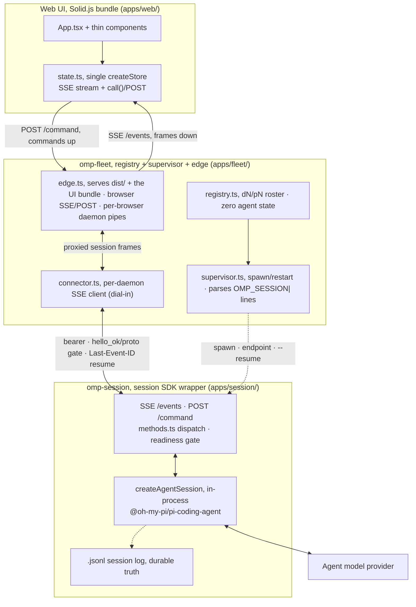

# omp-web: System architecture

Overall architecture for omp-session + omp-fleet. Product positioning lives in [`PRODUCT.md`](../PRODUCT.md); per-command usage is in the [README](../README.md); user-facing documentation lives under [`docs/src/content/docs/`](src/content/docs/).

## Topology

```
browser (Solid, one app, served by the fleet)
   ⇄ SSE/POST ⇄ omp-fleet (registry + supervisor + edge, serves the UI)
                  ⇄ per-browser proxied SSE/POST ⇄ omp-session …  (local children, or remote: ssh -L / tailnet / direct)
                  ⇄ control SSE/POST ⇄ omp-session …             (dial-in, idle-drop control sockets)
                  ⇄ HTTPS callback pair ⇄ omp-session …          (managed clone workspaces: no inbound service, the sandboxed daemon dials the fleet outbound)
```

One web app, and the fleet is its only server. The browser talks to omp-fleet's edge, which proxies each attached browser through to the selected session daemon. A session daemon serves the wire API only (no HTML); pointed at one directly, the client sets `state.fleetRequired` and shows the fleet-required notice. Managed clone workspaces add a hop of their own: the sandboxed omp-session has no inbound service and dials the fleet's callback pair outbound (see Managed clone workspaces). The fleet itself binds loopback by default and is made reachable by explicit operator transport: ssh -L/tailnet for ad-hoc remote, or a same-origin TLS gateway/reverse proxy (with `--trusted-proxy` listing) for production streaming; plain-HTTP loopback is the explicit developer exception, never a production deployment.

## Architecture diagram


```mermaid
flowchart TB
  subgraph web["Web UI, Solid.js bundle (apps/web/)"]
    store["state.ts, single createStore<br/>SSE stream + call()/POST"]
    ui["App.tsx + thin components"]
  end

  subgraph fleet["omp-fleet, registry + supervisor + edge (apps/fleet/)"]
    edge["edge.ts, serves dist/ + the UI bundle · browser SSE/POST · per-browser daemon pipes"]
    conn["connector.ts, per-daemon SSE client (dial-in)"]
    super["supervisor.ts, spawn/restart · parses OMP_SESSION| lines"]
    reg["registry.ts, dN/pN roster · zero agent state"]
  end

  subgraph sdk["omp-session, session SDK wrapper (apps/session/)"]
    daemon["SSE /events · POST /command<br/>methods.ts dispatch · readiness gate"]
    wrap["createAgentSession, in-process<br/>@oh-my-pi/pi-coding-agent"]
    log[".jsonl session log, durable truth"]
  end

  model["Agent model provider"]

  ui --> store
  store -->|"POST /command, commands up"| edge
  edge -->|"SSE /events, frames down"| store
  edge <-->|"proxied session frames"| conn
  conn <-->|"bearer · hello_ok/proto gate · Last-Event-ID resume"| daemon
  super -. "spawn · endpoint · --resume" .-> daemon
  reg --> super
  daemon <--> wrap
  wrap <--> model
  wrap -.-> log
```

## Layers and import discipline

Strictly leaf-ward layering, verified across the tree:

- **`lib/`**: the closed leaf layer (`wire`, `platform`, `runtime`, `session-files`, `sdk-settings`, `testkit`). Every repository-local import inside `lib/` must resolve to another `lib/` file, enforced by `scripts/check-lib-boundary.ts` (run as the first half of `bun run lint`) across imports, re-exports, type-only edges, and dynamic imports; library cycles fail too. Bun/Node built-ins and npm packages stay unrestricted.
- **`apps/`**: the four applications. `apps/session/` is the omp-session daemon, `apps/fleet/` the omp-fleet supervisor/registry/edge, `apps/cli/` the installed entrypoints, `apps/web/` the Solid browser client. Apps import `lib/` freely and do not import each other; `apps/web/` imports repository code from `lib/wire` only, and its SDK references are type-only.
- **`e2e/`, `scripts/`, `docs/`**: orchestration and tooling consumers that may import any app or library surface (`e2e/onboarding.ts` and the release scripts do).

fleet↔session coupling is exactly the wire-contract library (`lib/wire/protocol.ts`) plus the SSE codec (`lib/wire/sse.ts`), with `OMP_PROTO` gating drift at hello; there is no app-to-app source import.

## The wire contract (`lib/wire/protocol.ts`, OMP_PROTO 2)

- **Transport:** `GET /events` (SSE, server→client, all frames) + `POST /command` (client→server, one `ClientCommand` per request, `202` accept). Answers ride the SSE stream only: one answer channel. No WebSocket on the agent-driving path; WS remains solely on the collab relay.
- **Priming sequence** on every daemon `/events` open: `hello_ok` → `attached` → `history` → `state` → `collab_status` → `available_commands` → `ready`. Connect implies attached. The fleet edge's own browser streams prime with `roster` + merged `daemons` + `registered_projects` (+ `daemon_activity` for ready daemons) and then proxy the attached daemon's priming down the per-browser pipe.
- **Resume:** daemon-global monotonic delta seqs; a bounded ring (10k entries) replays deltas past `Last-Event-ID`. A reconnect whose seq still sits inside the ring window replays the recorded deltas strictly after that seq (never a silent re-prime); a ring miss (the window was evicted) falls back to a fresh prime/resync, never a partial replay. Priming is fresh and current, so stale clients skip replay. Consumers dedup by id (`call_result` resolves only a pending call).
- **Keepalive:** id-less `ping` events (never advancing resume counters); consumers treat >2× the ping interval of silence as a dead peer and reconnect.
- **Backpressure:** a stream whose enqueue would exceed 4 MiB is terminated with an error: drop-and-resume, the consumer redials with `Last-Event-ID` and the ring covers the gap.
- **Idempotency:** POST commands dedup by client-supplied id within a bounded window; duplicates get another `202`. The client re-POSTs an unanswered call's exact id on a 5s cadence (stopping once past the dedup window), so a lost `call_result` is recovered by the daemon's recorded answer instead of hanging until the caller's deadline. Because that memory is per daemon process, the edge keys each forwarded id to three proofs of the process (the pipe's `hello_ok.pid`, the endpoint, and the per-spawn bearer token) and REFUSES a replay that disagrees on any of them (an id-keyed error answer naming the axis, never a second execution); same-process redials forward as before, and only DELIVERED origin records are cap-evictable so an outstanding id is never forgotten while the client may still replay it.
- **Evolution rule:** additive changes only. `OMP_PROTO` (currently 2) must bump on any breaking change to the handshake or frame shapes.
- **Project/worktree onboarding (additive):** new project/worktree/branch `ClientCommand` variants, full shapes in `lib/wire/protocol.ts`, which the edge answers in-process via the shared registry/supervisor/worktrees module, its fail-closed command allowlist growing with them; parallel `/ctl` routes serve the CLI/API. New fleet-scoped frames: `registered_projects` (broadcast; lets project groups with zero daemons render), `daemon_activity`, and `daemon_sessions`. `DaemonEntry` gains optional `projectId` and `managed` fields (absent for remote entries and older edges).
- **Real-time daemon activity (additive, fleet-scoped):** `daemon_activity` `{daemonId, streaming, blocked}`, edge-generated from the per-daemon control-tap (state → isStreaming; ui_request/ui_request_end → the open-dialog set), broadcast on change and primed once per known ready daemon on stream open; never carries a sessionId and is stripped from proxy pipes like `daemons` rosters. While any browser stream is open, the edge retains+dials every ready daemon so activity stays live: that retention counts as an attached client and suspends those daemons' idle auto-exit until the last browser disconnects, then releases and the normal 60s idle-drop resumes. Never carries tokens/endpoints.
- **Roster session dropdown (additive, fleet-scoped):** clicking a roster row opens a per-worktree session picker, `list_daemon_sessions` `{daemonId}` (edge-handled) listed from disk via the SDK's `SessionManager` (new `apps/fleet/daemon-sessions.ts`, lazy import so the fleet stays SDK-free at static load) and answered with unicast `daemon_sessions` `{daemonId, sessions}` (newest-first, ≤10, not ringed, re-POSTed like `projects`), so asleep/never-started daemons answer too. Resuming a picked session: `spawn_resume` gains optional `sessionFile` (edge validates membership against the same listing before `--resume <file>`), and ready daemons use attach+`switchSession`. `DaemonEntry` gains optional `sessionEmpty` (probed like `sessionTitle` from the last session file: missing or messageless = empty), the row renders a bare "New session" title instead of nothing.
- **Spawn contract (R6b):** omp-session prints `OMP_SESSION|{"event":"listening",…}` on **stdout** immediately after bind, before session creation, so a spawner learns the endpoint early. The advertised `url` is `ws://`-shaped for legacy reasons; consumers normalize via `daemonHttpBase` (ws→http, wss→https, strip path). A remote wrapper may print a later `{"event":"endpoint"}` line when the reachable address differs from the bind.
- **Managed-clone callback transport (`OMP_CALLBACK_PROTO = 1`, separately versioned):** every fleet-managed daemon (clone workspaces, plus unsandboxed worktrees and default workspaces) continuously tails its full session lineage subtree and streams raw bytes to the fleet over a daemon-initiated callback pair (`POST /callback/up` NDJSON upload, `GET /callback/down` SSE downlink, daemon-initiated `POST /callback/bulk/<correlationId>` for large transfers), so the fleet becomes a durable transcript store. Identity rides request headers only (`x-omp-workspace-id`, `x-omp-generation`, `x-omp-connection-id`, bearer enrollment credential), never URL paths or query strings; a URL alone never enrolls. Enrollment credentials are 256-bit, stored only as sha-256 digests, scoped to workspace+generation, and revocable. The pair requires HTTPS except the explicit loopback-HTTP exception for sandboxed development (`--callback-allow-http` / `OMP_SESSION_CALLBACK_ALLOW_HTTP=1`, loopback hosts only; the fleet derives a loopback `OMP_FLEET_CALLBACK_URL` default when unset). Details: session log streaming, the fleet log store, retention, wake materialization, and typed failures are frozen in [`clone-contracts.md`](clone-contracts.md).

## omp-session daemon (`apps/session/`)

One process, one bound cwd (immutable), one live in-process SDK session (`createAgentSession`, no child process, no JSON-RPC hop). Sequential session *replacement* (`newSession`, `switchSession`, `branch`, `fork`, `handoff`, `compact`, `retry`, `freshSession`); concurrency lives one layer up in omp-fleet. Disk `.jsonl` logs make the daemon disposable: respawn with `--resume` and the transcript is back.

Module map (split along the seams identified in the 2026-08 audit):

- `index.ts`: boot, HTTP routing (`/events`, `/command`, the collab WS relay, `/download`; every other path 404s, the daemon serves no web UI), dispatch wiring, readiness gate, idle auto-exit, signal/shutdown, bearer auth (R14: loopback exempt, off-loopback hard-requires `--token`), `/download` realpath jail.
- `methods.ts`: the `WebMethodName` dispatch table.
- `sse-delivery.ts`: stream registry, ring, broadcast, backpressure termination, chunked history priming (512 KiB frames; each message degrades only above a 1 MiB replication ceiling, images first, then string/array clipping).
- `ui-context.ts`: `ui_request`/`ui_response`/`ui_request_end` dialog relay (ExtensionUIContext), incl. collab fallthrough.
- `subagent-mirror.ts`: subagent lifecycle/progress mirror + byte-offset transcript reader; steer/abort.
- `daemon-broker.ts`: the omp hub daemon-broker polling/control client behind the ActiveDaemons panel.
- `session-entry.ts`, `settings-effects.ts`, `config.ts`: session state snapshots, session-owned settings side effects, flag/env parsing; the shared parity model (`settingChanged`, `coerceSettingValue`, `buildSettingsModel`, `SettingsSession`) lives in `lib/sdk-settings/settings-model.ts`.
- `fleet-callback.ts` + `daemon-control.ts` + `log-tailer.ts` + `session-materialize.ts` + `writer-flush.ts` + `quiesce-evidence.ts`: the daemon half of the managed-clone callback pair (see Managed-clone transport): the pair client (`POST /callback/up` NDJSON upload, `GET /callback/down` SSE reader, bulk transfers, identity in headers only), the control router that mirrors session frames and runs the quiesce sequence, the lineage tailer that streams the session subtree, fill-missing materialization of stored bytes into the agent dir before a resume, all-writer flush capture, and the structural JSONL + Git evidence the deletion gate consumes.
- `collab-host.ts`, `collab-relay.ts`, `collab-session.ts`: the collab room machinery (see below); the room CLI lives in `apps/cli/collab-cli.ts`.

Lifecycle gates: a **boot gate** preserves connect-implies-attached for streams that race session creation; a **readiness gate** fails prompt-family calls with `not_ready` until provider/model/auth resolution completes and the daemon broadcasts `ready`. **Idle exit:** with no attached clients, running agent/queue, in-flight bash/eval, open dialog, or live collab room, the daemon exits cleanly after the idle timeout: the `.jsonl` is already durable.

## omp-fleet (`apps/fleet/`)

Holds the registry of N daemons and zero SDK state: all agent truth lives in the omp-session processes and their `.jsonl` logs. Fleet and session files are exclusively pidfile-locked for the owning process's lifetime (self-healing via pid liveness), so a second fleet, or a second daemon resuming the same session file, refuses to start instead of clobbering state. Clone workspaces ride the same roster: a workspace IS a registry entry, carrying a fleet-private `WorkspaceRecord` (kind, project, source, pinned revision, profile, desired state, authorized generation, provider handle, deletion state) that never serializes into roster frames. The fleet also runs a read-only log store + stored-sessions app over the transcript mirror; see Managed clone workspaces.

- `registry.ts`: JSON persistence (atomic tmp+rename on every mutation) to `~/.omp-web/fleet-state.json` (env `OMP_FLEET_STATE`), monotonic `dN` id allocation floored above the max id found on disk, boot-time status reconciliation, and the first-class `projects[]` (`pN` monotonic ids, realpath-keyed, deduped on registration: a duplicate realpath returns the existing project; `removeProject` implicitly drops provably-empty placeholder entries (the auto-registered, never-started default workspace: spawned/asleep, no lastSessionFile, no endpoint) and refuses while any REAL roster entry references it, naming the blockers; never touches disk). Projects persist in the same atomic state file; project-set mutations fire a dedicated `onProjectsChange` hook (edge → `registered_projects` broadcast). Roster serialization (`toRosterEntry`) structurally strips token/endpoint/template before anything reaches a browser.
- `discovery.ts`: project discovery: roots one level deep, git repos + worktrees.
- `worktrees.ts`: managed-worktree path mapping + lifecycle. Layout: `<workspaceDir>/<repo-basename>/<slug(name)>` under the `workspaceDir` knob (env `OMP_FLEET_WORKSPACE_DIR`, flag `--workspace-dir`, config-file key, default `~/.omp-web/workspaces`; created lazily on first worktree, never at boot); a repo-basename collision gets a `-<sha1-prefix>` suffix via the `<basename>/.omp-web-repo` ownership marker. Lifecycle: `resolveBaseRef` (`git symbolic-ref refs/remotes/origin/HEAD` → local default branch → current HEAD, no fetch), `createWorktree` (branch = slugified name, or attach an existing not-checked-out branch; refuses an existing target dir or a checked-out branch), `listProjectBranches` (local branches + checked-out state via for-each-ref/worktree-list, feeds the branch picker), `listUnregisteredWorktrees` (linked worktrees minus registered, feeds the Add-existing tab), `worktreeDeleteInfo` (owned/dirty + branch merge/push evidence) and `deleteWorktree` (ownership = realpath under `workspaceDir`, clean-only, dirty refuses, no `--force`; optional `git branch -d`, never `-D`), plus `registerWorktreeEntry` (roster entry `mode: "spawned"` tagged `projectId`/`worktreeOf`, optional spawn) and `registerProjectMainEntry`: registering a project auto-registers its DEFAULT WORKSPACE: a roster entry for the main checkout mapped to the repo CWD (never a managed worktree under `workspaceDir`), asleep and wakeable via `spawn_resume` unless `start` spawns it live.
- `supervisor.ts` + `spawn-parse.ts`: spawns children from **command templates** (never a hardcoded launch method): `{cwd}`/`{token}`/`{name}`/`{labels}`/`{resume}` substitution is shell-escaped; child stdout is parsed for `OMP_SESSION|` lines; endpoint resolution precedence is wrapper `endpoint` line › template `host` + port › `advertise` › loopback, with a 30s resolution timeout. Fresh 32-byte token per spawn attempt; respawn is serialized per daemon (mutex) with `--resume`; restart-on-failure with a bounded consecutive-crash budget (the counter resets on ready); SIGTERM→SIGKILL escalation; intentional-stop/manual-respawn flags so expected deaths don't trigger restarts.
- `session-title.ts`: read-only session probe for the roster's `sessionTitle`/`sessionEmpty` fields: bounded 8KB head read of `lastSessionFile` (256B title slot preferred, session-header title fallback; emptiness = whole file inside the head with no `{"type":"message"` entry), LRU-cached by `(path, mtimeMs, size)`; called from the supervisor's git-state poll, never for remote entries, registry updated only on change.
- `connector.ts`: dials each daemon (dial-in only; daemons never dial out) with bearer auth, verifies `hello_ok.cwd` against the registry entry and `OMP_PROTO` against the local version before the daemon is drivable, keeps liveness via the SSE silence deadline, and redials with `Last-Event-ID` + jittered exponential backoff. `retain`/`release` arms an idle-drop so unused control sockets close and the daemon's own idle timer can fire.
- `edge.ts`: the browser surface: browser SSE + POST, per-browser daemon pipes and rings (one slow browser is dropped and resumed without stalling others), `sessionId` stamping on all session-scoped frames (guards cross-daemon contamination on session switch), a waking-set serializing spawn-resume vs attach, per-id origin routing for unicast answers (the daemon broadcasts an answer to every pipe, so the edge delivers each `call_result`/`daemon_logs_result`/`daemon_control_result` to the browser that forwarded the command and consumes the other copies), and fail-closed command/frame allowlists kept exhaustiveness-safe against the protocol union at compile time (the allowlist gained the project/worktree onboarding commands).
- `fanout.ts` + `selectors.ts`: `dN` / `all` / glob / `label:k=v` / `project:name` selectors and fan-out prompting with per-turn correlation on each target's `agent_end`.
- `events.ts`: `FleetEventLog` + `FleetFacts`: capped lifecycle-event ring (daemon status changes, spawn/exit/respawn, control-route failures; default 500 entries) fed to `/ctl/debug` and the serve-mode CLI banner; entries never hold secrets.
- `settings.ts`: the unattached settings surface (`/ctl/settings`): lazily initializes the process-global `Settings` singleton (the same instance a session reads) and builds the wire `SettingsModel` from `lib/sdk-settings/settings-model` metadata, persisting coerced values without live session side effects.
- `workspace-lifecycle.ts`: THE single create/ensure/stop/delete owner for provider-managed clone workspaces (clone-plan P6/P7). It enforces one lifecycle implementation (HTTP handlers and edge commands both call here; nothing self-fetches `/ctl/*`), persists desired state/generation/provider handle/source/pin/progress before any retry-prone provider step, proves predecessor termination before bumping a generation, and routes every destructive transition through the verify-at-deletion gate: admission → quiesce with proven stop → Git guard → fleet-store verification cross-checked against the workspace volume's own session tree → read-only flip → provider deletion → volume deletion → roster removal. Stop preserves the checkout and session logs; only the gate deletes. Idle handling stays fleet-owned: this service never stops compute on its own; explicit stop/wake are the only transitions.
- `clone-control.ts` + `server.ts`: the clone control API (route layer over the lifecycle service): `clone-control.ts` owns create and the profile catalog, the remaining lifecycle routes are mounted inline by `apps/fleet/server.ts`, and nothing self-fetches `/ctl/*`. Routes: `POST /ctl/clones` (create), `GET /ctl/profiles` (secret-free profile catalog), `POST /ctl/start`/`/ctl/wake` (clone-only ensure-running), `POST /ctl/stop`, and clone-aware `DELETE /ctl/worktrees/:daemonId` / `POST /ctl/remove` (kind-dispatched to the same verified gate; no kind-blind roster eviction can bypass it). `GET /ctl/logs/orphans` lists deleted-without-verification store subtrees; `POST /ctl/logs/purge {workspaceId}` is the only removal path for them (explicit manual purge; never automatic). `POST /ctl/workspaces/:id/resume-clone` is the explicit resume-onto-fresh-clone action for a deleted workspace's view-only session.
- `log-store.ts`: the durable, append-only fleet log store (`logs/<workspaceId>/<sessionId>/<relpath>` + `index.json` sidecar, fsync-before-ack, offset-contiguous). Retention is explicit: purge session/workspace on workspace-side notice, plus `listOrphans` against the live registry set; no GC, no timers, verified data is never deleted internally (read-only flip is the only automatic transition).
- `stored-sessions.ts` + `wake-materialize.ts`: the read-only history app (`GET /ctl/stored/workspaces`, `/ctl/stored/sessions[/:workspaceId/:sessionId[/transcript]]`, a pure disk read that never wakes compute) and the fleet-side fill-missing materialization that writes validated store bytes into a clone volume's agent sessions dir before a resume (also powering resume-onto-fresh-clone).
- `daemon-transport.ts`: the fleet half of the callback pair (see Managed-clone transport).
- `provider-profile.ts`: provider-profile validation (`providerProfiles` config key) and the secret-free public view (`toPublicProfile` drops executable, secret-ref values, image/namespace; keeps id, provider, resource limits, storage class name, and secret-ref names).
- `server.ts` + `cli.ts`: loopback control API and the `omp-fleet` CLI; `daemons-aggregator.ts`: the aggregated daemons panel feed. Control-plane routes added by onboarding: `GET /ctl/projects` → `{ projects: ProjectEntry[], registered: RegisteredProject[] }` (discovery stays ephemeral + read-only; the registered set is merged alongside), `POST /ctl/projects` `{path, start?, template?, labels?}` → `201 {project, entry?}` | `400` bad path | `409` dedup (already registered), `DELETE /ctl/projects/:projectId` → `200 {removed}` | `409` naming referencing daemons | `404`, `POST /ctl/projects/:id/worktrees` (create-new `{name, baseRef?, existingBranch?, start?}` | add-existing `{worktreePath, start?}`) → `201 {entry}`, `GET /ctl/worktrees/:daemonId/delete-info` → guard-evidence payload (never deletes), `DELETE /ctl/worktrees/:daemonId` `{deleteBranch?}` → stop → evict → `git worktree remove`; ownership + dirty guards run BEFORE any mutation (`403` unowned / `409` dirty, no `--force`), and transcripts live under the agent dir, never inside the worktree. Fleet CLI verbs add `add-clone`, `preflight --profile <id>`, and `start` (clone wake); `profiles` lists the secret-free profile catalog. The server additionally mounts `GET /ctl/profiles`, the clone lifecycle routes above, `GET /ctl/logs/orphans`, `POST /ctl/logs/purge`, `POST /ctl/workspaces/:id/resume-clone`, the read-only `/ctl/stats/*` and `/ctl/stored/*` history surfaces, and `/callback/*` (transport first-responder). Fleet-server config: `--bind`/`OMP_FLEET_BIND` (default `127.0.0.1`; non-loopback bind without browser auth is a startup error), browser-auth token/CSRF/origin gate, and `--trusted-proxy`/`trustedProxies` for the production gateway.

## Browser client (`apps/web/`)

One Solid app, served only by the fleet edge. `state.ts` is the store: chat items, streaming, session-state mirror, roster state, `call()` helper over POST, reconnect with backoff, and a stale-frame guard keyed on the stamped `sessionId` so frames from a previously attached daemon are never applied to the current view. A page that receives an `attached` or `hello_ok` frame before any `roster` frame on this connection sets `state.fleetRequired` and renders the fleet-required notice instead of the shell; `App.tsx` then mounts the shell with the DaemonSidebar and everything else (subagent drill-down, settings, export, pickers, login, `/btw`, goal, usage) hangs off it.

## State ownership

The SDK session and its `.jsonl` log are the single agent truth. The fleet registry only mirrors defined wire points (cwd from validated hello, sessionFile from hello/state frames, readyAt from the ready frame). The client resets its per-session view on every attach. Nothing assumes process permanence: daemons are disposable by design.

## Managed clone workspaces

Clone workspaces are provider-managed, disposable-compute sessions on a
workspace volume, and they make the fleet log store the durable transcript
home:

- **Provider profiles** live in `~/.omp-web/config.json` under `providerProfiles`, keyed by profile id. Fields: `provider` (`bwrap` | `kubernetes`), `executable`, `tools`, `resources` (`cpu`/`memory`), `storage` (`class`/`size`), `secretRefs`, and k8s-only `image`/`namespace`/`context`; bwrap profiles may set `network: "host"` (explicit dev-only netns share) or `isolated` (the default). Validation is total: malformed entries are dropped at load with an actionable warning, and the fleet still boots. `GET /ctl/profiles` (and the `registered_projects.providerProfiles` frame) serves the secret-free view.
- **Secret injection:** profile `secretRefs` maps an env name to an external reference. bwrap uses the `env:NAME` scheme (values live in the provider process's own environment; the sandbox never mounts the operator agent dir, and key names alone ever touch the sidecar), k8s uses `<secretName>/<key>` injected as `secretKeyRef` pod env. Reserved keys and credential-shaped ambient keys never pass the sandbox allowlist; secret-ref values merge after the allowlist and cannot override it. Requests never carry secret values. Kubernetes API-side exposure: the enrollment token is readable by anyone with pod `get` in the operator-approved namespace, so that namespace must be scoped.
- **Preparation** (`lib/runtime/prepare-workspace.ts`, in-pod or fleet-side): resolves and pins the initial commit exactly once, clones into `.checkout/` with an independent object store (no hardlinks, no alternates), writes `.omp-workspace-init.json` only after verification. Sessions live at `.home/agent/sessions`; the agent dir is `PI_CODING_AGENT_DIR=.home/agent`. Uncommitted source files are never transferred; the volume marker (workspaceId, source, resolvedCommit, branch) is written before the clone so retries reuse the pin. Fleet-side preparation also seeds a sanitized copy of the operator's global SDK config into `.home/agent/config.yml` and, when a sibling `models.yml` sits beside it, seeds provider definitions into `.home/agent/models.yml` with literal credentials rewritten to env-name references the profile's secretRefs must inject (best-effort, never overwriting); k8s in-pod preparation is unseeded in v1.
- **The Git guard** (workspace-lifecycle `#runGitGuard`, P7.4) is the final protection before deletion: against the clone's `.checkout`, with writers stopped, dirty files, untracked files, stashes, and commits not reachable from any origin ref all block deletion with actionable messages. There is no force override and no transcript-as-source-backup claim; an unreachable git or unreadable checkout blocks (unknown status). A never-prepared clone has no checkout to guard, and the store/volume checks are then authoritative.
- **Store verification + read-only flip:** deletion is gated on fleet-store completeness for every session: offset-contiguous streams (acked offset equals stored size, no gaps) plus structural JSONL verification under the manifest rules, cross-checked against the workspace volume's own session tree (the store must be byte-identical to what the volume had). Failures retain the workspace, its volume, and its still-writable store with a typed `delete-pending-retry` error. On pass the store subtree flips read-only before provider deletion, then volume deletion, then roster removal; verified history is Retention's and is never garbage-collected.
- **Retention and orphans:** a workspace deleted without a passed verification gate leaves its store subtree as an orphan, marked in the registry (with source + pinned revision preserved) and listed by `GET /ctl/logs/orphans`; only the explicit `POST /ctl/logs/purge {workspaceId}` removes orphans or verified read-only history. No timers, no automatic expiry. A session deleted workspace-side purges that session's fleet copy (the workspace wins). Read-only browsing of stored history never wakes compute.
- **Wake-from-store and resume-onto-fresh-clone:** any session is wakeable whether its workspace is alive or deleted. Alive: waking a stopped clone re-provisions compute and resumes the last session via the existing resume path; when the resume-target transcript is cold or missing in the agent dir (fresh volume, or store-only), the daemon requests materialization over the bulk channel (`materialize_session` correlation) and the fleet serves the validated stored lineage bytes (main jsonl + artifact subtree) into `.home/agent/sessions` BEFORE the existing `--resume` path runs, so resume finds the full tree (byte-identical, size + sha256 verified before rename). An explicit session pick on an already-ready clone switches to that real session, never a fresh boot; a nonexistent explicit session id answers typed `unavailable` without waking compute. Before a wake resume the fleet unlinks a stale `<session>.lock` beside the resume target: bwrap pid namespaces confuse the daemon's liveness probe, and the unlink is safe because stop proof precedes the generation bump. Deleted: sessions are view-only by default, and the explicit `POST /ctl/workspaces/:id/resume-clone` action provisions a fresh clone at the pinned revision, materializes the chosen session, and resumes there; unresolvable source/pin or missing transcripts fail typed `unavailable`, never an upstream substitution, and without a wired `CloneResumeSpawner` the route fails typed `unavailable` rather than faking a spawn. Standing fact: session logs are not the workspace. Transcripts never contain working-tree files; uncommitted file state is unrecoverable and the surfaced facts say so.
- **Honest isolation limits:** bwrap and Kubernetes sandboxes share the host kernel and provide no kernel-level confidentiality boundary. Selected model/tool credentials enter the sandbox as environment values that a sandboxed process can read (bwrap: injected secret env; k8s: `secretKeyRef` env in the pod). Operator credentials, the SSH agent, container sockets, and fleet/provider admin state are never mountable into a bwrap sandbox (allowlist-built mounts, deny roots masked), and the k8s image is unprivileged with no such mounts. Enforcement is by allowlist, not by deny-list, and preflight fails loudly on unmet promises rather than launching a weaker sandbox.
- **Runtime distribution:** installed `omp-web` resolves the pinned SDK + provider executables; the reproducible session-runtime image (`apps/session/Containerfile`, built from the repo's pinned `bun.lock`) defines the k8s session environment. Provider runtimes must be present and preflighted on the fleet host (bwrap) or the cluster (k8s) before workspaces use them; operator prerequisites are reported by `omp-web preflight --profile <id>`, never auto-provisioned. Real bwrap smoke exists and the direct-vs-callback load comparison passed thresholds in this runtime at p0-mid; genuinely pending external prerequisites are the real Kubernetes lifecycle (no operator cluster), production TLS-gateway + streaming-proxy failure/recovery (not provisioned), and the multi-runtime/fairness load dimensions.

## Security model

- **Dial-in by default:** omp-fleet initiates every connection to direct and worktree daemons; a bare omp-session never dials out and has no `--fleet` flag, and a sandbox image for one knows nothing of the external world (egress may be denied entirely). Managed clone daemons are the exception: they have no inbound service and dial the fleet's callback pair outbound, authenticating with workspace-scoped enrollment credentials (256-bit, hashed at rest) plus the workspace/generation/connection headers. The callback pair is HTTPS-only except the explicit loopback-HTTP developer exception; credentials never ride URL paths or query strings, and `/callback/*` never rides the browser-auth gate.
- **Per-daemon bearer tokens** minted at spawn; a leaked token gates that one daemon only. Loopback exempt; off-loopback requires the token plus a secure transport (ssh `-L`, tailnet, or own TLS). The browser surface is separately gated: an operator access token (`--browser-access-token`, stored only as its sha-256 digest) plus an Origin/CSRF session for non-loopback peers; a non-loopback fleet bind without browser auth configured is a startup error.
- **Roster hygiene:** tokens/endpoints/templates never serialize into roster frames; the fleet-private WorkspaceRecord (including provider handles, enrollment digests, deletion state) never crosses trust boundaries. Callback enrollment digests and secret-ref values likewise never appear in roster/debug surfaces or agent-admin mounts.
- **Egress:** `/download` is realpath-jailed to the bound cwd + tmpdir + session dirs: the only file-egress path; `list_files` never escapes the cwd. The fleet edge does not proxy `/download`, so in the fleet UI an export link never resolves from the browser: it names a path on the host running the session daemon, and you retrieve the file there.

## Collab (the WebSocket exception)

Collab rooms are the one remaining WS surface: an E2E-encrypted relay (`/r/<roomId>`) owned by `@oh-my-pi/pi-coding-agent/collab`, shared with the TUI collab mux, deliberately untouched by the SSE migration. Hosts create rooms off-loopback only with the daemon token; guests join with the room key from a shareable link (no account). Rooms are capped (`OMP_SESSION_COLLAB_MAX_ROOMS`, default 256; guests 64). There is no collab surface in the web UI by design: rooms are hosted and joined from the CLI/TUI.
