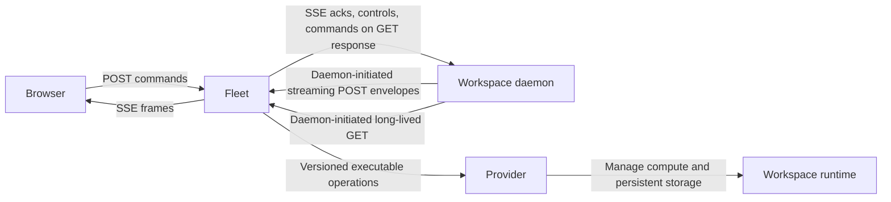
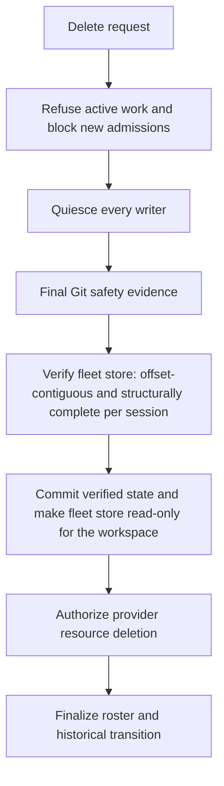

# Independent clone workspaces, sandbox providers, and stored session history

## Status and purpose

This document records the approved product and architecture design. It is normative for the intended behavior, not a description of completed implementation. Implementation resumed on 2026-09-06 under explicit user authorization; completion and evidence are tracked in clone-plan.md.

Amended 2026-09-05: fleet now durably stores continuously streamed session logs from every managed daemon, and the sealed-export archive pipeline is replaced by verify-at-deletion. The Deliberate invariant revisions section records each change; the sections below describe the amended design.

The pending execution sequence, dependencies, and implementation gates are in [clone-plan.md](clone-plan.md). This document preserves the design decisions rather than duplicating that mechanical checklist. Concrete encoding and platform mechanics identified below must be specified during execution without reopening the approved product scope.

## Product scope and ownership

Independent Git clones become a workspace kind alongside existing worktrees, grouped under registered projects by stable `projectId`. Display strings such as `worktreeOf` are not ownership identifiers. Existing worktrees keep local, unsandboxed execution. Sandbox providers initially operate on independent clones.

| Component | Authority and responsibility |
| --- | --- |
| Fleet | Workspace identity, desired lifecycle state, provider profiles, browser access, live routing, and the durable streamed transcript store |
| Daemon | Execution, live session behavior, and workspace session records; execution authority and file-level source of truth for the lifetime of the workspace |
| Provider | Compute and persistent resources, with resource operations authorized and orchestrated by fleet |
| UI | Browser presentation and interaction through fleet; independently deployable behind the same public origin |
| Operator | Infrastructure preparation, provider configuration, durable fleet storage, and its backup boundary |

There is one active fleet, with durable state and restart recovery. Active-active operation and multi-user permissions are out of scope. Fleet-served UI is the default. The UI may instead run on another machine, provided a single browser-facing public origin reverse-proxies the UI and fleet.

### Deliberate invariant revisions

The previous zero-state fleet invariant is deliberately revised again. Every fleet-managed daemon, sandboxed clones and unsandboxed worktrees and default workspaces alike, continuously tails its full session lineage subtree and streams the bytes to fleet, which durably appends them to its own disk near-realtime. The rationale is durability and wake-any-session: a persisted copy on fleet disk survives workspace loss and keeps any session viewable or resumable without relying on the original storage. The daemon remains the execution authority and the file-level source of truth while the workspace exists. Fleet holds a deliberate, durable transcript store, not zero agent state, and not only finalized historical copies after archive acceptance; that earlier revision and the zero-state invariant it revised are both superseded.

The out-of-scope exclusion of continuous archival is removed. Continuous session-log streaming is now in-scope, required behavior for every managed daemon, and the remainder of this document describes it as such.

The sealed-export archive pipeline is deliberately replaced by verify-at-deletion. There is no export, staging, rename, acceptance receipt, or separate archive copy: workspace deletion is gated directly on fleet-store completeness, and the store becomes read-only for the workspace once verified. The existing manifest schema and structural JSONL verification transfer to this gate; the workspace-side copy step is removed.

The previously proposed WebSocket callback is deliberately replaced. The internal daemon-to-fleet callback uses two daemon-initiated HTTP requests: a long-lived streaming POST carrying envelope traffic upstream, and a long-lived GET whose SSE response delivers fleet-routed acknowledgments, controls, and commands downstream. No inbound daemon service is required. Existing collaboration WebSockets and the browser transport boundary, POST commands and SSE streaming, are unchanged. This is not a browser transport replacement.

The existing live SDK constraint of one session per process remains. Supported direct daemon paths, standalone behavior, and existing worktree behavior remain unless explicitly affected by a coordinated migration. Existing worktree deletion is retained. Session-log streaming and the delete verification gate now apply to every fleet-managed daemon, unsandboxed worktrees included, but this imposes no destructive migration: daemons stream what they already write, and no existing storage or workflow is discarded.

## Workspace creation and presentation

A unified project-level **Add workspace** dialog offers **Worktree** and **Clone**, without losing **Add existing worktree**. Creation inputs are name, kind, provider profile where applicable, source or base revision, branch, and start-immediately. A new workspace branch defaults to a name derived from the workspace name.

The dialog remembers the last-used combination of kind, provider profile, and start-immediately. The scope is per browser per fleet, across projects, rather than a separate preference for each project. A saved kind must not be overridden by a fixed Worktree default. Start-immediately defaults to enabled only when there is no prior preference.

These preferences contain no secrets and do not remember names, branch names, source URLs, or revisions. If the remembered profile is no longer available, the operator must select a profile; the UI must not silently substitute another. Fleet origins must not accidentally share preferences.

Preparation, runtime startup, and callback connection are distinct visible stages. Failures are inspectable and retryable, not presented as successful creation or an indefinitely ambiguous spinner. Workspace rows show kind, profile, lifecycle status, and applicable actions.

The CLI exposes clone, profile, start, stop, and delete operations end to end. Existing verbs remain supported; this design does not introduce an otherwise unnecessary breaking major version.

## Independent clone preparation

Clone preparation is shared executable functionality that runs in the execution environment before the daemon. It is not clone logic embedded in the session engine. Local preparation may occur outside the sandbox, but the source repository is never mounted into the running sandbox.

An initialized sandbox clone has an independent object store, with no hardlinks or alternates to the host repository. The approved scope does not include an optional shared-object fast path, even for trusted local use.

Local sources may include local commits. Uncommitted source changes are not copied. A remote configured Git URL must offer the selected commit; an unreachable local commit must not be silently replaced with an upstream commit. Preparation resolves and pins the initial commit, then reuses that exact commit when initialization is retried.

Preparation is successful only after verification of the completed checkout. Retry must be safe for partially initialized state. Waking an already initialized workspace never resets its checkout or reclones it. Uncommitted work and session records survive ordinary stop and wake.

Preparation Git credentials are separate from optional runtime push credentials. Runtime push credentials are not supplied by default. There is no built-in push or fetch-back automation: preservation and collaboration use the standard push and pull-request workflow. A missing runtime credential may require manual preservation before deletion; it is never a reason to bypass a Git safety guard.

## Provider contract and infrastructure

Ship external executable providers for bwrap and Kubernetes, together with a reproducible session-runtime container image definition. The provider interface remains compatible with a future microVM implementation, but no microVM backend is included until its runtime is selected.

The executable contract is versioned JSON with the operations `ensure-running`, `inspect`, `stop`, and `delete`. These operations use stable workspace identity, desired runtime generation, and private provider handles. Operations are idempotent and must discover previous resources after a fleet restart rather than blindly creating replacements.

A provider profile selects the executable, configuration, runtime tools, resource constraints, storage, and secret references. The browser does not accept arbitrary shell programs or Kubernetes manifests. Public capability and status data is secret-free; resource handles and launch details stay private.

Provider execution is fleet-side: bwrap runs on the fleet host, while the Kubernetes provider uses an API reachable from fleet. There is no outbound launcher service or remote bwrap provisioning subsystem.

### bwrap

The profile defines permitted runtime files and tools. Namespace setup alone is not sufficient lifecycle supervision. The provider must support supervised execution that can survive a fleet network interruption or fleet process restart, and reconcile resource identity independently of a transient child PID.

Fleet shutdown must not automatically terminate running provider-managed work unless requested. Already accepted work is allowed to continue. PID-only identity is not a sufficient basis for safe lifecycle decisions.

### Kubernetes

Infrastructure is operator-prepared. Profiles specify namespace, image, resource limits, StorageClass, and secret references. Each workspace has a persistent PVC holding its checkout and session data across compute replacement. Stop retains the claim. Delete requires the authorization defined by the delete verification contract below.

There is no ephemeral-storage fallback. Fleet state and streamed-log storage must also be durable. Delete verification runs fleet-side over the already-streamed store, so an already-stopped daemon does not block deletion.

Preflight reports actionable infrastructure errors. The product does not create clusters, install system dependencies automatically, or grant broad RBAC permissions. Required access must be restricted to the operations and resources the configured provider needs. Neither an inbound daemon Service nor ingress to the workspace is required.

### Existing provisioning integration

The existing one-shot `spawnHook` provisioning model, which returns an endpoint and token, is not a complete lifecycle contract. Foreground child-supervision templates are likewise insufficient on their own for independent pods. Obsolete provisioning pathways must be deliberately evolved or replaced rather than leaving a competing hook convention beside the provider interface. Unaffected worktree and direct remote behavior is preserved.

## Connectivity and protocol compatibility

The callback pair is initiated entirely by the daemon. The upstream half is a long-lived streaming POST whose request body carries UTF-8 NDJSON envelopes, including daemon-to-fleet acknowledgments, controls, and session frames. The downstream half is a long-lived GET whose SSE response carries fleet-routed acknowledgments, controls, and commands. The POST response is ordinary request completion, not a concurrent streaming channel. Fleet routes traffic without opening an inbound service on the daemon. Both requests are authenticated HTTPS; unencrypted HTTP is permissible only for explicitly allowed local loopback use. The same pair carries continuous session-log streaming for every fleet-managed daemon; see Session log streaming below.

Both halves bind workspace, runtime generation, and connection identity. Individual multiplexed envelopes identify their logical stream; the pair is not bound to a single logical stream. The pair must be ready before new commands flow through it. If either half fails, both halves are replaced together with jittered backoff; replacement never replaces the runtime and never stops already accepted work.

A separately versioned callback envelope carries established session command and frame payloads, preserving existing payload semantics and the `OMP_PROTO` rules below. Envelope kinds are explicit: session frames, session-log stream records, transport acknowledgments, controls, and heartbeats. Daemon-to-fleet acknowledgments, controls, and session frames travel in POST NDJSON envelopes; fleet acknowledgments, controls, and routed commands travel in GET SSE frames. Parsing is incremental with bounded record sizes, and oversized payloads are split at the application level. HTTP chunk boundaries are transport framing rather than message boundaries, and HTTP/2 framing does not use chunked transfer encoding.

Streaming proxy behavior is explicit configuration rather than ambient discovery. An unsupported ingress or proxy setup fails visibly instead of falling back automatically. Idle heartbeats must be delivered through the proxy, and the pair is renewed on a separate periodic schedule. Heartbeats do not overcome intermediary buffering or absolute timeouts.

Virtual per-browser streams preserve daemon ownership of priming, history, and replay. Each stream has independent bounded buffering and backpressure, with fairness so commands and controls are not starved by history or a slow browser.

Fleet routes live traffic and durably stores the continuously streamed transcript bytes. Consumers that currently dial daemon endpoints, including per-browser pipes, activity connections, fanout, calls, session access, and downloads, use the transport appropriate to the workspace. A common transport boundary prevents callback-specific exceptions from leaking throughout the application. Existing direct paths continue to work.
Bulk payloads, including transcript downloads, use separate bounded, authenticated, daemon-initiated HTTP transfers correlated to fleet requests rather than the streaming pair. Completing a bulk transfer does not by itself change the verification state of the fleet store.

Reconnect sequencing, command acceptance, deduplication, resume semantics, and bounded history and chunking mechanics must be specified before their cross-component implementation. There is no durable offline command queue: fleet may wait a bounded time for daemon wake and reconnect before submitting new commands, and reports the workspace unavailable when no ready callback pair exists. Fleet and the caller distinguish commands never submitted from commands whose acceptance is unknown, and retry only the same command identity within the defined deduplication contract. Daemon reconnect remains ongoing for the workspace lifecycle. Replay is bounded, acknowledged per logical stream, and paired with duplicate suppression; when acknowledged replay is unavailable, the daemon performs an explicit resync and re-prime. A transport acknowledgment is not command acceptance, and controls are never silently discarded. There is no unsupported exactly-once promise. The guarantee is the defined and tested acceptance/deduplication contract, including no duplicate observable execution within that contract.

The existing wire contract is additive-only while `OMP_PROTO` remains unchanged. Any necessary breaking change requires an `OMP_PROTO` bump and coordinated protocol gates across clients, connectors, and edge handling rather than an accidental unilateral change.

## Session log streaming

Every fleet-managed daemon continuously tails its full session lineage subtree, the Q2 subtree: the main session, subagent sessions, advisor sessions, and their metadata JSONL and blob records. This applies to sandboxed clones and to unsandboxed worktrees and default workspaces alike. Bytes stream over the same uniform daemon-initiated callback pair used for live traffic, with the same envelope format, registry, and resume mechanics; no separate transport or endpoint family is introduced.

Fleet durably appends the streamed bytes to its own disk near-realtime, in arrival order, per session record. This makes fleet a deliberate transcript store rather than a stateless router, and it makes stored history available without a separate archival step.

Failure semantics are bounded and explicit. Each daemon keeps a bounded per-session in-memory ring of unacknowledged bytes. On reconnect, streaming resumes from the last fleet-acknowledged offset. Ring overflow flags a gap, and the gap is repaired by re-streaming from the daemon-side files, which remain the source of truth. An atomic full-file rewrite, detected through a generation or inode change, triggers a resync from offset zero. Crash-partial trailing lines are tolerated exactly as the existing SDK loader tolerates them.

The durability ceiling is explicit: nothing upstream is fsynced, so guarantees are software-crash-safe only, with a sub-second lag target between file append and fleet arrival. Fleet-side appends are durable. Streamed session logs are not a source backup, and streaming them does not make the environment exfiltration-proof.

## Lifecycle, disconnection, and single-writer safety

Fleet persists desired running or stopped state separately from observed provider and connection state. Reconciliation inspects before acting: reconnect existing compute when it exists, and create absent desired-running compute only when safe. Recovery failures are bounded and visible.

A disconnected daemon is not proven dead and is not proven idle. It continues already accepted work, records logs locally, waits for fleet when a browser dialog requires it, and reconnects with jitter and backoff. Network interruption is not a reason to kill the work. Kubernetes liveness must not depend on fleet connectivity.

Only fleet performs idle stop for provider-managed workspaces. Its decision uses reported readiness and activity together with the absence of an attached browser. Busy work, dialogs, and calls must be accounted for; unknown activity during disconnection is not idleness. Autonomous daemon idle exit is disabled for these workspaces, while legacy direct behavior remains intact.

Only one runtime generation is authorized. Obsolete callbacks are rejected. This connection fencing is necessary but not sufficient: before replacement, the predecessor must be proven terminated. If termination cannot be established, replacement is blocked to prevent two writers to the persistent workspace volume.

Stop is an ordinary lifecycle operation that preserves checkout and logs. It does not delete storage, authorize deletion, or by itself satisfy the delete verification gate. Ensure-running on workspace interaction or fanout follows the same persisted desired-state, inspection, and single-writer rules.

## Browser authentication and deployment security

The single operator signs in using an access token. Successful login establishes a persistent HttpOnly, Secure, same-site session cookie with a 30-day absolute expiry. Fleet stores hashed opaque session credentials. Logout invalidates the relevant session; revoke-all and access-token rotation invalidate sessions as required by their scope.

Native same-origin `EventSource` authenticates with the cookie, so authentication does not force an SSE rewrite. Browser credentials must not appear in URLs or localStorage. Mutations require CSRF protection, and browser access is limited to approved origins. Session and artifact/download routes must enforce the same access boundary rather than relying on an unprotected URL.

The normal topology is a single public origin served through a TLS gateway or reverse proxy. Independent UI deployment does not rely on arbitrary cross-site third-party cookies. Certificate automation is not included. Upstream links are protected through loopback binding, private networking, or TLS as appropriate. Forwarded headers are trusted only from explicitly configured proxies.

Any local loopback development exception to Secure-cookie policy must be explicit and limited by a documented secure network policy. Opening the fleet bind address must not expose unauthenticated control access. Existing local CLI access remains protected and compatible.

### Credential separation

Browser, daemon, provider, and model credentials are separate authorities. Provider-managed and externally launched workspaces require workspace-scoped authorized enrollment: knowing a callback URL alone is insufficient. Generation and replacement credentials are scoped and revocable. The detailed encoding and client credential mechanism are implementation specifications, not a mandate for a particular kubelet certificate scheme.

Secrets and private endpoints must not be serialized into roster or debug output. Preparation Git credentials and opt-in runtime push credentials remain separate from these enrollment authorities.

## Isolation and its limits

Agent commands are untrusted. Each workspace has a private writable home and checkout. The runtime does not mount the operator's home, SSH agent, container socket, cloud administration credentials, Kubernetes credentials, fleet credentials, or provider administration credentials. Selected model credentials are supplied through native secret mechanisms, never by mounting the entire operator agent directory.

Any credential readable by agent code can be stolen by that code. No model gateway is built initially. General outbound network access is allowed, so this design is not an exfiltration-proof environment.

Profiles declare only protections that can be enforced, including any metadata-service or administration-endpoint restrictions they promise. Unmet promises cause preflight or launch failure rather than a silent weakening. bwrap does not by itself justify a destination-filtering claim, and Kubernetes NetworkPolicy enforcement is not assumed merely because a policy object exists.

bwrap and ordinary containers share the host kernel. They are not VM security boundaries, and the design makes no equivalent-security claim.

## Workspace deletion: verify-at-deletion contract

**Delete** is an explicit operation for clone workspaces, distinct from ordinary stop and from **Stop current work**. It refuses active work rather than silently terminating it, and it runs only after the fleet transcript store for the workspace is verified complete. If current work must be stopped, the operator uses the separate action first.

Cleanup admission prevents new work before the final destructive checks. All writers must be quiesced, and the daemon must supply final Git safety evidence and a final flush boundary for its session files. Force-killing a process is not a flush acknowledgment.

The required ordering is:

Any failed prerequisite blocks deletion and retains the workspace storage. Registry cleanup state remains until the operation is complete and survives fleet restart. The registry must not be removed early merely because cleanup was requested or compute has stopped.

### Git deletion guard

Deletion is refused for dirty changes, untracked files, stashes, or local history not verified as preserved on the configured remote. Unknown status blocks deletion. There is no force override. The guard is rechecked with writers stopped so an earlier clean result cannot authorize deletion after later writes.

Stored transcripts are not a source backup. Optional push credentials may mean the operator must manually preserve source history before retrying. The product reports that requirement instead of silently bypassing the guard.

### Fleet store scope and verification

The fleet store covers every persisted workspace session, its subagent and advisor sessions, and session metadata: exactly the lineage subtree each daemon streams. Authentication, configuration, and unrelated directories are excluded. Session records can nevertheless contain secrets embedded in transcript text or bytes; directory exclusion does not sanitize transcript content.

The store preserves raw JSONL bytes and the relative layout that expresses record relationships. Fleet appends streamed bytes and must not rewrite or concatenate records in a way that changes their identity. Stable workspace and session identity and workspace/source provenance accompany the records.

Raw session logs are self-describing, but main/subagent classification and existing statistics indexes with absolute paths require a path-aware index. A remote `stats.db` is not copied as a merged database. Fleet indexes are rebuildable from the stored transcript bytes and their metadata.

### Deletion gate and retry

Verification runs fleet-side over the store before any deletion. For every session in the lineage, the store must be offset-contiguous through the last acknowledged offset and structurally verified under the existing manifest schema and JSONL rules. The quiesced daemon's final flush boundary defines the expected end offsets, so a gap between the daemon files and the store blocks deletion.

When contiguity and structural verification hold for every session, fleet commits the verified state and marks the store read-only for the workspace. Verified data is never garbage-collected; the read-only state is the historical transition, and there is no staging, rename, acceptance receipt, or separate archive copy. An identical retry is idempotent, and a conflict with an already read-only workspace blocks rather than overwriting stored history.

Only a verified fleet store authorizes provider deletion. Before verification, a streaming, store, or verification failure may stop compute but must retain the workspace volume, with deletion still blocked and the store still writable; the UI shows a deletion-pending-retry state. After verification, a provider deletion failure leaves a recoverable cleanup record, including any resources still present; the verified read-only store remains intact.

## Retention and orphaned logs

A verified fleet store survives workspace deletion, is read-only, and has no automatic expiration. Deleting stored history is a separate explicit deletion operation that applies only to verified stores. Fleet storage backup is the operator's responsibility.

A workspace deleted without completed verification leaves its fleet store as orphaned logs. They are kept indefinitely, because deletion was not authorized on completeness grounds and the fleet copy may be the only surviving record. Orphaned logs are removed only by explicit manual purge, never by routine garbage collection or by a later workspace lifecycle event.

A session deleted workspace-side, while the workspace itself remains, purges the fleet copy of that session: the workspace wins. A workspace deletion is a different event: a verified store is retained as history, and an unverified store is orphaned until manual purge.

The data-loss boundary is the acknowledgment offset. If sandbox storage is destroyed before a record is streamed and acknowledged, that record is lost; reconnect routing, ring bounds, and in-memory buffers do not remove this boundary. Every acknowledged record is durably stored fleet-side, and the streaming failure semantics repair gaps only over surviving daemon files.

## Workspace history, stored transcripts, and wake

**Live workspace sessions** and **stored transcripts** are distinct surfaces with distinct read paths. Live session listing, transcripts, resume validation, and downloads go to the owning daemon through the appropriate transport, including the callback for managed clones, while the workspace is alive. A stopped workspace is woken when access requires its daemon. Remote session identity must not be interpreted as a fleet-local working-directory path.

### Wake and resume

Any session is wakeable. When the workspace is alive, fleet materializes cold or missing transcripts from its store into the agent directory before the existing `--resume` path runs, so resume validation sees its full lineage. When the workspace has been deleted, stored transcripts stay view-only by default, and the explicit **Resume onto fresh clone** action provisions a fresh clone at the pinned commit, materializes the transcripts, and resumes. Uncommitted working-tree state is unrecoverable after deletion, and the action reports that explicitly. If the pinned source or commit is unavailable, the action fails with a typed error and never substitutes an upstream revision.

Session logs are not the workspace. Transcripts contain the session lineage only: they do not include working-tree files, uncommitted changes, or other workspace data. Stored history therefore cannot stand in for the workspace and never substitutes for source preservation.

### Read access

Fleet-stored logs are gated by the same P2 browser authentication as every other fleet surface, with no new permission model. Stored transcripts are readable without the workspace daemon running, but only under that authentication boundary.

This change adds no new read surfaces: roster and statistics consumption of the fleet store is deferred to a later phase. Existing per-browser pipes, activity connections, fanout, calls, session access, and downloads continue to use the transport appropriate to the workspace under their existing same-origin authentication.

The store contains session records and embedded bytes, not arbitrary linked generated files or attachments. When a referenced asset was not stored, the UI explicitly reports it as unavailable rather than offering a broken download. Browser download authentication follows the same-origin session boundary.

## Intended acceptance envelope

These are proposed acceptance conditions, not measurements, test results, or delivered guarantees. The intended workload envelope is 20 concurrently streaming daemons, 100 registered workspaces, and 3 browser clients. Controlled clients exercise load, while actual bwrap and Kubernetes runtimes establish provider lifecycle behavior.

Callback latency is compared with an equivalent direct-workload baseline. Concrete benchmark thresholds are established before implementation, not invented here. Evidence should quantify latency, throughput, and memory under sustained load and idle conditions.

Acceptance covers:

- Bounded memory and history delivery, isolated slow clients, and controls not starved by history traffic.
- Reconnect and fleet restart without duplicate observable command execution within the defined acceptance/deduplication contract, or concurrent replacement writers.
- Already accepted work continuing through network interruption, including real configured HTTPS proxy disconnects of either callback half, without treating disconnection as idle or dead.
- Real configured HTTPS proxy evidence that incremental POST delivery reaches fleet before request completion, that the downstream GET delivers SSE acknowledgments, controls, and commands, that idle heartbeats are delivered, and that either-half disconnect leads to replacement and renewal of the pair.
- Restart, replay, and deduplication within the bounded acknowledged replay contract, including explicit resync and re-prime when replay is unavailable, with streaming bounds and control fairness observed through real proxy intermediation.
- Stop and wake preserving uncommitted checkout changes and session records on both providers.
- Real provider ensure, inspect, stop, replacement, and delete behavior, including persistent Kubernetes storage and process-independent bwrap recovery.
- Interrupted streaming, store, disk-full, bad-network, restart, forced-exit, and provider-delete failure scenarios preserving the required deletion boundary and retry state.
- Manifest completeness, malicious-path and unsafe-type rejection, conflicting-state rejection for read-only workspaces, exclusion of secret directories, and intact main/subagent relationships.
- Browser cookies surviving reload and browser restart within their expiry, with logout, revoke-all, token rotation, CSRF, origin, and unauthenticated-route enforcement.
- Remembered creation options across dialog reopening, reload, and projects, with fleet-origin separation and explicit handling of a missing profile.
- Distinct live and stored history, authenticated downloads, unavailable linked assets, read-only stores, and accurate statistics coverage and deduplication.
- Existing worktree, direct remote, standalone, and local CLI compatibility; actual browser interaction rather than only simulated UI checks.

Implementation proof includes targeted behavioral regressions, `tsgo`, the full suite for shared/server/edge changes, and distribution and onboarding end-to-end coverage for CLI or bundle changes. Real provider smoke evidence is required. A missing runtime or configured Kubernetes environment is an explicit verification blocker, not something a mock can prove away. None of those checks is claimed to have run for this documentation task.

## Existing integration areas

This is an area map, not a claim that the design is already implemented or that exact code locations have been determined:

| Concern | Existing areas |
| --- | --- |
| Shared protocol and SSE | `shared/protocol.ts`, `shared/sse.ts` |
| Fleet identity, configuration, and workspace grouping | `fleet/registry.ts`, `fleet/config.ts`, `fleet/worktrees.ts`, `fleet/discovery.ts` |
| Existing runtime supervision and launch parsing | `fleet/supervisor.ts`, `fleet/spawn-parse.ts` |
| Fleet routing and connections | `fleet/server.ts`, `fleet/edge.ts`, `fleet/connector.ts`, `fleet/fanout.ts` |
| Session access and statistics | `fleet/daemon-sessions.ts`; fleet statistics routes, libraries, and configuration |
| Session log streaming and store | Daemon-side lineage tailing; fleet-side durable store, gap repair, and verification; concrete files specified during execution |
| Fleet operator interfaces and examples | `fleet/cli.ts`, `fleet/examples` |
| Daemon runtime and session delivery | `server/index.ts`, `server/config.ts`, `server/sse-delivery.ts`, `server/session-entry.ts`, `server/collab-session.ts` |
| Browser state and workspace presentation | `src/state.ts`, `src/store/projects.ts`, `src/store/roster.ts`, `src/components/roster/SidebarGroups.tsx`; `WorktreeModal.tsx`, `DaemonRow.tsx`, `DeleteWorktreeDialog.tsx`; `src/tx` |
| Distribution and onboarding | `cli/omp-web.ts`, `scripts/build-omp-web.ts`, `scripts/test-onboard.ts` |
| Existing documentation to reconcile during implementation | `README.md`, `AGENTS.md`, `docs/architecture.md` |

New provider, preparation, callback, streaming, and deletion-verification modules are proposed responsibilities; concrete file layout is specified during execution using existing repository conventions. Documentation changes must remain scoped to implemented behavior, approved contracts, and recorded verification evidence.

## Specification details for execution

The approved behavior above is settled. Execution must specify literal callback endpoints, envelope schemas and method names, acknowledgment cadence, heartbeat and renewal intervals, buffer bounds, timeouts, and replay retention, together with command acceptance and replay details, SDK flush evidence, session-log stream and store mechanics, fleet store verification and read-only state handling, concrete client credential handling, configured ingress and StorageClass, and baseline-derived benchmark thresholds. These are implementation mechanics and deployment prerequisites, not unresolved requests for additional product choices.

The scope does not include shared clone storage, active-active fleet operation, multi-user permissions, a microVM backend, remote bwrap provisioning, an outbound launcher service, cluster creation, automatic system installation, broad RBAC grants, a model credential gateway, exfiltration-proof networking, automated push/fetch-back, automatic store expiration, or restoration of an archived execution environment. Session-log streaming is not source backup and is not an exfiltration-proof channel.

The phased plan remains [clone-plan.md](clone-plan.md). Implementation may not claim completion from compiling scaffolds, unexercised lifecycle paths, or assumed infrastructure capabilities.
