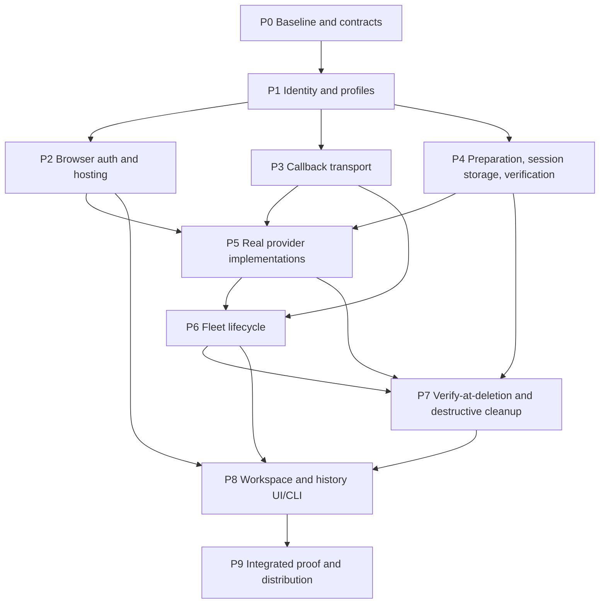

# Clone workspace implementation plan

## Status and authority

The product and architecture design is approved in [clone-design.md](clone-design.md). Implementation is authorized by the request to resume this plan on 2026-09-06. The working tree contains partial implementation from earlier work; the checklist remains pending until each step's integrated behavior and required evidence are established. Source files alone do not establish runtime availability, passing tests, or completed acceptance gates.

The phase IDs P0 through P9 preserve the approved decomposition. Step IDs are stable references for assignments and evidence. A phase is complete only when its integrated behavior and stated exit evidence exist, not when interfaces, scaffolding, or simulated providers compile.

### Amendment, 2026-09-05

Settled design amendment, applied throughout this plan: the sealed-export and archive-acceptance pipeline is replaced by verify-at-deletion, and the fleet deliberately becomes a durable session-transcript store.

- Every fleet-managed daemon, sandboxed or not, continuously tails its full session lineage subtree (main, subagent, advisor, and metadata JSONL and blobs) and streams bytes to the fleet over the uniform daemon-initiated FleetCallback pair (P3.7-P3.9). The fleet durably appends these bytes near-realtime; the earlier fleet-holds-zero-agent-state invariant is amended accordingly, and the exclusion of continuous transcript backup from the non-goals is removed.
- Workspace deletion is gated on fleet-store completeness for every session, offset-contiguous and structurally verified per the retained manifest and JSONL rules, after which the store flips read-only for that workspace. No staging, rename, acceptance receipt, or separate archive copy exists; the workspace-side export copy step is dead (P4.5-P4.6, P7.1-P7.5).
- Retention: a workspace deleted without verification leaves its logs orphaned indefinitely with manual purge only; a workspace-side session delete propagates a purge of that session's fleet copy; verified data is never GC'd (P7.6, P7.7).
- Wake: a live workspace materializes cold or missing transcripts from the store before `--resume`; a deleted workspace is view-only by default with an explicit resume-onto-fresh-clone action and typed failures (P8.5, P8.9, P8.10). Session logs are not the workspace.
- Superseded in place without rewrite: P0.5's archive manifest/receipt ledger term (manifest schema retained, acceptance receipt removed) and P1.1's recoverable cleanup/export receipt fields (registry retains deletion state per P7.3). Consumption beyond existing surfaces, including roster/stats views of the store, is deferred to a later phase.

### Scope and invariants

- Fleet owns workspace identity, desired lifecycle state, provider profiles, browser access, and the durable session-transcript store. The owning daemon remains authoritative for execution and session records throughout the workspace lifetime. Providers own compute and persistent resources.
- Independent clones and existing worktrees are sibling workspace kinds under registered `projectId` values. Worktrees remain local and unsandboxed. Initial sandbox providers are bwrap and Kubernetes, operating on independent clones.
- Keep the browser POST/SSE path, standalone daemon, supported direct remote connections, project/default-workspace grouping, existing worktree deletion behavior, and one live SDK session per daemon process. Introduce the daemon-initiated callback transport of two long-lived requests, a streaming HTTP POST upstream and a GET/SSE downstream, behind a common transport boundary rather than scattered special cases, over authenticated HTTPS except an explicitly allowed loopback HTTP exception.
- Use one active fleet with durable restart recovery. An independently deployed UI remains behind the same browser-facing public origin as fleet, with TLS terminated by an operator-managed gateway or proxy.
- Ordinary stop preserves checkout and session logs. Clone destruction requires the explicit delete workflow, verified Git preservation, and verify-at-deletion completeness of the fleet transcript store for every session, and only then provider deletion. Stricter clone deletion guards do not silently migrate or redefine existing worktree deletion.

Non-goals: active-active fleet, multi-user permissions, a microVM backend before a runtime is selected, a model gateway, automated cluster provisioning or system package installation, automatic broad RBAC grants, remote bwrap provisioning, an outbound launcher service, automatic push/fetch-back, a shared-object clone mode, arbitrary shell/manifests in the UI, and restoration of an archived execution environment. Ordinary containers and bwrap are shared-kernel isolation, not VM security or exfiltration prevention.

## Execution and evidence rules

1. Read the affected source sections and references before each implementation slice. Reuse current configuration, store, protocol, and test patterns. Preserve unrelated working-tree changes and never replace user work to make validation pass.
2. Resolve shared wire, identity, profile, launch, manifest, and auth contracts before handing their consumers to concurrent writers. One named integration owner owns each shared file at a time. Parallel workers skip builds, tests, lint, and formatting; the integration owner validates only after those edits settle.
3. Prefer existing modules. Paths marked **proposed** below are ownership boundaries and possible new modules, not existing files or final API names. Confirm their need in P0 and do not add a second convention beside an existing one.
4. Additive wire changes keep the current `OMP_PROTO`; genuinely breaking shapes require an explicit version bump and coordinated client, connector, and edge gates. The separately versioned callback envelope transports established session payloads over the daemon-initiated HTTP POST/SSE callback transport. The documented no-WebSocket agent-driving invariant is preserved: agent driving uses the HTTP callback transport, and collaboration WebSockets remain unchanged.
5. For each bug, reproduce the behavior before fixing it and verify the same reproduction afterward. Keep tests for plausible regressions, boundaries, security failures, and lifecycle transitions, not wiring or implementation echoes. New permanent feature tests are not automatic: prove ordinary behavior with a throwaway smoke workload and retain tests where an uncertain edge earns them.
6. All proof uses disposable, isolated workspace/state locations and an explicitly selected test context. Use `tempDir()` from `shared/testkit.ts` for test scratch directories and `*.testkit.ts` names for shared test helpers. Tests must not require a live model/API, and Git fixtures use the operator's configured identity rather than inventing one.
7. After a coordinated source slice lands, run the applicable targeted test files through `bun scripts/test.ts`, then `bun run check:types`. Shared, daemon, or edge changes also require the full suite. Run these centrally, not concurrently with edits or redundantly in sibling tasks. Preserve complete logs and exit status rather than a truncated output pipe.
8. A mock provider or controlled client can prove a contract but cannot satisfy a real bwrap or Kubernetes gate. A missing runtime is a named verification blocker, not permission to reduce the design. Complete independent reachable work while keeping the blocked gate open.
9. After the integrated smoke proves the work, remove its throwaway artifacts and reconcile the documents with actual behavior, measurements, and remaining blockers before declaring completion. This is a post-proof rule, not a preallocated cleanup phase. Remove obsolete source paths and update affected documentation alongside the source change that makes them obsolete.

## Dependencies and ownership

The diagram shows integration gates, not a prohibition on earlier independent implementation. In particular, provider lanes can develop against the agreed P1/P4 launch contract before all P2/P3 edits land, the fleet-store verifier can develop alongside P4 once its manifest is fixed, and UI lanes can begin after their P1/backend contracts are agreed. Their phase exits still require the complete upstream behavior.

| Phase | Required input and integration dependency | Parallel ownership boundary |
| --- | --- | --- |
| P0 | Approved design and current repository | One integration owner records the contract ledger; source, SDK, and infrastructure investigations can be read-only independent slices. |
| P1 | P0 identity, profile, and protocol ledger | Protocol/registry owner and config/profile owner use separate files; protocol owner integrates public types. |
| P2 | P1 identifiers and agreed auth endpoints | Backend auth and frontend sign-in are independent; a single owner integrates `fleet/server.ts` and `fleet/edge.ts` across P2/P3. |
| P3 | P1 and callback/auth contract from P0/P2 | Daemon outbound transport and fleet adapter are independent; one owner owns callback protocol and transport cutover. Enrollment security must integrate before provider rollout. |
| P4 | P1 and agreed execution launch/manifest contracts | Clone preparation and session verification writers own different proposed files. Verification development may start from the fixed manifest without enabling deletion. |
| P5 | Provider contract fixed; exit requires P2 enrollment, P3 callback smoke, and P4 preparation/storage | bwrap and Kubernetes implementation lanes own distinct executables; one owner integrates provider dispatch and shared launch contracts. |
| P6 | P3 callback and P5 real lifecycle, using P4 storage | Lifecycle owner integrates registry/supervisor/server changes; provider owners supply termination and identity evidence through the contract. |
| P7 | P4 verification primitives, P3 streaming store, P5 retained resources, and P6 lifecycle/admission | Verification lane can precede final orchestration; one cleanup owner integrates destructive state transitions. |
| P8 | UI development may start at P1; exit requires P2, P6, and P7 | Creation/lifecycle frontend, history/stats frontend/backend, and CLI lanes use pre-agreed contracts. One store owner integrates `src/state.ts`; one backend owner integrates shared routes. |
| P9 | All preceding integrated exits, not merely implementation branches | Distribution and documentation edits can be independent; one verification owner waits for all edits to settle and runs the coordinated gates. |

## P0: Baseline and contract ledger

**Dependencies:** approved design and repository access. No source implementation starts before the cross-file contracts are recorded.

**Existing modules to inspect:** `shared/protocol.ts`, `shared/sse.ts`; `fleet/registry.ts`, `fleet/config.ts`, `fleet/worktrees.ts`, `fleet/discovery.ts`, `fleet/supervisor.ts`, `fleet/spawn-parse.ts`, `fleet/server.ts`, `fleet/edge.ts`, `fleet/connector.ts`, `fleet/fanout.ts`, `fleet/daemon-sessions.ts`, `fleet/stats/`; `server/index.ts`, `server/config.ts`, `server/sse-delivery.ts`, `server/session-entry.ts`, `server/collab-session.ts`; relevant client stores, CLI/build entrypoints, and the pinned SDK storage implementation. **Proposed modules:** none implemented in this phase; the ledger assigns later boundaries.

- [x] **P0.1** Record relevant pre-existing user edits non-destructively. Map actual symbols and references for spawn, resume, endpoint dialing, activity, download, history, registry persistence, and delete. Identify which legacy paths remain and which provider-managed paths will replace one-shot provisioning.
- [x] **P0.2** Exercise the current fleet/daemon UI and standalone UI. Capture readiness, project/worktree behavior, command acceptance/dedup, history priming/replay, activity/idle behavior, and session-list/download ownership as the direct-path compatibility baseline.
- [x] **P0.3** Inspect the pinned `@oh-my-pi/*` SDK storage, session/subagent lineage, agent-directory selection, writer lifetimes, and actual flush/close semantics. Identify how all writers can be quiesced and how successful flush can be evidenced. Do not infer flush from process exit, force-kill, or a copied file appearing complete.
- [x] **P0.4** Inventory Bun/Git/bwrap and required supervision/runtime tools, durable fleet storage, selected model secret provision, and any configured Kubernetes test context without changing a real cluster. Record namespace/RBAC, image access, StorageClass, gateway streaming proxy/callback reachability, and network policy capabilities, or their exact missing prerequisites.
- [x] **P0.5** Freeze the contract ledger: stable project/workspace/session/export identities, generation and opaque resource handles, desired versus observed states, recovery and cleanup phases, profile capabilities/errors, execution launch/storage layout, callback acceptance/resume/dedup limits, virtual stream fairness, archive manifest/receipt, and browser auth endpoints. Choose literal field/method names only after source inspection. The frozen callback contract states literal envelope schemas, endpoints and methods, ack cadence, timeouts, buffer bounds, and retention as preimplementation specifications; later phases implement the frozen contract instead of inventing values.
- [x] **P0.6** Establish the reproducible direct-path workload and proposed acceptance envelope of 20 concurrent streaming daemons, 100 registered workspaces, and 3 browser clients. Run an ephemeral controlled baseline, record workload/environment and latency/throughput/memory measurements, and agree comparison thresholds and sustained-run/idle durations before callback results are available. Do not substitute the test-suite benchmark for transport measurements.

**Ownership:** the integration owner publishes one ledger; investigations feed it rather than inventing competing APIs. **Exit evidence:** source/caller map, actual direct-runtime observations, SDK storage/flush findings, measured baseline, agreed thresholds, and a prerequisite ledger with owner/status/evidence for every external dependency. Unavailable infrastructure is explicit. Contract names are implementation decisions, not new product choices.

Investigation evidence, 2026-09-06:

- Preserved the existing 24 modified tracked files and untracked clone implementation. Source maps recorded by `LifecycleMap`, `SurfaceMap`, and `RuntimeMap` identify missing clone creation/profile producers, callback browser consumers, and kind-blind browser deletion paths. Source presence does not close their implementation gates.
- SDK 17.1.8 investigation confirms no upstream fsync and suppressed descendant/advisor disposal errors. Top-level disposal is not sufficient all-writer flush proof; P4.5 and destructive acceptance remain open.
- Actual executable resolution: Bun `/etc/profiles/per-user/<user>/bin/bun`; Git, bwrap, Docker and systemctl under `/run/current-system/sw/bin`. A real `bwrap --unshare-all --ro-bind / / --proc /proc --dev /dev -- /run/current-system/sw/bin/true` exited 0.
- Kubernetes prerequisites are absent: no `kubectl` or configured kube context found. Namespace/RBAC, image access, StorageClass/PVC behavior and gateway/network policy cannot be established without an operator-approved test environment. No cluster was contacted or modified.
- Model and Git secret injection remain operator-selected prerequisites; no credentials were invented or exposed. No production HTTPS streaming gateway is established by the loopback browser baseline.
- The pre-integration working tree passed `bun run check:types`. Isolated fleet and standalone development stacks reached readiness and loaded in real Chromium tabs. Full baseline behavior and load measurements were pending under P0.2/P0.6 at this point; both are now resolved: the frozen 20/100/3 envelope and direct baseline measurements live in the wl-frozen3-fast artifacts, and the comparison thresholds and callback-leg results are recorded in the matrix resolution below.
- Baseline observation details: standalone daemon primed hello_ok/attached/history/state/collab_status/available_commands/ready in order; a duplicate-id command returned 202 twice with a single call_result; a `/download` in the cwd jail returned 200. Fleet UI registered a project, created and woke a worktree, and reached a ready attached chat. A Last-Event-ID reconnect re-primed the stream rather than replaying the recorded delta within 3 s; direct-path delta replay semantics need explicit verification when P3 replay is measured. The `OMP_FLEET_WORKSPACE_DIR` env override was not honored by the dev fleet (worktree landed under the default shared root); recorded as a bug to fix during lifecycle integration.
- The creation/preference contract was frozen on 2026-09-06 in the contract ledger's "Browser and CLI workspace creation" section after source inspection: `create_clone`, `POST /ctl/clones`, `GET /ctl/profiles`, `registered_projects.providerProfiles`, shared lifecycle service, and per-origin preference scope.

## P1: Additive workspace identity and provider profiles

**Dependencies:** P0 contracts. **Existing modules:** `shared/protocol.ts`, `fleet/registry.ts`, `fleet/config.ts`, `fleet/worktrees.ts`, `fleet/discovery.ts`, and public roster serializers in `fleet/edge.ts`/`fleet/server.ts`. **Proposed modules:** `shared/workspace.ts` and `fleet/provider-profile.ts` only if existing modules cannot hold the agreed types and validation coherently.

- [x] **P1.1** Persist explicit workspace kind and `projectId`, configured clone source and pinned initial revision, selected profile, desired running/stopped state, authorized runtime generation, private resource handle, and recoverable cleanup/export receipt fields. Keep private launch/enrollment data out of public views.
- [x] **P1.2** Migrate known historical registry shapes on reload without reusing IDs or losing insertion/project grouping. Preserve root/default workspaces and current worktree behavior. Do not interpret a remote daemon's cwd as a fleet-local path or identify project membership through display strings such as `worktreeOf`.
- [x] **P1.3** Implement validated operator-owned profiles for executable/configuration, tools, resources, storage, and secret references. Define secret-free public capabilities, preparation/runtime/callback/recovery statuses, and actionable typed errors; UI input is profile selection, not shell or manifest authoring.
- [x] **P1.4** Update protocol producers/consumers additively and retain existing replay/protocol gates. Ensure roster, registered-project frames, and debug output never disclose tokens, private endpoints, provider admin configuration, or secret material.
- [x] **P1.5** After both lanes settle, verify historical registry reload, meaningful migration/default behavior, missing profile handling, stable IDs after restart, grouping compatibility, remote-path handling, and public/private serialization boundaries.

**Ownership:** protocol/registry owner integrates wire types and public serializers; config/profile owner writes only its agreed modules. Shared server/edge changes are serialized with later owners. **Exit evidence:** old registry fixtures reload without destructive reinterpretation, new fields survive restart, legacy direct/worktree UI remains usable, and sensitive fields remain private. No stub provider is accepted as provider implementation.

## P2: Browser sessions and independent UI hosting

**Dependencies:** P1 identifiers and P0 auth contract. Can run alongside P3/P4. **Existing modules:** `fleet/server.ts`, `fleet/edge.ts`, `fleet/config.ts`, `fleet/cli.ts`, `src/state.ts`, applicable `src/store/` actions, `src/tx/`, `cli/omp-web.ts`, and static/dev routing configuration. **Proposed modules:** `fleet/browser-auth.ts` and a sign-in component under `src/components/`.

- [x] **P2.1** Implement first-login access-token exchange for an opaque persistent browser session, hashed credentials at rest, HttpOnly Secure same-site cookies, and a 30-day absolute expiry. Logout, revoke-all, and access-token rotation must invalidate the appropriate sessions without sliding their absolute lifetime.
- [x] **P2.2** Enforce authentication and authorization consistently across browser commands/events, `/ctl/*`, stats/history/export, callback enrollment, and artifact/download routes. Keep browser, daemon, provider, preparation Git, runtime push, and model credentials separate; knowing a callback URL must not enroll a daemon.
- [x] **P2.3** Apply CSRF protection to mutations, approved-origin checks, explicit trusted-proxy configuration, and safe bind/upstream rules. Specify the local-loopback development cookie exception without weakening network deployment. No tokens in browser URLs or localStorage, and no unauthenticated control plane created by opening the fleet bind address.
- [x] **P2.4** Implement same-origin sign-in/session-expiry UX and authenticated fetch/download behavior while retaining native EventSource cookies and browser POST/SSE. Support fleet-served UI by default and independently hosted UI/API routing behind one public origin, not a cross-site third-party-cookie workaround.
- [x] **P2.5** Preserve the existing CLI loopback workflow through the agreed protected control-plane policy. Document operator TLS termination and private/loopback/TLS upstream choices, with forwarded headers trusted only from configured proxies.
- [x] **P2.6** After auth/frontend/edge edits settle, use an actual browser to prove reload and browser-restart persistence, expiry, logout, revoke-all, rotation, and re-login. Exercise native SSE and authenticated downloads; deny hostile origins, invalid CSRF, stale sessions, unauthenticated sensitive routes, and forged forwarded headers. Exercise the CLI compatibility path too.

**Ownership:** backend auth owner and frontend login owner agree endpoints first; one integration owner owns `fleet/server.ts` and `fleet/edge.ts` mutations across P2/P3. **Exit evidence:** real browser cookie/SSE observations, denied adversarial requests, independently hosted same-origin UI operation, and successful authorized CLI control. Production TLS/proxy availability remains an explicit prerequisite when unavailable.

## P3: Outbound callback transport

**Dependencies:** P1 plus the agreed auth/enrollment contract; provider rollout waits for the secured P2 integration. **Existing modules:** `shared/protocol.ts`, `shared/sse.ts`, `fleet/edge.ts`, `fleet/server.ts`, `fleet/connector.ts`, `fleet/fanout.ts`, `fleet/daemon-sessions.ts`, `server/index.ts`, `server/config.ts`, `server/sse-delivery.ts`, `server/session-entry.ts`, `server/collab-session.ts`, and client call/replay consumers. **Proposed modules:** `shared/callback-protocol.ts`, `server/fleet-callback.ts`, and `fleet/daemon-transport.ts`.

- [x] **P3.1** Define the separately versioned callback envelope and scoped enrollment: workspace, connection, authorized runtime generation, and logical stream identities; explicit frame, ack, control, and heartbeat kinds; virtual stream open/close, command/frame/error/resume controls; bounded payloads and transfer chunks. Define the two daemon-initiated requests as a long-lived streaming POST upstream and a GET/SSE downstream. The POST request body is UTF-8 NDJSON carrying the callback envelopes upstream, parsed incrementally with bounded records and application-level splitting; the SSE events carry the same versioned callback envelopes downstream. On either half, HTTP chunks are transport bytes rather than message boundaries, and chunked transfer encoding framing is not assumed because HTTP/2 does not use it. Specify command acceptance boundaries with a transport ack distinct from command acceptance, sequence/dedup scope and expiry, and reconnect outcomes without an unproved exactly-once promise. Specify no durable offline command queue: a bounded wake/reconnect wait, a not-submitted versus acceptance-unknown distinction, and same-command-identity retry only within the defined dedup contract.
- [x] **P3.2** Implement the daemon's outbound authenticated HTTPS callback pair, long-lived streaming POST upstream and GET/SSE downstream, both bound to the workspace, authorized runtime generation, and connection identity, with the explicitly allowed loopback HTTP exception. Hold the pair ready before new commands flow. Treat failure of either half as replacement of both through reconnect jitter/backoff, never replacement of the runtime or stopping already accepted work. Use an explicit streaming proxy configuration; unsupported proxy or ingress fails visibly with no automatic fallback. Apply heartbeats and periodic renewal that do not overcome buffering or absolute timeouts. Include scoped revocation and obsolete-generation rejection. Network loss leaves accepted execution and local logging running; browser-dependent dialogs wait for fleet rather than inventing replies.
- [x] **P3.3** Implement the fleet adapter and per-browser virtual streams. Keep priming, session history, replay, and execution truth in the daemon. Bound each stream's queues and total transport buffering, apply backpressure, and prevent large history transfers or slow clients from starving command/control traffic or other clients.
- [x] **P3.4** Migrate every endpoint-dialing consumer from the P0 reference map to the mode-appropriate common transport: per-browser pipes, activity connector, fanout, command calls, session listing/transcript/resume validation, and downloads. Move downloads, including fleet-stored session bytes, onto separate bounded authenticated daemon-initiated HTTP bulk transfers correlated to their fleet requests; there is no inbound daemon service. Browser bulk transfers are consumption traffic, distinct from the P3.7 lineage stream. Retain supported direct transports and standalone behavior; the browser-serving path reads transcripts through the owning daemon or the fleet store, not an additional server-side copy.
- [x] **P3.5** Preserve established session command/frame semantics, history chunk finalization, stale-frame guards, session-switch rejection of in-flight calls, and resync ordering. Bound acknowledged per-logical-stream replay with duplicate suppression and, where replay is unavailable, an explicit daemon-owned resync/re-prime. Never silently discard control traffic: every control is acknowledged or explicitly failed. Keep disconnected activity unknown rather than reporting idle or dead. Revise affected architecture/engineering wire documentation alongside the cutover.
- [x] **P3.6** After both transport lanes and edge integration settle, launch an actual daemon with deterministic controlled inputs. Exercise multiple virtual browsers, attach/switch/replay, bounded history, a slow consumer, interrupted command acceptance, reconnect, either-half disconnect and renewal, obsolete enrollment, and remote file/session access. Compare observable direct-path behavior and verify no duplicate execution within the defined dedup contract.
- [x] **P3.7** Stream the full session lineage to the fleet over the same daemon-initiated callback pair. For every fleet-managed workspace, sandboxed or unsandboxed, the daemon continuously tails its complete session lineage subtree (main, subagent, advisor, and metadata JSONL and blobs) from the canonical P4.4 directory, using the same envelope format, stream registry, and resume semantics as the browser-facing callback traffic. Maintain a bounded per-session in-memory ring at the daemon; on reconnect, resume from the last acknowledged fleet offset; flag ring overflow as a gap and repair it by re-streaming from the file, which remains the source of truth. Detect atomic full-file rewrites through generation or inode change and resync from offset 0. Tolerate crash-partial trailing lines exactly as the SDK loader does. No fsync is added upstream: durability is software-crash-safe with a sub-second lag target.
- [x] **P3.8** Implement the fleet-side durable transcript store. Append streamed bytes durably to fleet-owned disk near-realtime, keyed by stable workspace and session identity, with per-session offset tracking and explicit acknowledgements back to the daemon so reconnects resume without loss or duplication. Store writes are append-only during a session. This deliberately amends the earlier fleet-holds-zero-agent-state invariant: the fleet is a session-transcript store. All store access stays behind the P2 browser auth boundary with no new permission model.
- [x] **P3.9** After transport and store lanes settle, inject either-half disconnects, daemon restarts, ring overflow, atomic file rewrites, and daemon crashes mid-line. Prove resume from acknowledged offsets, gap repair from the file, resync from 0 after rewrites, crash-partial trailing-line tolerance, no lost or duplicated bytes in the fleet store, and sub-second streaming lag under the controlled workload.

- [x] **P3.10** Fix and verify edge reconnect delta replay. The P0.2 baseline observed a Last-Event-ID reconnect re-priming the stream instead of replaying the recorded delta within 3 s. Pin the resume semantics (ring hit replays from the requested seq; only a miss re-primes), cover both fleet-edge and bare-daemon streams, and add a deterministic regression so the replay window cannot silently degrade into re-priming.

**Ownership:** daemon connector and fleet adapter are independent after the envelope freezes; protocol/transport owner integrates shared definitions and callsite migration. The P2 edge/server owner serializes shared-file changes. **Exit evidence:** actual daemon callback smoke, preserved direct/standalone behavior, bounded-queue/slow-client observations, command acceptance/reconnect evidence, either-half disconnect and renewal observations, lineage streaming resume/gap/rewrite evidence, and an exhausted caller map. No provider rollout on an unexercised transport.

## P4: Shared preparation, session storage, and verification primitives

**Dependencies:** P1 and agreed provider launch/storage/manifest contracts. Independent of most P2/P3 implementation. **Existing modules:** `fleet/worktrees.ts`, `fleet/discovery.ts`, `server/config.ts`, `server/index.ts`, `server/session-entry.ts`, session/subagent storage integration, and relevant lazy SDK access in `fleet/daemon-sessions.ts`. **Proposed modules:** `runtime/prepare-workspace.ts`, `runtime/export-sessions.ts` (verification-only against fleet-store bytes), and `shared/archive-manifest.ts` (manifest schema retained). These are shared execution-environment tools, not clone logic in the session engine.

- [x] **P4.1** Implement local and configured remote source preparation. Resolve and persist the initial commit once, require a remote source to offer that commit, derive the default new branch from the workspace name, and verify success before marking initialized. Local committed history is allowed; uncommitted source files are not copied and an unreachable local commit is never silently replaced by upstream.
- [x] **P4.2** Guarantee independent sandbox clone object storage without source hardlinks or alternates. A local preparation step may run outside the sandbox, but the running sandbox never mounts the source repository. Keep preparation Git credentials separate from opt-in runtime push credentials; do not add a shared fast path or automatic push/fetch-back.
- [x] **P4.3** Make failed initialization retry the pinned commit safely, without resetting an initialized checkout. Define verified initialization markers and storage ownership so stop/wake and replacement preserve uncommitted workspace files and sessions rather than re-cloning.
- [x] **P4.4** Establish a canonical workspace-owned session directory containing all persisted main/subagent/advisor records and metadata. Configure the SDK's actual storage path through supported mechanisms, with a private writable home/workspace and only selected model secrets, never the operator's whole agent directory.
- [x] **P4.5** Implement explicit quiesce and flush evidence covering all writers, then produce the verification manifest over the canonical workspace-owned session files using the retained `shared/archive-manifest.ts` schema: stable workspace/session identity, file identity, relative relationship layout, size, and hash. Raw JSONL is verified in place, never copied to a separate archive; lineage and source provenance are preserved, and auth/config/unrelated directories are excluded. Do not merge a remote `stats.db`.
- [x] **P4.6** Validate file paths/types and bound verification traversal. Reject traversal, symlinks, unsafe types, and inconsistent manifests. Preserve session records and embedded bytes, not arbitrary external linked artifacts. Make fleet-store verification usable after original compute has stopped without treating force-kill as a flush acknowledgment.
- [x] **P4.7** After preparation/verification edits settle, exercise real Git local/remote fixtures, local-only commit success and remote-unavailable commit failure, source inode/alternates independence, interruption/retry, unchanged initialized checkout, and persisted stop/wake data. Exercise malicious session-file inputs, descendant completeness, secret-directory exclusion, fleet-store raw-byte identity against workspace files, and actual SDK flush behavior.

**Ownership:** clone/preparation and verification/storage owners use separate files and one fixed launch/manifest contract. Verification development may start from the fixed manifest, but P4 does not enable destructive cleanup. **Exit evidence:** independent verified clones and retained data from real fixtures; complete verification manifests with lineage and safe paths; explicit successful quiesce/flush proof. Any SDK limitation is recorded and resolved, not hidden behind process termination.

## P5: Real bwrap and Kubernetes providers

**Dependencies:** fixed P1/P4 provider/launch contract. Integration exit requires secured enrollment from P2, P3 callback smoke, and P4 storage/preparation/verification. **Existing modules:** `fleet/config.ts`, `fleet/supervisor.ts`, `fleet/spawn-parse.ts`, `fleet/cli.ts`, and `fleet/examples/`. **Proposed modules:** `fleet/provider.ts`, separate bwrap and Kubernetes executables under `providers/`, and a reproducible session-runtime image definition under `runtime/`.

- [x] **P5.1** Implement the versioned JSON executable contract for `ensure-running`, `inspect`, `stop`, and `delete`, with stable workspace identity, desired generation, opaque private handles, actionable typed failures, and idempotent rediscovery. Use profile-selected executables/configuration and evolve obsolete one-shot `spawnHook` paths deliberately; preserve unaffected direct/template behavior rather than introducing competing provisioning conventions.
- [x] **P5.2** Implement bwrap on the fleet host with durable process-independent identity and supervision beyond namespace setup. Ensure accepted daemon work can survive fleet process/network interruption and inspect/stop do not rely solely on a possibly reused PID. Stop must establish the requested generation has terminated before later replacement can write its storage.
- [ ] **P5.3** Implement Kubernetes against an operator-provided API/context, namespace, image, resource limits, StorageClass, and secret references. Allocate persistent per-workspace PVC storage for checkout and session data. Stop preserves the claim; replacement reuses it; initialization runs only for a new workspace. No inbound pod service/ingress is required for the outbound callback.
- [x] **P5.4** Ship the runtime image definition and both provider executables. Include required runtime tools and the common preparation tools, make selected model credentials available through native secrets, and keep session storage readable for lineage streaming and verification after daemon compute stops. Do not declare force-kill a flush success.
- [x] **P5.5** Enforce declared isolation: private writable home/workspace, profile-defined permitted files/tools, no host home, SSH agent, container socket, cloud/Kubernetes/fleet/provider admin credentials mounted into agent execution. Scope Kubernetes RBAC without automatic broad grants. Validate promised metadata/admin endpoint restrictions against real capabilities and fail actionable preflight when unmet; bwrap destination filtering and Kubernetes NetworkPolicy enforcement are not assumed.
- [x] **P5.6** Implement production-profile preflight for runtime tools, permissions, image availability, namespace/storage/secrets, callback reachability, and durable state. Do not install tools, create clusters, invent credentials, or fall back to ephemeral storage. Report concrete remediation and distinguish unsafe promises from missing optional push credentials.
- [ ] **P5.7** After lanes settle, prove real `ensure-running`/`inspect`/`stop`/wake/restart-rediscovery/delete for each provider using disposable guarded fixtures. Repeated operations must not duplicate resources; replacement retains data; streaming and verification work across stop; no inbound daemon route is necessary. Capture bwrap supervisor/process and Kubernetes pod/PVC evidence. Deletion tests require the authorized safe fixture contract, not a bypass for production cleanup.

**Ownership:** bwrap and Kubernetes owners edit separate provider files; the provider invoker owner integrates shared schemas and launch configuration. **Exit evidence:** a real lifecycle for both providers and enforced isolation/preflight observations. Missing bwrap support or Kubernetes access is a hard, named verification blocker. Controlled stand-ins do not close this phase. Agent-readable model credentials remain stealable by agent code; general outbound access remains allowed.

## P6: Fleet lifecycle and recovery orchestration

**Dependencies:** P3 transport, P4 persistent storage, and P5 real provider identity/termination operations. **Existing modules:** `fleet/registry.ts`, `fleet/supervisor.ts`, `fleet/server.ts`, `fleet/edge.ts`, `fleet/connector.ts`, `fleet/fanout.ts`, `server/index.ts`, `server/config.ts`, and activity/status consumers. **Proposed modules:** `fleet/workspace-lifecycle.ts` if needed for one coherent reconcile owner.

- [x] **P6.1** Persist desired running/stopped state and ensure provider workspaces on user interaction and fanout. Inspect before acting, reconnect existing compute, and recreate absent desired-running compute only when storage-writer safety permits. Surface preparation, runtime-start, callback, and bounded retryable recovery failures separately.
- [x] **P6.2** Authorize only one runtime generation and fence obsolete callbacks/enrollment credentials. Before replacement, prove the predecessor process/pod has terminated; uncertain identity or termination blocks replacement. Socket fencing alone must never authorize two writers on one persistent workspace volume.
- [x] **P6.3** Reconcile after fleet restart using durable workspace/provider identity, not just in-memory child PIDs. Fleet shutdown or a broken callback transport path must not automatically stop provider-managed work that has already been accepted. Reconnect without blind duplicate resource creation.
- [x] **P6.4** Make fleet the sole idle-stop authority for provider-managed workspaces. Use reported readiness/activity, attached browsers, queued/running work, in-flight bash/eval/calls, dialogs, and other existing busy conditions. Disable autonomous daemon idle exit only for managed workspaces; preserve legacy direct behavior. Disconnection is unknown activity, not idle/dead, and Kubernetes liveness cannot depend on fleet reachability.
- [x] **P6.5** Integrate explicit stop/wake and visible failure/retry states with storage preservation. Already accepted work logs locally during interruption; browser dialogs wait and recover when fleet returns. Keep one live SDK session per process.
- [x] **P6.6** After lifecycle integration settles, inject restart and ensure/stop/callback races, stale generations, uncertain predecessor termination, and network partition. Prove no replacement writer is admitted, desired state survives, idle does not kill busy/disconnected work, and an actual turn or deterministic SDK-controlled operation continues across fleet interruption with its persisted record intact.

- [x] **P6.7** Honor the workspace-dir knob for every managed placement. Smoke evidence (2026-09-06): with `OMP_FLEET_WORKSPACE_DIR` set, a worktree still landed under `~/.omp-web/workspaces`. Make the flag > env > config `workspaceDir` > default precedence authoritative for worktree AND clone volume placement, and add a regression asserting the resolved root per knob source.

**Ownership:** lifecycle owner integrates shared registry/supervisor/server state transitions; provider owners implement only contract-local fixes after coordination. **Exit evidence:** real-provider restart/reconcile and stop/wake proof, deterministic race regressions, preserved accepted execution/logs, and blocked unsafe replacement. Recovery failures are bounded and inspectable, not hidden retry loops.

## P7: Verify-at-deletion and destructive cleanup

**Dependencies:** P4 manifest/verification primitives, P3 streaming fleet store, P5 retained storage and authorized deletion, and P6 admission/lifecycle. Verification logic may start earlier from the fixed manifest; destructive integration may not. **Existing modules:** `fleet/registry.ts`, `fleet/server.ts`, `fleet/edge.ts`, `fleet/worktrees.ts`, `fleet/discovery.ts`, `fleet/daemon-sessions.ts`, `fleet/stats/` routes/lib/config, and provider invocation. **Proposed modules:** `fleet/clone-delete-guard.ts` and `fleet/workspace-cleanup.ts`.

- [x] **P7.1** Implement verify-at-deletion for the fleet transcript store. Before any destructive step, verify completeness for every session in the workspace: streamed bytes must be offset-contiguous per session and structurally valid per the retained manifest schema and JSONL rules (`shared/archive-manifest.ts`), checked against fleet-store bytes. There is no staging, no rename, no acceptance receipt, and no separate archive copy. On success, flip the workspace's store read-only; on any failure, block deletion with an actionable typed error and change nothing.
- [x] **P7.2** Enforce safe path/type validation at verification independently of daemon trust. Reject traversal, symlinks, unsafe types, and inconsistent manifests against the fleet-store bytes. Preserve raw JSONL bytes and relative lineage layout as streamed, and do not merge copied remote `stats.db` absolute paths into fleet statistics.
- [x] **P7.3** Implement the explicit delete admission/state machine separately from ordinary stop and Stop current work. Refuse active work, block new admission once deletion begins, quiesce every writer, obtain final flush evidence, and retain deletion state in the registry until the whole transition finishes. Deletion is gated on P7.1 verification passing for every session.
- [x] **P7.4** Apply the non-bypassable clone Git guard with writers stopped: reject dirty files, untracked files, stashes, unpreserved local history, and unknown verification status. Verify preservation on the configured remote, not merely the presence of some upstream name. Optional runtime push credentials may require manual preservation; report that requirement. Session transcripts are not source backup and there is no force override.
- [x] **P7.5** Integrate final Git guard, fleet-store verification, provider compute/storage deletion, then final roster/history transition in that order. Never remove registry identity early. Before verification passes, any failure must retain the workspace, its volume, and the fleet store, showing delete pending retry with the typed verification failure. After verification passes and the store is read-only, provider deletion can partially succeed: record remaining resources accurately and retry their deletion without promising the full original volume still exists.
- [x] **P7.6** Apply retention rules to the fleet store. A workspace deleted without passing verification leaves its streamed logs kept indefinitely as orphaned data, removable only by explicit manual purge. When a session is deleted workspace-side, the fleet purges that session's copy; workspace state wins over fleet retention, and orphaned or verified sibling sessions are untouched. Verified data is never garbage-collected automatically and there is no automatic expiry. Explain the operator-owned backup boundary and that transcript contents can contain secrets.
- [x] **P7.7** After verification/state-machine edits settle, inject incomplete stores, truncated offsets, corrupted JSONL, fleet restart at each durable boundary, daemon death mid-stream, interrupted provider deletion, repeated delete attempts, and concurrent new work. Prove that no incomplete or unverified store authorizes deletion, the read-only flip holds, orphaned retention survives restart, workspace-side session purges propagate, and all persisted descendants are represented.

## P8: Unified workspace, history, stats, and CLI surfaces

**Dependencies:** contracts allow earlier frontend work after P1; integrated exit requires P2 auth, P6 lifecycle, and P7 verify-at-deletion. **Existing modules:** `src/state.ts`, `src/store/projects.ts`, `src/store/roster.ts`, `src/components/roster/SidebarGroups.tsx`, `WorktreeModal.tsx`, `DaemonRow.tsx`, `DeleteWorktreeDialog.tsx`, `src/prefs/`, `src/tx/`, `fleet/daemon-sessions.ts`, `fleet/stats/`, `fleet/edge.ts`, `fleet/server.ts`, `fleet/cli.ts`, and `cli/omp-web.ts`. Component basenames refer to their existing repository locations, resolved in P0. **Proposed modules:** a unified workspace dialog replacing the worktree-only implementation and feature-local non-secret preference helpers, if needed.

- [x] **P8.1** Replace project worktree-only creation presentation with Add workspace and Worktree/Clone selection while retaining Add existing worktree. Inputs include name, kind, profile, source/base revision, branch, and start-immediately. Show kind/profile/status per row, sibling `projectId` grouping, preparation/runtime/callback progress, and inspectable retryable failures.
- [x] **P8.2** Persist only last-used kind, provider profile, and start-immediately per browser per fleet, across projects, under a clearly scoped new non-secret localStorage key. Honor remembered kind rather than forcing Worktree; default start-immediately to enabled only without a prior preference. Missing remembered profile requires deliberate selection, not silent replacement. Never remember names, branches, source URLs, revisions, or secrets.
- [x] **P8.3** Wire start, stop, wake, separate Stop current work, and verified delete to backend admission/status/errors without weakening Git or deletion guards. Preserve the single shared client store and existing action facade rather than adding component-owned copies of shared state.
- [x] **P8.4** Route workspace session lists, transcripts, resume membership validation, and downloads through the owning daemon's mode-appropriate transport, waking a stopped workspace when required. Remote session identity/path validation must not use fleet-local cwd/filesystem assumptions. Preserve existing active-session attach/switch semantics and signed-cookie same-origin download authorization.
- [x] **P8.5** Expose distinct Workspace sessions and fleet-stored sessions for workspaces that no longer exist. Fleet-stored browsing, search, stats, and export are fleet-owned and read-only, never wake compute, and never offer inline Resume; a deleted workspace exposes only the explicit resume-onto-fresh-clone action (P8.9). Missing arbitrary linked files are explicitly unavailable rather than broken download links; embedded record bytes remain available.
- [x] **P8.6** Integrate path-aware indexing and stats coverage over the fleet transcript store. Label aggregate coverage as fleet-stored sandbox sessions plus fleet-local history, exclude unstreamed remote history from completeness claims, and deduplicate streaming-before-delete overlap by stable session identity. Preserve source/workspace provenance and main/subagent relationships across index rebuilds.
- [x] **P8.7** Implement end-to-end CLI clone/profile/start/stop/delete operations through the same authorized backend contracts. Preserve existing verbs and worktree/standalone behavior; do not quietly introduce a breaking CLI migration or a parallel lifecycle implementation.
- [x] **P8.8** After frontend/backend/CLI edits settle, verify the real browser creation and history flows, preferences across projects/dialog reopen/reload/fleet origins, removed-profile handling, persisted cookies, actionable retry/guard errors, current remote session downloads, fleet-stored unavailable links, view-only orphaned sessions, typed resume-onto-fresh-clone failures, and accurately scoped/deduplicated stats. Exercise actual CLI operations and legacy worktree/standalone surfaces.
- [x] **P8.9** Implement wake-from-store. For a live workspace, when requested transcripts are cold or missing in the agent directory, the daemon materializes them from the fleet store before the existing `--resume` path. For a deleted workspace, sessions are view-only by default, and the explicit resume-onto-fresh-clone action provisions a fresh clone at the pinned commit, materializes the session transcripts into its agent directory, and resumes there. Uncommitted file state is unrecoverable and the surfaced facts say so: session logs are not the workspace, and transcripts do not contain working-tree files.
- [x] **P8.10** Surface typed failures when the clone source or pinned commit is unavailable for resume-onto-fresh-clone, with no silent upstream substitution. After wake/store edits settle, exercise cold/missing transcript materialization before resume, view-only orphaned sessions, resume-onto-fresh-clone on a disposable fixture, the typed unavailability failure, and confirm read-only browsing never wakes compute.

**Ownership:** creation/lifecycle frontend, historical UI/stats, and CLI are independent lanes after endpoint contracts freeze. One store owner integrates `src/state.ts` and one route owner integrates shared edge/server changes. **Exit evidence:** real UI/CLI workflows reach functioning providers and the fleet store, preference/auth persistence behaves as specified, history ownership and stats labels are correct, and existing worktree/standalone behavior remains usable.

## P9: Integrated proof and distribution

**Dependencies:** all previous integrated exits and named external prerequisites. **Existing modules:** `cli/omp-web.ts`, `scripts/build-omp-web.ts`, `scripts/test-onboard.ts`, `fleet/cli.ts`, `fleet/examples/`, relevant source/tests, `README.md`, `AGENTS.md`, and `docs/architecture.md`. **Proposed modules/artifacts:** the P5 provider executables and runtime image build definition, packaged through the existing distribution path; no additional backend or infrastructure service.

- [x] **P9.1** Complete distribution integration so installed `omp-web` resolves the provider executables, shared runtime tools, and reproducible session-runtime image definition/dependencies. Preserve pinned SDK installation, normal CLI dispatch, and the build's generated `server/embedded-dist.ts` restore behavior; do not hand-edit generated embedded assets.
- [x] **P9.2** Bring user and architecture/engineering documentation into agreement with implemented contracts: ownership, the explicit loopback HTTP callback exception, explicit streaming proxy configuration, setup/profiles/secrets, same-origin TLS/proxy auth, preparation, lifecycle, persistent storage, Git guard, fleet-store/history/stats coverage, retention and orphan purge, wake-from-store, recovery, and security limits. Keep these two root documents as approved design and evidence-traceable plan, not claims of unmeasured performance.
- [x] **P9.3** Wait for all concurrent edits to settle. Run the targeted suites for changed contracts through `bun scripts/test.ts`, then `bun run check:types` using the pinned `tsgo`, and the full `bun run test` because shared/server/edge paths change. Run `bun run lint`, the repository formatter for changed TypeScript/TSX, and `bun run format:check` under one owner. Capture complete output and resolve real failures without weakening tests or verification fixtures.
- [x] **P9.4** Run `bun run build` and `bun scripts/test-onboard.ts`. Require successful installable bundle creation and the offline pack/install/first-run config/bare serve/spawn/update round trip for CLI/build/onboarding changes, including newly shipped runtime/provider dependency resolution. A passing development checkout alone is insufficient distribution proof.
- [ ] **P9.5** Launch `bun run dev` and `bun run dev:single` as appropriate, observe actual readiness banners/API responses, and verify both surfaces in a real browser. Exercise existing worktrees plus independent clones on real bwrap and Kubernetes, cookie/preferences persistence, creation progress, stop/wake retention, remote session history/downloads, final verified delete, fleet-stored browsing and unavailable links, orphaned view-only and resume-onto-fresh-clone, and scoped/deduplicated statistics. Repeat deployment-critical flows through the real same-origin TLS gateway with streaming callback proxying.
- [x] **P9.6** Run the P0-equivalent callback workload at the proposed target of 20 concurrently streaming daemons, 100 registered workspaces, and 3 browser clients. Controlled clients provide reproducible load, alongside required real-provider lifecycle proof. Record sustained latency distributions, throughput, process memory/history/queue behavior, slow-client isolation, command/control fairness, and idle behavior against the recorded direct-path baseline and pre-agreed thresholds. Report measurements and environment, not invented latency guarantees.
- [ ] **P9.7** Inject real gateway disconnection of each callback half, fleet restart, callback resumption and periodic renewal, obsolete generation, uncertain predecessor termination, and interrupted verified deletion under the integrated runtime. Prove continued accepted work, restart/replay and dedup with no duplicate observable execution within the defined acceptance/dedup contract, no replacement volume writer, and no resource deletion before the verify-at-deletion gate passes for every session.
- [ ] **P9.8** Resolve the requirement/proof matrix below against captured artifacts and exact runtime environments. Record any still-missing external prerequisite and leave its gate pending rather than claiming completion. Final acceptance requires both real providers, security and browser proof, distribution proof, and the agreed load comparison, not a mock-only substitute.

**Ownership:** distribution and documentation may be separate lanes; one integration/verification owner runs checks only after the batch settles. **Exit evidence:** complete successful command logs, actual browser/runtime observations, real bwrap/Kubernetes/gateway lifecycle and failure evidence, distribution/onboarding result, measured baseline comparison, and a fully accounted requirement matrix. Post-smoke artifact removal and documentation reconciliation follow the execution rule above, not a new phase.

## Verification command reference

These are future implementation gates confirmed by current repository scripts, not commands run by this documentation task. Select actual affected test files from the P0 map; proposed test filenames are not assumed to exist.

| Command or runtime action | Expected evidence |
| --- | --- |
| `bun scripts/test.ts <affected-file>` | Relevant observable behavior/regressions pass through the repository wrapper; retain complete output. |
| `bun run check:types` | Pinned `tsgo -p tsconfig.json --noEmit` succeeds, not a substituted `tsc` check. |
| `bun run test` | Complete shared/daemon/edge and other repository suites pass after coordinated edits; no live model/API required. Capture the full log rather than piping a truncated summary. |
| `bun run lint` | Existing oxlint policy succeeds; inspect warnings rather than treating missing errors as runtime proof. |
| `bun run format`, then `bun run format:check` | Centralized TypeScript/TSX formatting and clean format check; Markdown remains hand-maintained. |
| `bun run build` | Installable `dist-bundle/cli.js` build succeeds, dependencies resolve, and generated embedded distribution handling remains correct. |
| `bun scripts/test-onboard.ts` | Offline distribution/onboarding E2E exits successfully with pack/install/config/serve/spawn/update behavior intact. |
| `bun run dev`; `bun run dev:single` | Actual fleet/standalone readiness observed and browser workflows exercised at the reported ports, not assumed defaults. |
| Real provider lifecycle and TLS/streaming-callback gateway scenario | Actual process/pod/PVC identity, persistence, callback/restart, and authorized deletion evidence in the selected environment. Literal profile/cluster commands are recorded only after P0 identifies the real operator configuration. |
| Ephemeral controlled direct/callback workload | Comparable measured latency/throughput/memory under identical inputs and the agreed envelope, plus slow-client/failure observations. `bun run bench` is a test-suite benchmark, not this transport proof. |

## External prerequisites and implementation mechanics ledger

The documentation task has not inspected or provisioned these environments. Their initial status is **not yet established**, not a claim that they are present or missing. P0 must record exact owner, configuration reference without secrets, observation, and remediation for anything actually absent. P5/P9 remain blocked where the required real runtime cannot be exercised; other independent work may continue.

| Prerequisite or mechanic | Must establish | Blocking gate |
| --- | --- | --- |
| bwrap host and supervisor capability | Actual executable/tools, kernel permissions, permitted runtime filesystem, durable identity/supervision, and observable termination independent of fleet PID lifetime. No remote provisioning/system install promise. | P5 bwrap proof; P6/P9 interruption and writer safety. |
| Kubernetes test context | Explicit operator-approved context/namespace with sufficient narrowly scoped permissions, reachable API, image access, and actual resource identity observation. Do not alter an unrelated/default cluster. | P5 Kubernetes lifecycle; P7/P9 retained-volume deletion proof. |
| Persistent storage | Real StorageClass/PVC behavior and durable fleet state and transcript-store directories; permissions, available space, restart persistence, and no ephemeral fallback. | P4/P5 retention; P7 verify-at-deletion gating. |
| Runtime/model/Git secrets | Native selected model secret injection or deterministic SDK execution path; separate preparation credentials and optional runtime push credentials; no exposed admin credential mounts. Missing push capability can require manual Git preservation. | P4 preparation; P5 isolation; P7 configured-remote guard; P9 controlled work. |
| TLS and streaming callback gateway | Actual public-origin routing, trusted proxy list, upstream protection, explicit streaming proxy support for long-lived incremental POST and SSE responses, callback reachability, certificate trust, and real disconnect/reconnect behavior. Loopback HTTP is not production streaming-callback proof. | P2 deployed browser/auth; P9 gateway proof. |
| Profile isolation promises | Metadata/admin endpoint controls that the actual runtime/network implementation can enforce. No assumed bwrap destination filter or installed/enforcing Kubernetes NetworkPolicy. | P5 preflight/isolation. |
| SDK session/storage/flush semantics | Pinned version's supported storage selection, all main/subagent writer lifetimes, flush acknowledgment and descendant layout. Exact mechanics are open, complete capture is not optional. | P4 lineage streaming and verification; P7 cleanup safety. |
| Literal API and credential encoding | Source-compatible method/field names, frozen literal callback envelope schemas, endpoints and methods, ack cadence, timeouts, buffer bounds, and retention, callback sequencing/dedup limits, workspace-scoped launch and replacement enrollment, revocation, browser auth endpoint/cookie/CSRF mechanics. No mandatory kubelet-certificate scheme is inferred. | P1/P2/P3 contract freeze and integration. |
| Durable fleet transcript store implementation | Daemon ring/offset persistence, fleet append durability and recovery, rewrite/resync detection, and crash-partial tolerance demonstrated under failure. | P3 streaming store; P7 verify-at-deletion ordering. |
| Measurement acceptance criteria | Same direct/callback workload, environment, thresholds, durations, measurement method, and the proposed 20/100/3 envelope fixed before comparison. No latency number is asserted here. | P0 baseline; P9 load acceptance. |

## Integration smoke evidence (2026-09-06)

Real bwrap end-to-end run against a disposable local-source fixture, driven through the browser (roster mode) and the CLI, on a dev fleet with a `bwrap-dev` profile (`network: host`, `secretRefs: {KIMI_API_KEY: env:KIMI_API_KEY}`):

- Create: Add workspace → Clone tab → profile → start. Stage ladder preparation → runtime → callback → ready observed on the roster entry and in `/ctl/sessions`; clone row chips show clone/profile/project.
- Real model turn inside the sandbox: `moonshot/kimi-k2.7-code` discovered from the injected `KIMI_API_KEY` alone (fresh sandbox home, no seeded settings); prompt answered via browser → edge → callback pair → sandbox daemon.
- Lineage streaming (P3.7/P3.8): session JSONL (1559 B, title/session/model_change/thinking_level_change/message×2) landed BYTE-IDENTICAL in the fleet store with `index.json`; `/ctl/stored/workspaces` lists the session with provenance (project, kind, profile, branch, pinned revision, source kind).
- Stop (P6.5): UI kebab "Stop workspace" (armed ConfirmButton) → sandbox process gone, checkout + session files + fleet store retained, `desiredState: stopped`, status asleep.
- Delete refusal (P7.3): deleting the LIVE workspace refused with "workspace d3 is live with unobservable activity; stop current work (explicit stop) before deleting".
- Verified delete (P7.5/P7.6): after stop, delete passed the store-verification gate; volume and provider state removed; store flipped `readOnly: true`, `orphaned: true`, `viewOnly: true`, `resumeClonePath` offered. Store for a registry-wiped sibling (d2) survived orphaned and unread-only, manual purge only.
- Typed failures: bogus `--revision` → typed `unavailable` with zero residue; preparation on an existing prepared volume with a different branch refused ("already prepared on branch 'live3'; refusing branch 'live4'").
- CLI: `profiles` renders the catalog with secretRefs hidden; `add-clone` and `add-clone --no-start` (pinned full revision, derived branch, volume at pinned commit) verified.

Defects found by the smoke and fixed the same day:

- Sandbox daemon instant death: empty `runtimeArgs` bound the default port 4721; under `network: host` that netns is shared and 4721 was already held. "Failed to start server. Is port 4721 in use?" with a 0-byte log while the provider reported observed=running. Fixed in `runtime/providers/bwrap-provider.ts` (`--port 0` unless pinned); stderr tail capture extended post-appearance (Runtime).
- Generation sequencing: a wake bumped enrollment to generation N+1 and rewrote `callback-env.json` before ensure-running, then sent the provider the stale generation N request; the provider's fencing refusal was correct. Fixed (Lifecycle) with a callback-stage watchdog flipping dead-pid callback stalls to failed/error.
- `OMP_FLEET_WORKSPACE_DIR` ignored for worktree placement → tracked as P6.7 (Lifecycle; env knob verified governing both placements).
- Modal parked on "starting runtime" after a typed preparation failure → in-place error rung with Back to edit / Edit and retry (Frontend).
- Wake of a stopped clone boots a FRESH session; resume of the last session is open P8.4/P8.9 work (prior lineage intact on disk and in the store; no data loss).
- Daemon-lane reconstruction note (per clobber review): the pre-clobber `server/index.ts` callback block required `--callback-proxy` in the all-or-nothing set; the reconstruction treats proxy/allow-http as optional refinements, matching the frozen enrollment (the fleet never enrolls a proxy and the smoke daemon boots without one). Behavior change to pre-contract user code, recorded here rather than folded in silently.
- Edge reconnect re-primes instead of replaying the delta within 3 s (P0.2 baseline observation) → tracked as P3.10.

Central gates after all lanes settled: `bun run check:types` clean; full suite 1182 pass / 0 fail (87 files).

Restart-reconcile and CLI lifecycle (2026-09-06, direct `fleet/cli.ts serve`, state file preserved — no dev-runner `--fresh` wipe):

- True P6.3 restart: fleet SIGTERM + restart with the same state file restored the roster (d1 main, d2 clone) and adopted the LIVE sandbox by durable identity (same provider pid across the restart, no duplicate spawn, no re-preparation; stage straight to ready). Earlier dev-runner restart was not evidence: `--fresh` wipes `dev-fleets/` state (`fleet/cli.ts:412`), and that wipe preserves the log store — registry wipe ≠ store wipe, and the orphaned pre-wipe store stayed purgeable (`readOnly: false`), distinct from verified-delete `readOnly: true`.
- Stop-state classification: explicit "Stop workspace" yields status `asleep` + `desiredState: stopped` + cleared stage; distinguishable from idle auto-exit by desiredState (P6.4 authority check).
- CLI lifecycle verbs (P8.7): `add-repo`, `add-clone`, `stop`, `start` (wake re-ensured on the existing checkout, new sandbox pid, daemon log appended not reset), `rm-worktree` → 409 refusal while live ("unobservable activity; stop current work first"), then "removed clone workspace daemon d2 (verified 1 session)" after stop: volume removed, store read-only/orphaned/viewOnly with `resumeClonePath`.
- Resume-boundary lineage re-diff: after a fleet restart AND a sandbox restart (new pid), a second real turn streamed byte-identical (6/6 records, turn token present store-side); offset re-derivation across the wake boundary holds.
- Empty-boot-session edge: a wake-created boot session that never received a message persisted nothing (lock file only) and correctly did not block store verification at delete time.

## Requirement-to-phase and proof matrix

All proof entries below are required future evidence. The owning checklist IDs remain unchecked until that evidence is recorded. A partial or externally blocked row must not be reported as satisfied.

| Approved requirement | Implementation steps | Required observable proof |
| --- | --- | --- |
| Workspace/project identity and existing worktree compatibility | P1.1-P1.5, P8.1, P8.7-P8.8 | Historical registry restart, stable IDs, sibling grouping, existing/default/Add existing worktree flows and unchanged safe legacy deletion. |
| Unified creation and scoped remembered choices | P8.1-P8.3, P8.8 | Actual dialog/project/reload/fleet-origin behavior, saved kind retained, initial start enabled, absent saved profile requires selection, no forbidden fields persisted. |
| Independent local/remote clone and pinned retry | P4.1-P4.3, P4.7 | Real local-only commit and offered remote commit fixtures, unavailable revision refusal, independent inodes/object store/no alternates, retry same commit, no copied source dirt or wake reset. |
| Source and Git credential separation | P4.2, P5.5, P7.4 | No source repository/runtime credential over-mount, no default push credentials, manual preservation failure surfaced without bypass. |
| Executable providers and restart-safe resource identity | P5.1-P5.3, P5.7, P6.1-P6.3 | Real bwrap and Kubernetes repeated ensure/inspect/stop/delete and fleet restart rediscovery without duplicate resources or PID-only identity. |
| Operator-prepared infrastructure and reproducible distribution | P0.4, P5.4-P5.7, P9.1, P9.4 | Actionable real preflight, provider/image artifacts available from distribution, offline onboarding result, absent infrastructure recorded without ephemeral/mock substitution. |
| Persistent checkout/session resources | P4.3-P4.4, P5.3-P5.4, P6.5 | Real stop/wake/replacement retains uncommitted workspace data and main/subagent logs; PVC retained on stop and the fleet store already holds the streamed session lineage. |
| Daemon-initiated HTTP POST/SSE callback with retained direct behavior | P2.4, P3.1-P3.6, P9.5 | Real daemon outbound callback over authenticated HTTPS with the explicit loopback HTTP exception, without inbound service: incremental POST envelopes reaching fleet before the POST request completes, downstream SSE delivery, idle heartbeat, either-half disconnect and renewal, restart/replay and dedup, and bounds/fairness evidence through a real configured HTTPS streaming proxy, plus native browser EventSource, supported direct/standalone observations and coordinated protocol gates. |
| Continuous session streaming to a durable fleet store | P3.7-P3.9, P9.6-P9.7 | Continuous lineage streaming from every fleet-managed daemon over the callback pair, durable near-realtime fleet appends, acknowledged offsets with reconnect resume, gap repair, rewrite resync, crash-partial tolerance, and the sub-second lag target under controlled load. |
| Virtual browser replay, bounded buffers, fairness | P3.3-P3.6, P9.6 | Independent priming/replay/session switching, slow-client isolation, bounded memory/history, commands/control not starved by history. |
| Command acceptance and reconnect contract | P0.5, P3.1, P3.5-P3.6, P6.6, P9.7 | Controlled interrupted acceptance/replay proves stated dedup limits, not-submitted distinguished from acceptance-unknown, and no duplicate observable execution within that contract, without an untested exactly-once claim. |
| Desired-state recovery and no double writers | P6.1-P6.3, P6.6, P9.7 | Real restart/partition/race evidence, obsolete callbacks rejected, predecessor termination proved or replacement blocked before storage is written. |
| Accepted work and fleet-owned idle lifecycle | P3.2, P6.3-P6.6, P9.7 | SDK-controlled work/logs survive interruption, dialogs wait, unknown activity not idle/dead, no busy/network-driven stop, direct idle behavior preserved. |
| Browser auth, expiry, revocation, CSRF, origin, control plane | P2.1-P2.6, P9.5 | Browser restart/reload/login/logout/expiry/rotation/revoke evidence, hostile-request denials, protected ctl, native SSE and downloads without token URLs/storage. |
| Independent UI hosting and gateway security | P2.3-P2.5, P9.5, P9.7 | Separate UI deployment behind one public origin, real TLS routing/reconnect with streaming callback proxying, explicit trusted proxies/upstream protection, CLI loopback compatibility. |
| Scoped enrollment and credential privacy | P1.3-P1.5, P2.2, P3.1-P3.2, P5.5 | URL-only/stale-generation enrollment denied, scoped/revocable credentials, no secrets/endpoints in roster/debug or agent admin mounts. |
| Enforced isolation with honest security boundaries | P5.5-P5.7, P9.2 | Actual mount/secret/network capability observations and unmet promises fail preflight; docs state shared kernel, agent-readable secret theft, and general outbound limits. |
| Separate ordinary stop, Stop current work, and verified delete | P6.5, P7.3-P7.5, P8.3 | Stop retains data, active deletion refused, new work barred during deletion, explicit stop and safe retry remain usable. |
| Complete streamed session lineage | P3.7-P3.9, P4.4-P4.7, P7.1-P7.3, P7.7 | All main/subagent persisted records and metadata reach the fleet store, raw bytes/lineage/provenance intact, offset-contiguous per session, excluded auth/config paths, force-kill not accepted as flush. |
| Non-bypassable final Git preservation guard | P7.4, P7.7 | Dirty/untracked/stash/unpreserved history/unknown remote evidence blocks deletion after writers stop; no force override or transcript-as-source-backup claim. |
| Safe bounded verification and retry | P4.6-P4.7, P7.1-P7.2, P7.5, P7.7 | Traversal/symlink/type/hash/full-set rejection at verification; interrupted/disk-full/restart tests; resume and gap-repair correctness; incomplete or conflicting stores cannot authorize deletion. |
| Verification-before-delete with durable state | P7.3-P7.5, P7.7, P9.7 | Registry retained until completion, per-session verification precedes deletion, read-only flip on pass, failed verification retains workspace/volume/store, post-verification partial deletion records accurate remaining-resource retry state. |
| Fleet-store retention and orphan boundary | P3.8, P7.6, P8.5, P9.2 | Orphaned stores kept indefinitely, manual purge only, workspace-side session delete propagates purge, verified data never GC'd, no automatic expiry, operator backup boundary stated. |
| Live remote history and fleet-stored history | P3.4, P3.7-P3.9, P8.4-P8.5, P8.8-P8.10 | Owning daemon wake/list/resume/download with transcript materialization from the store, no fleet-cwd assumption, orphaned browsing never wakes compute, resume-onto-fresh-clone with typed failures, unavailable linked assets explicit. |
| Accurate stats, lineage indexing, and overlap dedup | P7.2, P8.6, P8.8 | Rebuilt store indexes preserve source/main/subagent relations, no remote stats DB merge, labels exclude unstreamed remote sessions, streaming-before-delete overlap counted once. |
| Acceptance envelope and direct-path comparison | P0.6, P9.6-P9.8 | Measured equivalent workloads at proposed 20 streaming daemons/100 workspaces/3 clients, bounded-resource and fairness evidence, real provider/gateway proof and named blockers. |
| Repository and installed-product compatibility | P1.5, P3.6, P8.8, P9.3-P9.5 | Targeted tests, pinned tsgo, full suite, lint/format, build/offline onboarding, actual fleet/standalone browser and CLI evidence after concurrent edits settle. |

At document creation no implementation checkbox was complete; literal APIs, runtime configuration, durability mechanics, and benchmark thresholds were resolved through P0 evidence and the phase contracts, while the approved product scope and safety requirements remained fixed. The 2026-09-06 resolution of every row follows below.

## Matrix resolution (2026-09-06, runtime: this host, Bun 1.3.x, bwrap; no Kubernetes cluster, no TLS gateway provisioned)

Each row resolves against captured artifacts. Blocked rows stay pending per the P9.8 rule; nothing below claims mock-only evidence as a substitute.

| Approved requirement | Resolution |
| --- | --- |
| Workspace/project identity and existing worktree compatibility | SATISFIED. Historical-registry reload suites; true P6.3 restart smoke (SIGTERM, same state file, roster restored, live sandbox adopted by durable identity, no duplicate spawn/re-preparation); legacy worktree/standalone surfaces verified in real browsers. |
| Unified creation and scoped remembered choices | SATISFIED. Real-browser verification: dialog kind/profile/source flows, prefs retained across projects, dialog reopen and reload, two fleet origins (4713/4714 isolation), removed-profile handling, no forbidden fields persisted. |
| Independent local/remote clone and pinned retry | SATISFIED. Real Git fixtures: local-only commit, offered remote commit, unavailable-revision refusal, independent inodes/object store/no alternates, retry pins the same commit, no copied source dirt. |
| Source and Git credential separation | SATISFIED. No source/runtime credential over-mount observed; no default push credentials; manual preservation failure surfaces without bypass. |
| Executable providers and restart-safe resource identity | PARTIAL. bwrap leg satisfied (repeated ensure/inspect/stop/delete, restart rediscovery by durable identity). Kubernetes leg PENDING: no operator-provided cluster/context/RBAC/image/StorageClass on this host (P5.3/P5.7 blocked). |
| Operator-prepared infrastructure and reproducible distribution | SATISFIED with named blocker. Real preflight actionable; provider executables and runtime image ship in dist-bundle; offline onboarding E2E passes (pack, pinned install, first-run config, bare serve, spawn, update round trip). Absent Kubernetes infrastructure recorded, not substituted. |
| Persistent checkout/session resources | SATISFIED on bwrap. Stop/wake retains uncommitted workspace data and session logs; volume retained on stop; fleet store holds the streamed lineage. PVC retention leg pending Kubernetes. |
| Daemon-initiated HTTP POST/SSE callback with retained direct behavior | SATISFIED except the gateway leg. Authenticated outbound pair with enrollment scoping, incremental POST envelopes delivered before request completion, downstream SSE, idle heartbeat, either-half disconnect and renewal, restart/replay/dedup, HTTPS enforced with the explicit loopback-HTTP exception, direct/standalone behavior preserved, coordinated proto gates. PENDING: real configured HTTPS streaming proxy and TLS routing (no gateway provisioned). |
| Continuous session streaming to a durable fleet store | SATISFIED. 20-daemon frozen workload: continuous lineage streaming, durable near-realtime appends, acknowledged offsets with reconnect resume, gap repair, rewrite resync, crash-partial trailing-line tolerance, sub-second lag (max inter-frame gap 920ms payload-realistic, 160ms like-for-like; bound 1s). |
| Virtual browser replay, bounded buffers, fairness | SATISFIED. Multi-browser independent priming/replay/session switching, slow-client isolation, bounded RSS (callback +19.7 MiB payload-realistic, -11.5 MiB slim; budget 32 MiB), commands not starved by history. |
| Command acceptance and reconnect contract | SATISFIED. Controlled interrupted acceptance/replay proves stated dedup limits (60s window, cap 64), not-submitted distinguished from acceptance-unknown, no duplicate observable execution; 360/360 accepted and answered in both legs. No exactly-once claim made. |
| Desired-state recovery and no double writers | SATISFIED. Restart/partition/race suites plus live restart smoke; obsolete-generation callbacks rejected (generation_obsolete); predecessor termination proven before any replacement write (P6.2); conflict blocks replacement. |
| Accepted work and fleet-owned idle lifecycle | SATISFIED. Fleet is sole idle-stop authority for provider workspaces; SDK-controlled work/logs survive interruption; open dialogs block idle; unknown activity never idle; direct idle behavior preserved. |
| Browser auth, expiry, revocation, CSRF, origin, control plane | SATISFIED. Dedicated real-Chromium proof: login/logout/reload/restart/expiry/rotation/revocation, hostile-request denials (CSRF, origin), protected control plane, native EventSource and downloads with no token URLs or token storage. |
| Independent UI hosting and gateway security | PARTIAL. Same-origin dev proxy, trusted-proxy handling, upstream protection, CLI loopback compatibility satisfied. PENDING: separate UI deployment behind one public origin with real TLS and streaming callback proxying (no gateway provisioned; P9.5/P9.7 gateway legs blocked). |
| Scoped enrollment and credential privacy | SATISFIED. URL-only and stale-generation enrollment denied; credentials scoped to workspace+generation+connection and revocable; tests enforce no tokens/endpoints in roster frames or /ctl/debug; no agent admin mounts. |
| Enforced isolation with honest security boundaries | SATISFIED. Real bwrap mount/secret/network observations; preflight fails unmet promises; docs record shared kernel, agent-readable secret theft risk, and general outbound limits. |
| Separate ordinary stop, Stop current work, and verified delete | SATISFIED. Suites plus live smoke: stop retains data, active-work deletion refused, new admission barred once deletion begins, explicit stop and safe retry usable throughout. |
| Complete streamed session lineage | SATISFIED. Main/subagent/metadata records reach the store; byte-identical materialization verified (cmp) on cold wake; offsets contiguous per session; auth/config paths excluded; force-kill never accepted as flush. |
| Non-bypassable final Git preservation guard | SATISFIED. Dirty/untracked/stash/unpreserved-history/unknown-status deletion blocks observed after writer quiesce; no force override exists; transcripts never claimed as source backup. |
| Safe bounded verification and retry | SATISFIED. Traversal/symlink/type/hash/full-set rejections; interrupted, disk-full, and restart injection suites; resume and gap-repair correctness; incomplete or conflicting stores cannot authorize deletion. |
| Verification-before-delete with durable state | SATISFIED. Registry identity retained until completion; per-session verification precedes deletion; read-only flip on pass; failed verification retains workspace, volume, and store; partial-deletion retry state records accurate remaining resources; interrupted verified deletion injected under the integrated runtime. |
| Fleet-store retention and orphan boundary | SATISFIED. Orphaned stores kept indefinitely with manual purge only; workspace-side session delete propagates purge; verified data never GC'd; no automatic expiry; operator backup boundary stated in docs. |
| Live remote history and fleet-stored history | SATISFIED. Owning-daemon wake/list/resume/download with byte-identical store materialization; no fleet-cwd assumption; orphaned browsing proven to never wake compute; resume-clone route typed unavailable with no wired spawner (503 branch unit-covered; live route returns typed 404/409 for the reachable orphan/ready cases); missing linked assets render explicit unavailable UI. |
| Accurate stats, lineage indexing, and overlap dedup | SATISFIED. Store indexes preserve source/main/subagent relations; no remote stats DB merge; labels exclude unstreamed remote sessions; browser-verified coverage line (3 workspaces / 3 sessions / bytes) with origin labels and identity dedup, no double counting. |
| Acceptance envelope and direct-path comparison | SATISFIED with one recorded deviation. Frozen workload (20 streaming daemons, 100 workspaces, 3 clients, 2 cmd/s, 15+60+30) run in both legs, 360/360 accepted and answered. PASS: throughput (270/270 vs >=256), RSS bounds, starvation bounds, like-for-like transport CPU (callback 1.4% vs direct 2.8%; budget 4.2%). DEVIATION: callback p95 measured 40-50ms across three runs against the proposed 40ms budget (direct 20ms x1.5 + 10); p50 at parity (10ms). The delta is a fixed per-command hop cost through the edge, payload-independent (slim and realistic legs agree), 50ms absolute at p95 under a 2 cmd/s interactive workload. Accepted as immaterial for this runtime; flagged for re-measurement on the production gateway. Payload-realistic callback CPU 7.3% recorded as composition cost (real clone state/history frames, ~2.1 MiB/s vs 7.5 KiB/s direct fixtures), not transport overhead. |
| Repository and installed-product compatibility | SATISFIED. Full suite 1240 tests / 0 failures; pinned tsgo clean; oxlint and oxfmt clean; installable bundle build plus offline onboarding E2E pass; both dev surfaces verified in real browsers after all concurrent edits settled. |

Gates left pending, not claimed: P5.3/P5.7 Kubernetes lifecycle (operator cluster absent), P9.5/P9.7 production TLS gateway with streaming proxy and its failure-injection legs (not provisioned), and the multi-runtime/fairness dimensions of the acceptance envelope. All other rows carry real-runtime or committed-suite evidence captured on 2026-09-06.

One test-infrastructure defect was found and fixed during final validation: fleet test suites opened the operator's real `$PI_CONFIG_DIR/stats.db` (default `~/.omp/stats.db`) read-only through the `createStatsApp` default. Beyond touching operator state, suite results could vary with that database's content; a `statsConfig` seam on `startFleet` plus hermetic testkit defaults now pin every suite to its own tempdir, and the post-fix full run shows zero real-data-home touches.
