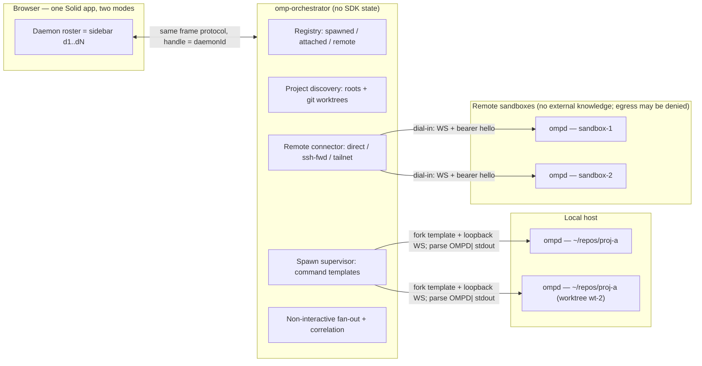

# ompd — single-session agent daemon + orchestrator plan

**Status: DRAFT for review (2026-08-10).** Supersedes the multi-session
direction of `docs/web-tui-parity-plan.md` (Phases 0–13 remain valid history;
the multiplexing rows are the parts being retracted). Written from three ground
inventories: `src/protocol.ts` (full wire contract), `server/index.ts` (dispatch,
mux registry, collab host/relay, daemon broker), and the omp capability
inventories of 2026-08-10. Every requirement below was settled in the grilling
session of 2026-08-10; open questions are collected at the end.

## Motivation

Today `server/index.ts` multiplexes N in-process SDK sessions in one Bun
process: a `SessionEntry` registry keyed `s1..sN`, five mux-only WS commands
(`create_session`, `attach`, `detach`, `close_session`, `list_live_sessions` +
`get_process_stats`), handle-stamped session frames, a client-side stale-frame
guard, per-session cwd tracking for the `/download` jail and cross-project
daemon aggregation, and the sessions sidebar. That coupling is what makes the
server hard to run as a small, disposable per-sandbox binary.

The move is not to delete multiplexing but to **relocate it one layer up**:
`ompd` hosts exactly one live session with an immutable CWD; the
`omp-orchestrator` holds the registry of N daemons (local children, attached
externals, remote sandboxes) and re-exposes them to the browser UI and to
non-interactive drivers. Orchestrator handles map to remote WS connections,
not in-process SDK state — mux becomes pure proxying.



## Requirements

### Functional

- **R1 — One live session per ompd.** Sequential session *replacement* is
  preserved: `newSession`, `switchSession` (resume picker), `branch`, `fork`,
  `handoff`, `compact`, `retry`, `freshSession`. What dies is *concurrent*
  in-process sessions, not session history. *(Grilling: mux_fate = flag now,
  delete at orchestrator parity.)*
- **R2 — CWD is bound at spawn and immutable** for the process lifetime.
  Changing project = new ompd. Collapses the `/download` jail, daemon scoping,
  `list_files`, and session-store selection to a single root.
- **R3 — Disk-backed session logs are the continuity mechanism.** The
  SessionManager `.jsonl` logs (as today, surfaced via `list_sessions` /
  `switchSession`) make ompd disposable: spawn `--resume <file>`, idle-exit →
  respawn resumes the last session, crash → restart resumes. Spawn session
  selection rule: *user-initiated new daemon = fresh session; respawn of an
  existing registry entry = resume its last session file.*
  *(Grilling: session_on_spawn = fresh by default, resume on request.)*
- **R4 — Transport: WebSocket over TCP everywhere.** Loopback for local
  children, secure transport off-loopback (wss direct, ssh-forward, or
  tailnet). No Unix domain sockets *(dropped 2026-08-10)*: one transport code
  path, one bind mode, no second listener semantics.
- **R5 — Local daemons: orchestrator both spawns children AND attaches to
  externally launched ompd** (terminal, systemd). Spawned children get
  lifecycle management (stop/restart, idle policy); attached daemons are
  connect-only. *(Grilling: local_spawn = Both.)*
- **R6 — Remote daemons: dial-in only.** The orchestrator initiates every
  connection to a remote ompd; ompd never dials out and has no
  `--orchestrator` flag. A sandbox image/environment contains **zero knowledge
  of the external world** — no external URLs, no outbound credentials. The
  only secret inside a sandbox is its own gate token, which authorizes
  inbound connections to itself and identifies nothing beyond it; sandbox
  egress may be denied entirely without breaking management. Reachability is
  the provisioner's problem (direct `host:port`, provider per-port ingress
  URL, `ssh -L` local-forward, tailnet — see Phase 4). Endpoint registration
  flows the other way: the provisioner/operator tells the orchestrator
  `name + url + token` when a sandbox is created. *(Grilling 2026-08-10
  initially chose dial-out, reversed same day: dial-in keeps all
  external-addressing credentials out of sandboxes.)*
- **R6b — Spawn commands are user-controlled; endpoints are discovered from
  stdout.** Local and remote spawns alike are **command templates** in the
  orchestrator config with `{token}` / `{cwd}` / `{name}` / `{labels}`
  substitution — the orchestrator never hardcodes a launch method. A remote
  template is anything whose stdout is readable and whose lifecycle is
  watchable: `ssh <host> ompd …`, `docker run --rm -p …`, a provider CLI, an
  arbitrary wrapper script. The endpoint contract is stdout lines prefixed
  `OMPD|` carrying JSON (contract lines on stdout, logs on stderr). ompd
  itself prints, immediately after bind and before session creation:
  `OMPD|{"event":"listening","bind":"0.0.0.0","port":4721,"url":"ws://0.0.0.0:4721","advertise":"…"?}`
  A remote wrapper MAY additionally print
  `OMPD|{"event":"endpoint","url":"wss://reachable-host:port"}` when the
  reachable address differs from the bind (published port, NAT). Resolution
  order: wrapper `endpoint` › template-declared host + `listening` port ›
  loopback + `listening` port. *(Added 2026-08-10: spawn-command control +
  network-reachable port output.)*
- **R7 — UI spawn flow:** picker lists projects from configured roots (e.g.
  `~/repos`) discovered as git repos, each expanded with `git worktree list`,
  plus a freeform path fallback. Pick → daemon row appears in `spawning` state
  → flips to `ready` → composer enables. *(Grilling: project_discovery =
  Configured roots + git discovery.)*
- **R8 — Readiness gate = SDK session live + provider/model/auth resolved.**
  ompd emits an explicit `ready` frame; background model-discovery refresh may
  still be running. Orchestrator readiness = transport up + registration
  accepted + first `state` frame + `ready`. *(Grilling: readiness_gate =
  Session live + model/auth resolved.)*
- **R9 — Non-interactive driving:** orchestrator API/CLI to `prompt` one daemon
  or fan out across a selector (`--tag api`, `--project foo`, `--all`), with
  `--wait` semantics correlated on `agent_end`/`error`/`abort` events and a
  collected result (final assistant text + usage). Fire-and-forget prompt is
  already supported by the protocol; correlation is the only new piece.
- **R10 — Interactive driving:** the browser UI talks only to the orchestrator;
  attaching to daemon `dN` proxies the socket through to that ompd. Per-ompd
  standalone UI (today's static bundle) remains served by each ompd for direct
  single-session use in a sandbox.
- **R11 — Idle auto-exit:** ompd exits after `OMPD_IDLE_TIMEOUT` (default 30 m)
  with no attached clients, no running agent/queue, no in-flight bash/eval, no
  open `ui_request`, and no live collab room. Orchestrator marks the entry
  `asleep` (keeping cwd + last session file) and respawns on demand — safe
  because of R3. *(Grilling: idle_lifecycle = Idle timeout auto-exit.)*
- **R12 — Full parity of the 58-method `WebMethodName` surface on ompd** minus
  the mux commands. Nothing else about chat, tools, settings, OAuth, subagents,
  usage, or exports changes.
- **R13 — Collab hosting stays per-ompd and unchanged** (`collab_start` /
  `collab_stop`, in-process relay rooms `/r/<roomId>`). The orchestrator can
  trigger room creation remotely and surface the join links; the pi-wire guest
  protocol is untouched.
- **R14 — Auth: bearer token per ompd**, minted by the orchestrator and
  injected via the spawn template (`{token}`) or `--token` / `OMPD_TOKEN`.
  Loopback peers are exempt; off-loopback requires the token and a secure
  transport (wss, ssh-forward, or tailnet). The token gates inbound
  connections to that daemon only — it addresses nothing external, so a
  leaked sandbox token grants no knowledge of or access to any other
  component. The orchestrator's own UI binds loopback by default;
  non-loopback UI gets the same bearer treatment. *(Grilling: auth_model =
  Bearer token per ompd.)*

### Non-functional

- **R15 — ompd ships as a single self-contained binary** (`bun build
  --compile`), configured by flags/env only. No build step, no repo checkout,
  no node_modules on the sandbox.
- **R16 — The orchestrator holds zero SDK state.** It is registry + WS clients
  + proxy + fan-out. All agent truth lives in ompd processes and their
  `.jsonl` logs.
- **R17 — Protocol continuity.** `ClientCommand` / `ServerFrame` from
  `src/protocol.ts` are the contract; changes are additive frames plus the
  documented command removals at de-mux time. A `proto` version in the hello
  (collab's `COLLAB_PROTO` pattern) gates orchestrator↔ompd drift.

### Non-goals

- **N1** — Concurrent in-process sessions on ompd beyond the `OMPD_MULTI=1`
  transition shim. The shim is scaffolding with a deletion date, not a
  supported mode.
- **N2** — Multi-user orchestrator, RBAC, audit. Single operator assumed.
- **N3** — Sandbox *provisioning* (creating VMs/containers). Phase 4 defines
  the enroll contract and a hook point; actual providers are follow-up work.
- **N4** — Changes to the collab guest protocol (`pi-wire` frames, TUI guests).
- **N5** — Unix domain sockets, in v1 and later (dropped 2026-08-10 — TCP
  loopback covers local children; one transport path only).

## Current state → target state

### What ompd inherits unchanged

From `server/index.ts` / `src/protocol.ts`: the `METHODS` dispatch table (58
rows), post-mutation resync (`HISTORY_RELOAD` / `READ_ONLY` tables), full
`AgentSessionEvent` forwarding, `ui_request`/`ui_response` dialog relay,
builtin slash interception (`executeAcpBuiltinSlashCommand`), settings model +
`applySettingSideEffects`, OAuth login frames (`login_url` /
`login_code_request`), bash/python/ephemeral chunk streaming, subagent
lifecycle/progress mirror + paged `getSubagentMessages`, `exportHtml`,
`/download` realpath jail (single root now), static `dist/` serving, daemon
broker poll (single project), collab host adapter + relay + CLI, graceful
shutdown.

### What mux removal deletes or moves

| Today (`src/protocol.ts`) | ompd | Orchestrator |
| --- | --- | --- |
| `create_session` / `attach` / `detach` / `close_session` | deleted (behind `OMPD_MULTI=1` until Phase 6) | re-implemented as daemon spawn/attach/stop |
| `list_live_sessions` / `live_sessions` frame | deleted | roster of daemons (`roster` frame) |
| `get_process_stats` / `process_stats` | kept, trivially (own process) | aggregated per-daemon |
| `sessionId` on session-scoped frames | constant `"s1"` during transition, dropped in Phase 6 | `daemonId` at the edge |
| `daemons` frame (hub/launch broker roster) | kept, scoped to the one bound cwd | aggregated across daemons by projectDir |
| stale-frame guard / `resetSessionView` / attach dance (`src/state.ts`) | deleted (connect = attached) | reused verbatim, guarding daemon switches |
| Sessions sidebar (`src/components/SessionsSidebar.tsx`) | hidden in standalone mode | becomes the daemon roster + spawn picker |

### ompd process & config surface

Spawn contract (flags map 1:1 to env; `OMP_WEB_*` read as fallback during the
transition, dropped in Phase 6):

| Flag / env | Default | Meaning |
| --- | --- | --- |
| `--cwd` / `OMPD_CWD` | process cwd | Bound project root (R2; immutable) |
| `--port` / `OMPD_PORT` | `4721` | Listen port (`0` = ephemeral; actual bind reported in the `OMPD|` listening line, R6b) |
| `--host` / `OMPD_HOST` | `127.0.0.1` | Bind address; anything else requires `--token` |
| `--advertise <host[:port]>` / `OMPD_ADVERTISE` | — | Overrides the address in the `OMPD|` listening line when the reachable address is known at launch (e.g. ssh-target hostname); reporting only, does not affect the bind |
| `--token` / `OMPD_TOKEN` | — | Bearer token (R14); generated by spawner when absent and binding off-loopback = hard error |
| `--resume <file>` / `OMPD_RESUME` | — | Session file to resume at boot (R3); fresh otherwise |
| `--idle-timeout` / `OMPD_IDLE_TIMEOUT` | `30m` | Idle auto-exit (R11); `0` disables |
| `--name` / `OMPD_NAME` | cwd basename | Registry display name |
| `--label k=v` (repeatable) / `OMPD_LABELS` | — | Selector labels for fan-out (R9) |
| `OMPD_MULTI=1` | off | **Experimental transition shim**: today's mux registry, flagged for deletion in Phase 6 |

Readiness (R8): after the SDK session exists and provider/model/credential
resolution has completed, ompd emits `ready` (a new ServerFrame) and stamps
`readyAt` into `state`. Before that, `prompt`-family calls return a
`not_ready` error instead of failing obscurely against a half-built session.
The `OMPD|` listening line is printed right after bind — before session
creation — so the spawner learns the endpoint early and the orchestrator is
typically already connected and waiting when `ready` arrives (R6b).

Idle exit (R11): the timer is suppressed while any of: attached sockets > 0,
agent streaming, queue non-empty, bash/eval in flight, open `ui_request`,
collab room live, ephemeral `/btw` turn in flight. On expiry ompd shuts down
cleanly (today's shutdown path: reject pending dialogs, stop collab adapters,
close relay rooms, dispose the session — the `.jsonl` is already durable).

### Wire protocol deltas

**ompd (Phase 1+):** `ClientCommand` loses `create_session`, `attach`,
`detach`, `close_session`, `list_live_sessions`, `get_process_stats` (last one
kept minus the sidebar semantics — plain process stats). Connect implies
attach: priming sequence `attached → history → state → collab_status →
available_commands` (unchanged), then `ready` when the gate clears. All
session-scoped frames keep `sessionId` = `"s1"` during transition.

**Dial-in handshake (new, orchestrator↔ompd control plane):**

```text
orch → ompd   WS upgrade to ompd's /ws with Authorization: Bearer <token>
              (first-frame { type: "hello", proto: 1, token } fallback)
ompd → orch   { type: "hello_ok", proto: 1, name, cwd, pid, version, sessionFile? }
              # or WS close 4001 unauthorized
# thereafter identical to a browser connection: ClientCommand (orch → ompd),
# ServerFrame (ompd → orch); ping/pong liveness at 15 s.
```

The orchestrator dials when the spawn stdout yields an endpoint (R6b) or when
a remote entry is registered (`add`), then waits for `ready` before marking
the daemon drivable (R8). Reconnects are orchestrator-initiated with
exponential backoff (1 s → 30 s, jittered); the daemon shows `reconnecting`
and proxied browser clients re-attach on return. `hello_ok.cwd` must equal
the registry entry's cwd — a mismatch flips the daemon to `error` (guards
against stale endpoints and IP reuse). The frame protocol is transport- and
direction-agnostic: a socket is a socket.

**Orchestrator edge (browser↔orchestrator):** today's protocol with handle =
`daemonId`. New frames:

```text
orch → browser  { type: "roster", daemons: DaemonEntry[] }          # replaces live_sessions
orch → browser  { type: "daemon_status", daemonId, status }         # spawning|connecting|session|resolving|ready|asleep|reconnecting|error
browser → orch  { type: "spawn", cwd } | { type: "spawn_resume", daemonId } | { type: "stop", daemonId }
browser → orch  { type: "list_projects" } → { type: "projects", projects: ProjectEntry[] }   # discovery for the picker
```

`DaemonEntry = { daemonId, name, cwd, project, worktreeOf?, labels[],
mode: "spawned" | "attached" | "remote", status, lastSessionFile?, readyAt?,
uptime?, pid? }`. `ProjectEntry = { name, path, isWorktree, worktreeOf?,
branch? }`.

### Orchestrator internals

- **Registry**: in-memory map + JSON state file (durable enough to re-attach
  after orchestrator restart). Remote entries persist `endpoint + token +
  labels`; spawned entries persist template name + cwd + last session file.
- **Project discovery**: scan configured roots (default `~/repos`) one level
  deep for `.git`; per repo run `git worktree list --porcelain`; cache 60 s;
  freeform path validated (exists + is directory) at spawn.
- **Spawn supervisor** (local + remote): fills the configured command
  template (R6b), mints the token, runs it, parses `OMPD|` stdout lines for
  the endpoint, and hands the endpoint to the connector. Local default
  template: `ompd --cwd {cwd} --port 0 --token {token}` (loopback). Restart
  `on-failure` with bounded backoff (mirrors the hub launch policy); stderr
  ring buffer surfaced in the daemon detail view.
- **Remote connector**: per spawned/remote entry, a WS client dialing the
  resolved endpoint (`wss://host:port` direct, `ws://` over ssh `-L` or
  tailnet) with backoff; hello handshake + cwd sanity check; feeds the proxy.
- **Proxy**: per-daemon WS client; browser socket in daemon-attach mode gets
  frames forwarded with `sessionId` rewritten to `daemonId`; commands forward
  verbatim. Backpressure: drop-and-mark on slow browser (today's collab socket
  already solves this pattern — `MAX_PENDING_SENDS` + reconnect buffer).
- **Non-interactive API**: CLI first (`omp-orchestrator prompt <selector>
  <text> [--wait <ms>] [--fan-out]`), then the same over a loopback HTTP/WS
  endpoint. Correlation: per-target subscribe to `event` frames, resolve on
  `agent_end`, reject on `error`/abort/timeout; result = final assistant text
  + usage + daemonId. Selectors: `dN`, name glob, `label:k=v`, `project:name`,
  `all`.
- **Idle/asleep handling**: on ompd exit → entry flips to `asleep` with cwd +
  last session file retained; a targeted prompt or UI click respawns with
  `--resume <lastSessionFile>` (R3 rule).

### Client (Solid app) changes

One app, two modes, decided by the attach handshake:

- **Standalone mode** (served by an ompd): today's UI minus the sessions
  sidebar; composer disabled until `ready`.
- **Roster mode** (served by the orchestrator): sidebar rows are daemons with
  status dots (`spawning`/`ready`/`asleep`/`error`), spawn picker (projects +
  worktrees + freeform), wake-on-click for `asleep`, stop with confirm;
  attaching switches the transcript via the existing `resetSessionView` path.
  The stale-frame guard survives unchanged — it now guards daemon switches.

## Security model

- Today there is **no auth anywhere** (localhost assumption). Remote sandboxes
  make R14 blocking, not optional: an off-loopback ompd without `--token` is a
  remote-code-execution service.
- Token generation: 32 random bytes, base64url, minted by the orchestrator
  and injected into the spawn template via `{token}` (env for local children —
  visible in `/proc/<pid>/environ`, acceptable single-operator; noted, not
  fixed, in v1). Remote enroll: the provisioner/operator registers
  `name + url + token` (`omp-orchestrator add …`, or the spawn hook's output).
  **No orchestrator URL or orchestrator credential ever enters the sandbox** —
  the token inside is the sandbox's own gate, nothing more.
- Transport security off-loopback: ssh local-forward and tailnet need no TLS
  code in ompd at all; direct `wss://` uses a per-daemon self-signed cert
  whose fingerprint the orchestrator pins at registration (no CA, no
  system-root dependence). The orchestrator's own UI binds loopback by
  default or sits behind the operator's reverse proxy.
- `/download` jail stays single-root (bound cwd + tmpdir + session dirs) and is
  the only file-egress path; `list_files` never escapes the cwd.
- The bearer token authorizes full drive of the daemon (bash included). There
  is no read-only orchestrator token in v1 — view-only access remains the
  collab view-link feature (R13), unchanged.

## Phased implementation plan

Repo layout assumption: this repo, monorepo-style. `server/` becomes `ompd/`,
new `orchestrator/`, shared `src/protocol.ts` moves to `protocol/` imported by
both, UI `src/` stays one app with the two modes. (If the split grows teeth,
revisit in Phase 6.)

- [ ] **Phase 0 — Requirements sign-off (this doc).** Review R1–R17, N1–N5,
  config table, protocol deltas. Edits happen here, not in code.

- [ ] **Phase 1 — ompd extraction.**
  Scope: collapse the `SessionEntry` registry to one entry behind constant
  `"s1"`; gate the mux code paths (registry, 5 mux commands, `live_sessions`,
  sidebar broadcast, cross-cwd daemon merge, stale-frame guard, sidebar UI)
  behind `OMPD_MULTI=1`; flag/env config surface incl. `OMP_WEB_*` fallback;
  bearer auth + off-loopback hard error; `ready` frame + `readyAt` + `not_ready`
  call errors; idle auto-exit with the suppression list; `--resume`; `bun
  build --compile` packaging script; rename pass (`omp-web` → `ompd` in
  user-visible strings; env vars keep fallback).
  Verification: `bun run check:types`; `bun test` (existing suite must pass
  with the flag ON; new tests: token gate, idle suppression list, `not_ready`);
  manual browser drive of a full single-session feature sweep (prompt, steer,
  queue, bash streaming, settings write, OAuth popup, collab room start,
  `/export`, subagent steer/abort) with the flag OFF; same sweep with
  `OMPD_MULTI=1` proves today's behavior intact.

- [ ] **Phase 2 — orchestrator core (headless).**
  Scope: registry + JSON persistence; project discovery (roots + `git worktree
  list`); spawn template engine + `OMPD|` stdout parser (R6b); local spawn
  supervisor (default template, token mint, restart policy, stderr ring);
  remote connector (dial-in hello handshake, cwd sanity check, backoff);
  readiness tracker implementing the R8 gate; CLI: `daemons` (list),
  `spawn <path> [--template t]`, `add <name> <url> --token <t>`, `stop <sel>`,
  `prompt <sel> <text> [--wait]` with `agent_end` correlation, `projects`;
  asleep/respawn-on-demand via `--resume`.
  Verification: unit tests for selector matching, correlation timeout,
  registry persistence round-trip, discovery parsing (porcelain fixtures),
  `OMPD|` parsing (interleaved log noise, endpoint-over-listening precedence);
  integration: spawn 3 local ompd, prompt each via CLI, kill one, observe
  reconnect; `add` an externally launched ompd and drive it; idle-exit one,
  prompt it, observe respawn+resume.

- [ ] **Phase 3 — aggregate UI.**
  Scope: roster mode in the Solid app (roster frame, status dots, spawn picker
  with worktree grouping, asleep/wake, stop confirm); daemon-attach proxying
  (`daemonId` rewrite) in the orchestrator; composer gating on
  `daemon_status=ready`; daemon detail popover (cwd, uptime, mode, labels,
  last session, stderr tail); standalone mode hides the sidebar.
  Verification: browser drive — spawn a daemon into a worktree from the
  picker, wait for ready, run a turn; open a second daemon, switch transcripts;
  put one to sleep, wake it, transcript intact via resume; direct-load an
  ompd's own URL and confirm standalone mode.

- [ ] **Phase 4 — remote sandboxes.**
  Scope: remote spawn templates (R6b) shipped as commented config examples —
  `ssh <host> ompd --cwd {cwd} --port 4721 --host 0.0.0.0 --token {token}`
  (host derived from the ssh target), a `docker run --rm -p …` wrapper that
  emits the `endpoint` line for the published port, a provider-script
  skeleton; endpoint resolution order implemented; transport security per the
  security model (ssh `-L` + tailnet first-class; direct wss + fingerprint
  pinning if needed); heartbeat/liveness + `reconnecting` surfacing;
  labels/selectors in the UI roster; fan-out CLI across remote daemons;
  `OMP_ORCHESTRATOR_SPAWN_HOOK` hook point (script creates the sandbox and
  prints `name/url/token` JSON; providers themselves are N3).
  Verification: drive an ompd in a Docker container on an isolated network
  via published port; drive one over `ssh -L` into a VM; assert the sandbox
  env contains no orchestrator URL/credential and that an egress-deny
  firewall on the sandbox breaks nothing; kill the orchestrator mid-turn,
  restart, confirm redial and roster continuity.

- [ ] **Phase 5 — local polish.**
  Scope: discovery cache tuning; aggregated daemons (hub/launch) panel across
  projects; token handoff via fd/stdin for local children if `/proc` environ
  exposure grates; spawn-template UX refinements (template picker in the
  spawn dialog, per-project template overrides).
  Verification: `check:types`; `bun test`; manual sweep of spawn/wake/stop
  flows across templates.

- [ ] **Phase 6 — de-mux + cleanup.**
  Scope: delete `OMPD_MULTI` and every code path it gates (registry, mux
  commands, `live_sessions`, stale-frame guard on ompd, sidebar legacy mode);
  drop `sessionId` from session-scoped frames on ompd; drop `OMP_WEB_*`
  fallbacks; README rewrite (ompd + orchestrator architecture, enroll,
  selectors); archive `docs/web-tui-parity-plan.md` mux rows.
  Verification: full test suite + manual sweep; grep gate: no `OMPD_MULTI`,
  no `create_session`/`attach`/`detach` in `ompd/`.

## Open questions (not settled in grilling)

1. **Direct-wss necessity**: if ssh `-L` + tailnet cover your remote cases in
   practice, Phase 4 can drop the self-signed-cert + fingerprint-pinning path
   entirely — ompd then ships with zero TLS code. Decide after listing your
   actual sandbox targets.
2. **Orchestrator persistence format**: JSON state file (proposed) vs SQLite.
   JSON is enough for tens of daemons; SQLite if the registry gains history.
3. **Where the orchestrator runs**: always-on homelab box (then local spawn =
   that box only; your workstation daemons are *remote* entries reached over
   ssh/tailnet), or per-workstation. The registry/discovery design is
   identical either way, but the default roots config and the default spawn
   templates depend on it.
4. **Token rotation**: none in v1. If sandboxes are long-lived, rotation
   becomes worth a phase.
5. **Naming**: `ompd` / `omp-orchestrator` assumed throughout; final binary and
   package names decided at Phase 1 packaging.
6. **`daemons` (hub/launch) cross-project aggregation** on the orchestrator:
   merge by `projectDir` key (today's client already keys on `projectDir\0name`),
   or per-daemon scoping in the detail view only. Minor; default to merge.

## Compatibility & migration

- During Phases 1–5, today's `bun run dev:server` + `dev:web` workflow keeps
  working with `OMPD_MULTI=1` (the flag defaults ON in dev, OFF in the packaged
  binary — decided here so dev never breaks silently).
- `OMP_WEB_*` env vars keep working until Phase 6; deprecation warnings on
  first use.
- The collab CLI (`bun run collab`) and TUI guests are unaffected at every
  phase.
- Browser clients older than Phase 3 work against any single ompd unchanged
  (standalone mode); the roster mode is purely additive.
